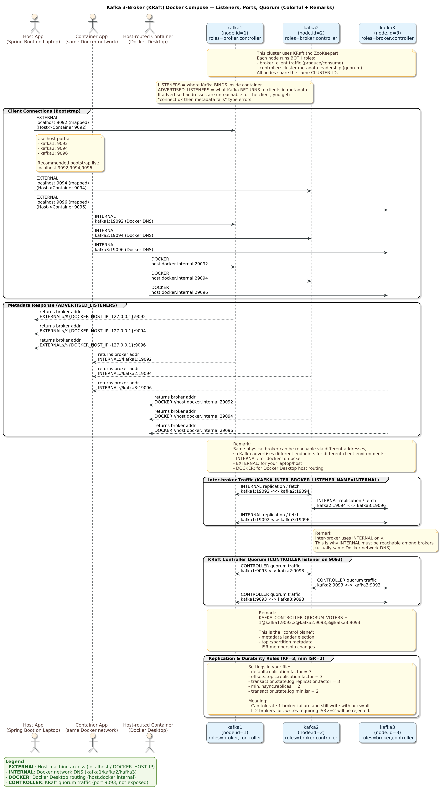

# docker-compose-multi-broker.yaml — Summary Table Notes (3 Kafka Brokers, KRaft Mode)


```yaml
services:
  kafka1:
    image: confluentinc/cp-kafka:7.4.0
    hostname: kafka1
    container_name: kafka1
    ports:
      - "9092:9092"
      - "29092:29092"
    environment:
      KAFKA_NODE_ID: 1
      KAFKA_LISTENER_SECURITY_PROTOCOL_MAP: CONTROLLER:PLAINTEXT,INTERNAL:PLAINTEXT,EXTERNAL:PLAINTEXT,DOCKER:PLAINTEXT
      KAFKA_ADVERTISED_LISTENERS: INTERNAL://kafka1:19092,EXTERNAL://${DOCKER_HOST_IP:-127.0.0.1}:9092,DOCKER://host.docker.internal:29092
      KAFKA_INTER_BROKER_LISTENER_NAME: INTERNAL
      KAFKA_CONTROLLER_LISTENER_NAMES: CONTROLLER
      KAFKA_CONTROLLER_QUORUM_VOTERS: 1@kafka1:9093,2@kafka2:9093,3@kafka3:9093
      KAFKA_PROCESS_ROLES: broker,controller
      KAFKA_LISTENERS: CONTROLLER://kafka1:9093,INTERNAL://kafka1:19092,EXTERNAL://0.0.0.0:9092,DOCKER://0.0.0.0:29092
      # Replication settings for distributed concepts
      KAFKA_OFFSETS_TOPIC_REPLICATION_FACTOR: 3
      KAFKA_TRANSACTION_STATE_LOG_MIN_ISR: 2
      KAFKA_TRANSACTION_STATE_LOG_REPLICATION_FACTOR: 3
      KAFKA_DEFAULT_REPLICATION_FACTOR: 3
      KAFKA_MIN_INSYNC_REPLICAS: 2
      KAFKA_LOG4J_LOGGERS: "kafka.controller=INFO,kafka.producer.async.DefaultEventHandler=INFO,state.change.logger=INFO"
      CLUSTER_ID: MkU3OEVBNTcwNTJENDM2Qk

  kafka2:
    image: confluentinc/cp-kafka:7.4.0
    hostname: kafka2
    container_name: kafka2
    ports:
      - "9094:9094"
      - "29094:29094"
    environment:
      KAFKA_NODE_ID: 2
      KAFKA_LISTENER_SECURITY_PROTOCOL_MAP: CONTROLLER:PLAINTEXT,INTERNAL:PLAINTEXT,EXTERNAL:PLAINTEXT,DOCKER:PLAINTEXT
      KAFKA_ADVERTISED_LISTENERS: INTERNAL://kafka2:19094,EXTERNAL://${DOCKER_HOST_IP:-127.0.0.1}:9094,DOCKER://host.docker.internal:29094
      KAFKA_INTER_BROKER_LISTENER_NAME: INTERNAL
      KAFKA_CONTROLLER_LISTENER_NAMES: CONTROLLER
      KAFKA_CONTROLLER_QUORUM_VOTERS: 1@kafka1:9093,2@kafka2:9093,3@kafka3:9093
      KAFKA_PROCESS_ROLES: broker,controller
      KAFKA_LISTENERS: CONTROLLER://kafka2:9093,INTERNAL://kafka2:19094,EXTERNAL://0.0.0.0:9094,DOCKER://0.0.0.0:29094
      # Replication settings for distributed concepts
      KAFKA_OFFSETS_TOPIC_REPLICATION_FACTOR: 3
      KAFKA_TRANSACTION_STATE_LOG_MIN_ISR: 2
      KAFKA_TRANSACTION_STATE_LOG_REPLICATION_FACTOR: 3
      KAFKA_DEFAULT_REPLICATION_FACTOR: 3
      KAFKA_MIN_INSYNC_REPLICAS: 2
      KAFKA_LOG4J_LOGGERS: "kafka.controller=INFO,kafka.producer.async.DefaultEventHandler=INFO,state.change.logger=INFO"
      CLUSTER_ID: MkU3OEVBNTcwNTJENDM2Qk

  kafka3:
    image: confluentinc/cp-kafka:7.4.0
    hostname: kafka3
    container_name: kafka3
    ports:
      - "9096:9096"
      - "29096:29096"
    environment:
      KAFKA_NODE_ID: 3
      KAFKA_LISTENER_SECURITY_PROTOCOL_MAP: CONTROLLER:PLAINTEXT,INTERNAL:PLAINTEXT,EXTERNAL:PLAINTEXT,DOCKER:PLAINTEXT
      KAFKA_ADVERTISED_LISTENERS: INTERNAL://kafka3:19096,EXTERNAL://${DOCKER_HOST_IP:-127.0.0.1}:9096,DOCKER://host.docker.internal:29096
      KAFKA_INTER_BROKER_LISTENER_NAME: INTERNAL
      KAFKA_CONTROLLER_LISTENER_NAMES: CONTROLLER
      KAFKA_CONTROLLER_QUORUM_VOTERS: 1@kafka1:9093,2@kafka2:9093,3@kafka3:9093
      KAFKA_PROCESS_ROLES: broker,controller
      KAFKA_LISTENERS: CONTROLLER://kafka3:9093,INTERNAL://kafka3:19096,EXTERNAL://0.0.0.0:9096,DOCKER://0.0.0.0:29096
      # Replication settings for distributed concepts
      KAFKA_OFFSETS_TOPIC_REPLICATION_FACTOR: 3
      KAFKA_TRANSACTION_STATE_LOG_MIN_ISR: 2
      KAFKA_TRANSACTION_STATE_LOG_REPLICATION_FACTOR: 3
      KAFKA_DEFAULT_REPLICATION_FACTOR: 3
      KAFKA_MIN_INSYNC_REPLICAS: 2
      KAFKA_LOG4J_LOGGERS: "kafka.controller=INFO,kafka.producer.async.DefaultEventHandler=INFO,state.change.logger=INFO"
      CLUSTER_ID: MkU3OEVBNTcwNTJENDM2Qk

```

# docker-compose-multi-broker.yaml — Summary Table Notes (3 Kafka Brokers, KRaft Mode)

This compose file runs **3 Kafka nodes** (`kafka1`, `kafka2`, `kafka3`) using Confluent image **cp-kafka:7.4.0**.  
Each node is configured as **broker + controller** (KRaft), forming a **3-node controller quorum** and a **3-broker cluster**.

---

## 1) Services Overview

| Service | Container Name | Role | KAFKA_NODE_ID | Image |
|---|---|---|---:|---|
| kafka1 | kafka1 | broker + controller | 1 | confluentinc/cp-kafka:7.4.0 |
| kafka2 | kafka2 | broker + controller | 2 | confluentinc/cp-kafka:7.4.0 |
| kafka3 | kafka3 | broker + controller | 3 | confluentinc/cp-kafka:7.4.0 |

---

## 2) Port Exposure (Host ↔ Container)

Each broker exposes 2 “client” ports to your host:
- **EXTERNAL** port (host apps: Spring Boot on your laptop)
- **DOCKER** port (Docker Desktop routing via `host.docker.internal`)

| Broker | EXTERNAL Host:Container | DOCKER Host:Container |
|---|---|---|
| kafka1 | `9092:9092` | `29092:29092` |
| kafka2 | `9094:9094` | `29094:29094` |
| kafka3 | `9096:9096` | `29096:29096` |

> Why different host ports? Because you can’t bind three containers to the same host port.  
> So each broker uses a unique host port (9092/9094/9096 …).

---

## 3) Listener Names (What each one is for)

All brokers define the same 4 listener names:

| Listener Name | Purpose | Typical Clients |
|---|---|---|
| `CONTROLLER` | KRaft controller quorum traffic | controllers only (internal Kafka control-plane) |
| `INTERNAL` | Inter-broker + same Docker network clients | other brokers, other containers |
| `EXTERNAL` | Host machine access | apps running on your laptop |
| `DOCKER` | Docker Desktop host routing | containers connecting via `host.docker.internal` |

All are mapped to `PLAINTEXT` via:

| Setting | Meaning |
|---|---|
| `KAFKA_LISTENER_SECURITY_PROTOCOL_MAP` | maps listener name → security protocol; here everything is `PLAINTEXT` (no TLS/SASL) |

---

## 4) LISTENERS vs ADVERTISED_LISTENERS (Most important Kafka networking concept)

### Quick meaning table

| Setting | What it controls | Think of it as |
|---|---|---|
| `KAFKA_LISTENERS` | where Kafka **binds** inside container | “open these ports here” |
| `KAFKA_ADVERTISED_LISTENERS` | what Kafka **tells clients** to use | “connect using these addresses” |

---

## 5) KAFKA_LISTENERS (Bind addresses per broker)

### kafka1
| Listener | Bind Address |
|---|---|
| CONTROLLER | `kafka1:9093` |
| INTERNAL | `kafka1:19092` |
| EXTERNAL | `0.0.0.0:9092` |
| DOCKER | `0.0.0.0:29092` |

### kafka2
| Listener | Bind Address |
|---|---|
| CONTROLLER | `kafka2:9093` |
| INTERNAL | `kafka2:19094` |
| EXTERNAL | `0.0.0.0:9094` |
| DOCKER | `0.0.0.0:29094` |

### kafka3
| Listener | Bind Address |
|---|---|
| CONTROLLER | `kafka3:9093` |
| INTERNAL | `kafka3:19096` |
| EXTERNAL | `0.0.0.0:9096` |
| DOCKER | `0.0.0.0:29096` |

> `0.0.0.0` = listen on all interfaces inside the container.

---

## 6) KAFKA_ADVERTISED_LISTENERS (What clients will receive in metadata)

### kafka1
| Listener | Advertised Address | Who can use it |
|---|---|---|
| INTERNAL | `kafka1:19092` | other containers / other brokers |
| EXTERNAL | `${DOCKER_HOST_IP:-127.0.0.1}:9092` | your laptop apps |
| DOCKER | `host.docker.internal:29092` | containers that need host routing |

### kafka2
| Listener | Advertised Address | Who can use it |
|---|---|---|
| INTERNAL | `kafka2:19094` | other containers / other brokers |
| EXTERNAL | `${DOCKER_HOST_IP:-127.0.0.1}:9094` | your laptop apps |
| DOCKER | `host.docker.internal:29094` | host-routed containers |

### kafka3
| Listener | Advertised Address | Who can use it |
|---|---|---|
| INTERNAL | `kafka3:19096` | other containers / other brokers |
| EXTERNAL | `${DOCKER_HOST_IP:-127.0.0.1}:9096` | your laptop apps |
| DOCKER | `host.docker.internal:29096` | host-routed containers |

### `${DOCKER_HOST_IP:-127.0.0.1}` explained

| Expression | Meaning |
|---|---|
| `${DOCKER_HOST_IP:-127.0.0.1}` | use env var `DOCKER_HOST_IP`, else default to `127.0.0.1` |

Useful if:
- Docker host is not your local machine
- you want to advertise a LAN IP like `192.168.x.x`

---

## 7) Inter-broker + Controller quorum settings

| Setting | Value | Why it exists |
|---|---|---|
| `KAFKA_INTER_BROKER_LISTENER_NAME` | `INTERNAL` | brokers talk to each other over INTERNAL listener |
| `KAFKA_CONTROLLER_LISTENER_NAMES` | `CONTROLLER` | controller traffic uses CONTROLLER listener |
| `KAFKA_PROCESS_ROLES` | `broker,controller` | each node runs both roles (dev-friendly) |

### Controller Quorum (KRaft)

All three brokers use the same voter list:

| Setting | Value | Meaning |
|---|---|---|
| `KAFKA_CONTROLLER_QUORUM_VOTERS` | `1@kafka1:9093,2@kafka2:9093,3@kafka3:9093` | defines the 3 controllers forming the quorum |

Format reminder:

| Format | Example |
|---|---|
| `<nodeId>@<host>:<controllerPort>` | `2@kafka2:9093` |

---

## 8) Replication + ISR settings (Distributed “real Kafka” behavior)

These are the settings that make this a “real” distributed cluster (not single-node dev defaults).

| Setting | Value | What it controls | Practical effect |
|---|---:|---|---|
| `KAFKA_OFFSETS_TOPIC_REPLICATION_FACTOR` | 3 | replication for `__consumer_offsets` | consumer group offsets survive 1 broker loss |
| `KAFKA_TRANSACTION_STATE_LOG_REPLICATION_FACTOR` | 3 | replication for transaction state log | transactions survive 1 broker loss |
| `KAFKA_TRANSACTION_STATE_LOG_MIN_ISR` | 2 | min in-sync replicas for transaction log | transactions require 2 healthy replicas |
| `KAFKA_DEFAULT_REPLICATION_FACTOR` | 3 | default RF for new topics | new topics replicate across all 3 brokers by default |
| `KAFKA_MIN_INSYNC_REPLICAS` | 2 | cluster-wide min ISR for writes (when `acks=all`) | stronger durability: can lose 1 broker and still write |

### What “RF=3 and min ISR=2” means

| Situation | Can producers write with `acks=all`? | Why |
|---|---|---|
| All 3 brokers healthy | ✅ Yes | ISR ≥ 2 |
| 1 broker down | ✅ Yes | still have 2 in-sync replicas |
| 2 brokers down | ❌ No | ISR would drop below 2 |

This is the classic “tolerate one broker failure” configuration.

---

## 9) Logging configuration

| Setting | Example value | What it does |
|---|---|---|
| `KAFKA_LOG4J_LOGGERS` | `kafka.controller=INFO,...` | reduces log noise, sets certain Kafka components to INFO |

---

## 10) Cluster identity (KRaft)

| Setting | Value | Meaning |
|---|---|---|
| `CLUSTER_ID` | `MkU3OEVBNTcwNTJENDM2Qk` | all nodes must share the same KRaft cluster id |

If cluster IDs differ:
- nodes won’t join the same KRaft metadata log
- cluster won’t form correctly

---

## 11) How to connect (quick table)

| Where your client runs | Use this bootstrap server style |
|---|---|
| Your laptop (host OS) | `localhost:9092` (or `localhost:9094`, `localhost:9096`) |
| Another container in same compose network | `kafka1:19092` (or `kafka2:19094`, `kafka3:19096`) |
| Container using Docker Desktop host routing | `host.docker.internal:29092` (or `...:29094`, `...:29096`) |

Tip: For host apps, you can list multiple bootstrap servers:

```text
localhost:9092,localhost:9094,localhost:9096
```

## 12) Common gotchas (why this config exists)
| Problem                                           | How this file prevents it                                                |
| ------------------------------------------------- | ------------------------------------------------------------------------ |
| “Connected to bootstrap but metadata fetch fails” | `KAFKA_ADVERTISED_LISTENERS` returns reachable addresses per client type |
| Port collision on host                            | each broker uses unique host ports (9092/9094/9096)                      |
| Single broker defaults break replication          | replication factors are set to 3 + min ISR 2                             |
| KRaft quorum not forming                          | consistent `KAFKA_CONTROLLER_QUORUM_VOTERS` and same `CLUSTER_ID`        |


