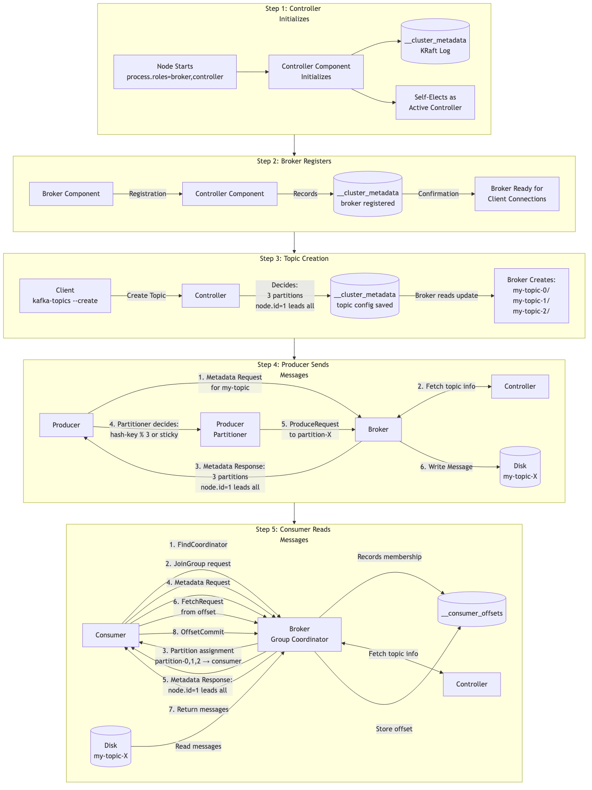

# Kafka as a Distributed Streaming System

This guide covers the fundamentals of distributed systems and how Kafka fits into the distributed streaming architecture.

---

## Part 1: What is a Distributed System?

### Definition

A **distributed system** is a collection of independent computers (nodes) that communicate over a network and coordinate their actions to appear as a single coherent system to end users.

Think of it like a restaurant kitchen:
- A single chef (monolith) can only cook so many dishes
- Multiple chefs (distributed) working together can serve hundreds of customers
- They coordinate, share ingredients, and cover for each other if someone is sick

```
┌─────────────────────────────────────────────────────────────────────────────┐
│                           MONOLITHIC SYSTEM                                 │
├─────────────────────────────────────────────────────────────────────────────┤
│                                                                             │
│                         ┌─────────────────────┐                             │
│                         │                     │                             │
│    User Request ───────▶│   SINGLE SERVER     │                             │
│                         │                     │                             │
│                         │  ┌───────────────┐  │                             │
│                         │  │  Application  │  │                             │
│                         │  ├───────────────┤  │                             │
│                         │  │   Database    │  │                             │
│                         │  ├───────────────┤  │                             │
│                         │  │  File Storage │  │                             │
│                         │  └───────────────┘  │                             │
│                         │                     │                             │
│                         └─────────────────────┘                             │
│                                                                             │
│    PROBLEMS:                                                                │
│    ┌────────────────────────────────────────────────────────────────┐       │
│    │ • Single Point of Failure - server dies, everything dies      │       │
│    │ • Limited Scalability - can only add so much CPU/RAM          │       │
│    │ • Maintenance Downtime - updates require full system restart  │       │
│    │ • Resource Contention - all processes compete for resources   │       │
│    └────────────────────────────────────────────────────────────────┘       │
│                                                                             │
└─────────────────────────────────────────────────────────────────────────────┘

┌─────────────────────────────────────────────────────────────────────────────┐
│                          DISTRIBUTED SYSTEM                                 │
├─────────────────────────────────────────────────────────────────────────────┤
│                                                                             │
│                    ┌──────────────────────────────┐                         │
│                    │      NETWORK / INTERNET      │                         │
│                    └──────────────────────────────┘                         │
│                       │          │          │                               │
│              ┌────────┘          │          └────────┐                      │
│              ▼                   ▼                   ▼                      │
│       ┌────────────┐      ┌────────────┐      ┌────────────┐               │
│       │   Node 1   │      │   Node 2   │      │   Node 3   │               │
│       │  (Server)  │◄────▶│  (Server)  │◄────▶│  (Server)  │               │
│       │            │      │            │      │            │               │
│       │ ┌────────┐ │      │ ┌────────┐ │      │ ┌────────┐ │               │
│       │ │Data: A │ │      │ │Data: B │ │      │ │Data: C │ │               │
│       │ │Copy: B │ │      │ │Copy: C │ │      │ │Copy: A │ │               │
│       │ └────────┘ │      │ └────────┘ │      │ └────────┘ │               │
│       └────────────┘      └────────────┘      └────────────┘               │
│              │                   │                   │                      │
│              └───────────────────┼───────────────────┘                      │
│                                  │                                          │
│                                  ▼                                          │
│                    ┌──────────────────────────┐                             │
│                    │  Appears as ONE system   │                             │
│                    │     to the end user      │                             │
│                    └──────────────────────────┘                             │
│                                                                             │
│    BENEFITS:                                                                │
│    ┌────────────────────────────────────────────────────────────────┐       │
│    │ • No Single Point of Failure - one node down, others continue │       │
│    │ • Horizontal Scalability - add more nodes as needed           │       │
│    │ • Geographic Distribution - nodes in different regions        │       │
│    │ • Parallel Processing - work divided across nodes             │       │
│    └────────────────────────────────────────────────────────────────┘       │
│                                                                             │
└─────────────────────────────────────────────────────────────────────────────┘
```

### Real-World Examples of Distributed Systems

| System | How It's Distributed |
|--------|---------------------|
| **Google Search** | Query hits one of thousands of servers; index split across data centers worldwide |
| **Netflix** | Content cached on edge servers globally; recommendation engine runs on hundreds of nodes |
| **Amazon** | Orders processed by multiple microservices; inventory synced across warehouses |
| **WhatsApp** | Messages routed through servers in multiple regions; 2M connections per server |
| **Bitcoin** | Every node has a copy of the blockchain; no central authority |

### Why Do We Need Distributed Systems?

```
┌─────────────────────────────────────────────────────────────────────────────┐
│                    WHY DISTRIBUTED SYSTEMS?                                 │
├─────────────────────────────────────────────────────────────────────────────┤
│                                                                             │
│  1. SCALE                                                                   │
│     ─────                                                                   │
│     Modern applications handle:                                             │
│     • Facebook: 500,000+ requests/second                                    │
│     • Google: 99,000+ searches/second                                       │
│     • Kafka at LinkedIn: 7 trillion messages/day                            │
│                                                                             │
│     No single machine can handle this!                                      │
│                                                                             │
│  2. RELIABILITY                                                             │
│     ───────────                                                             │
│     Hardware fails. It's not "if" but "when":                               │
│     • Hard drives: 2-4% annual failure rate                                 │
│     • Servers: ~5% annual failure rate in large data centers                │
│     • At 10,000 servers: ~1-2 failures per day!                             │
│                                                                             │
│     We need systems that survive failures.                                  │
│                                                                             │
│  3. LATENCY                                                                 │
│     ───────                                                                 │
│     Speed of light limits us:                                               │
│     • New York to London: ~70ms round trip                                  │
│     • Users expect <100ms response times                                    │
│                                                                             │
│     Solution: Put servers close to users (CDNs, edge computing)             │
│                                                                             │
│  4. DATA LOCALITY                                                           │
│     ──────────────                                                          │
│     Laws like GDPR require data to stay in certain regions                  │
│     • European user data must stay in EU                                    │
│     • Distributed systems can enforce this                                  │
│                                                                             │
└─────────────────────────────────────────────────────────────────────────────┘
```

### Voice Script - Part 1

> "Let's start with a fundamental question: What is a distributed system?
>
> In simple terms, a distributed system is a collection of independent computers that work together and appear as a single system to the end user. Think about the last time you used Netflix or Google. You probably didn't think about it, but behind that simple search or that movie stream, thousands of servers were working together. That's a distributed system.
>
> Let me use a restaurant analogy. Imagine a small restaurant with a single chef. That chef can only cook so many dishes at once. If they get sick, the restaurant closes. If there's a rush, customers wait forever. That's like a monolithic system - everything depends on one server.
>
> Now imagine a restaurant kitchen with ten chefs. They coordinate, share ingredients, specialize in different dishes, and cover for each other if someone is sick. That's a distributed system - multiple nodes working together.
>
> Why do we need them? Three main reasons.
>
> First, scale. No single machine can handle the billions of requests Google gets every day, or the seven trillion messages LinkedIn processes through Kafka daily.
>
> Second, reliability. Hardware fails - it's not IF but WHEN. At the scale of 10,000 servers, you're looking at one or two failures every single day. We need systems that survive these failures automatically.
>
> Third, latency. Physics limits us. Light takes 70 milliseconds just to travel from New York to London. Users expect responses in under 100 milliseconds. The only way to achieve this is to put servers close to users - which means distributing them globally.
>
> Now that we understand what distributed systems are and why we need them, let's look at the qualities that make a distributed system effective."

---

## Part 2: Key Qualities of a Distributed System

### Quality 1: Scalability

**Definition:** The ability of a system to handle increased load by adding resources.

```
┌─────────────────────────────────────────────────────────────────────────────┐
│                    VERTICAL vs HORIZONTAL SCALING                           │
├─────────────────────────────────────────────────────────────────────────────┤
│                                                                             │
│    VERTICAL SCALING (Scale Up)          HORIZONTAL SCALING (Scale Out)      │
│    ───────────────────────────          ─────────────────────────────       │
│                                                                             │
│    Before:        After:                Before:        After:               │
│    ┌───────┐      ┌───────────┐         ┌─────┐        ┌─────┐ ┌─────┐     │
│    │ 4 CPU │      │  32 CPU   │         │Node1│        │Node1│ │Node2│     │
│    │ 8 GB  │ ──▶  │  256 GB   │         └─────┘   ──▶  └─────┘ └─────┘     │
│    │ 500GB │      │   4 TB    │                        ┌─────┐ ┌─────┐     │
│    └───────┘      └───────────┘                        │Node3│ │Node4│     │
│                                                        └─────┘ └─────┘     │
│                                                                             │
│    PROS:                                PROS:                               │
│    • Simple - no code changes           • Unlimited scaling potential       │
│    • No distributed complexity          • Better fault tolerance            │
│    • Lower latency (all local)          • Cost effective (commodity HW)     │
│                                         • No downtime to scale              │
│    CONS:                                                                    │
│    • Hardware limits (can't add         CONS:                               │
│      infinite CPU/RAM)                  • Distributed system complexity     │
│    • Expensive high-end hardware        • Network latency between nodes     │
│    • Single point of failure            • Data consistency challenges       │
│    • Downtime to upgrade                • More operational overhead         │
│                                                                             │
│    COST CURVE:                                                              │
│                                                                             │
│    $│                    ╱ Vertical                                         │
│     │                  ╱   (exponential)                                    │
│     │                ╱                                                      │
│     │              ╱                                                        │
│     │           ╱    ╱─────── Horizontal                                    │
│     │        ╱   ╱             (linear)                                     │
│     │     ╱  ╱                                                              │
│     │  ╱╱                                                                   │
│     └──────────────────────────────────▶ Capacity                           │
│                                                                             │
└─────────────────────────────────────────────────────────────────────────────┘
```

**Scalability in Kafka:**

```
┌─────────────────────────────────────────────────────────────────────────────┐
│                         KAFKA SCALABILITY                                   │
├─────────────────────────────────────────────────────────────────────────────┤
│                                                                             │
│   SCENARIO: Your application grows from 1,000 to 1,000,000 messages/sec    │
│                                                                             │
│   STEP 1: Add More Partitions                                               │
│   ────────────────────────────                                              │
│                                                                             │
│   Before: Topic with 3 partitions                                           │
│   ┌─────────┐ ┌─────────┐ ┌─────────┐                                      │
│   │   P0    │ │   P1    │ │   P2    │   Max: ~100K msg/sec                 │
│   └─────────┘ └─────────┘ └─────────┘                                      │
│                                                                             │
│   After: Topic with 30 partitions                                           │
│   ┌────┐┌────┐┌────┐┌────┐┌────┐┌────┐┌────┐┌────┐┌────┐┌────┐            │
│   │ P0 ││ P1 ││ P2 ││ P3 ││ P4 ││ P5 ││ P6 ││ P7 ││ P8 ││ P9 │ ...       │
│   └────┘└────┘└────┘└────┘└────┘└────┘└────┘└────┘└────┘└────┘            │
│                                                                             │
│   Max: ~1M msg/sec (10x more partitions = 10x more throughput)             │
│                                                                             │
│                                                                             │
│   STEP 2: Add More Brokers                                                  │
│   ────────────────────────                                                  │
│                                                                             │
│   Before: 3 brokers                      After: 10 brokers                  │
│   ┌────────┐┌────────┐┌────────┐        ┌────┐┌────┐┌────┐┌────┐┌────┐    │
│   │Broker 1││Broker 2││Broker 3│   ──▶  │ B1 ││ B2 ││ B3 ││ B4 ││ B5 │    │
│   │10 parts││10 parts││10 parts│        └────┘└────┘└────┘└────┘└────┘    │
│   └────────┘└────────┘└────────┘        ┌────┐┌────┐┌────┐┌────┐┌────┐    │
│                                         │ B6 ││ B7 ││ B8 ││ B9 ││B10 │    │
│                                         └────┘└────┘└────┘└────┘└────┘    │
│                                                                             │
│   Partitions automatically spread across all brokers                        │
│                                                                             │
│                                                                             │
│   STEP 3: Add More Consumers                                                │
│   ──────────────────────────                                                │
│                                                                             │
│   Consumer Group with 30 consumers (1 per partition = max parallelism)      │
│                                                                             │
│   P0 ──▶ Consumer 1     P10 ──▶ Consumer 11     P20 ──▶ Consumer 21        │
│   P1 ──▶ Consumer 2     P11 ──▶ Consumer 12     P21 ──▶ Consumer 22        │
│   P2 ──▶ Consumer 3     P12 ──▶ Consumer 13     P22 ──▶ Consumer 23        │
│   ...                   ...                      ...                        │
│                                                                             │
└─────────────────────────────────────────────────────────────────────────────┘
```

### Voice Script - Scalability

> "The first quality of a distributed system is scalability - the ability to handle increased load.
>
> There are two ways to scale: vertical and horizontal.
>
> Vertical scaling, or scaling up, means getting a bigger machine - more CPU, more RAM, more storage. It's simple because you don't need to change your code. But it has limits. You can't add infinite resources to a single machine, and high-end hardware gets exponentially more expensive. Plus, it's still a single point of failure.
>
> Horizontal scaling, or scaling out, means adding more machines. This is what distributed systems do. The cost grows linearly - ten small servers often cost less than one giant server with equivalent power. And there's virtually no limit to how far you can scale.
>
> Let's see how Kafka scales. Say your application grows from a thousand messages per second to a million.
>
> First, you add more partitions. Partitions are Kafka's unit of parallelism. A topic with three partitions might handle 100,000 messages per second. Increase to thirty partitions, and you can handle a million.
>
> Second, you add more brokers. Kafka automatically spreads partitions across available brokers. More brokers means more disk I/O capacity, more network bandwidth, more CPU for handling requests.
>
> Third, you add more consumers. With thirty partitions, you can have up to thirty consumers in a group, each processing one partition in parallel.
>
> This is horizontal scalability in action. No downtime, no code changes - just add resources and Kafka adapts."

---

### Quality 2: Fault Tolerance

**Definition:** The ability of a system to continue operating properly in the event of failure of some of its components.

```
┌─────────────────────────────────────────────────────────────────────────────┐
│                    TYPES OF FAILURES IN DISTRIBUTED SYSTEMS                 │
├─────────────────────────────────────────────────────────────────────────────┤
│                                                                             │
│   1. CRASH FAILURES                                                         │
│      ───────────────                                                        │
│      Node stops working completely (hardware failure, power outage)         │
│                                                                             │
│      ┌─────────┐      ┌─────────┐      ┌─────────┐                         │
│      │ Node 1  │      │ Node 2  │      │ Node 3  │                         │
│      │   ✓     │      │   💀    │      │   ✓     │                         │
│      └─────────┘      └─────────┘      └─────────┘                         │
│                        (crashed)                                            │
│                                                                             │
│   2. NETWORK FAILURES                                                       │
│      ────────────────                                                       │
│      Nodes can't communicate (cable cut, switch failure, congestion)        │
│                                                                             │
│      ┌─────────┐              ┌─────────┐                                   │
│      │ Node 1  │──────╳───────│ Node 2  │                                   │
│      │   ✓     │   (network   │   ✓     │                                   │
│      └─────────┘    broken)   └─────────┘                                   │
│                                                                             │
│   3. BYZANTINE FAILURES (Malicious/Corrupted)                               │
│      ──────────────────────────────────────                                 │
│      Node behaves incorrectly (sends wrong data, lies about state)          │
│                                                                             │
│      ┌─────────┐      ┌─────────┐      ┌─────────┐                         │
│      │ Node 1  │      │ Node 2  │      │ Node 3  │                         │
│      │  "A=5"  │      │  "A=5"  │      │  "A=99" │ ← Lying!                │
│      └─────────┘      └─────────┘      └─────────┘                         │
│                                                                             │
│   4. PERFORMANCE FAILURES                                                   │
│      ─────────────────────────                                              │
│      Node responds too slowly (overloaded, garbage collection pause)        │
│                                                                             │
│      Request ──▶ Node ──────────────────────────▶ Response (10 sec later)   │
│                       (expected: 100ms)                                     │
│                                                                             │
└─────────────────────────────────────────────────────────────────────────────┘
```

**How Kafka Handles Failures:**

```
┌─────────────────────────────────────────────────────────────────────────────┐
│                    KAFKA FAULT TOLERANCE MECHANISMS                         │
├─────────────────────────────────────────────────────────────────────────────┤
│                                                                             │
│   MECHANISM 1: REPLICATION                                                  │
│   ────────────────────────                                                  │
│                                                                             │
│   Topic: orders, Partition: 0, Replication Factor: 3                        │
│                                                                             │
│   ┌─────────────────┐  ┌─────────────────┐  ┌─────────────────┐            │
│   │    Broker 1     │  │    Broker 2     │  │    Broker 3     │            │
│   │  ┌───────────┐  │  │  ┌───────────┐  │  │  ┌───────────┐  │            │
│   │  │ orders-P0 │  │  │  │ orders-P0 │  │  │  │ orders-P0 │  │            │
│   │  │  LEADER   │──┼──┼─▶│  FOLLOWER │  │  │  │  FOLLOWER │  │            │
│   │  │           │──┼──┼──┼───────────┼──┼──┼─▶│           │  │            │
│   │  │  [1,2,3]  │  │  │  │  [1,2,3]  │  │  │  │  [1,2,3]  │  │            │
│   │  └───────────┘  │  │  └───────────┘  │  │  └───────────┘  │            │
│   └─────────────────┘  └─────────────────┘  └─────────────────┘            │
│                                                                             │
│   All 3 copies have the same data: messages [1, 2, 3]                       │
│                                                                             │
│                                                                             │
│   MECHANISM 2: LEADER ELECTION                                              │
│   ────────────────────────────                                              │
│                                                                             │
│   What happens when the leader fails?                                       │
│                                                                             │
│   Before:                           After:                                  │
│   ┌────────────┐                    ┌────────────┐                         │
│   │  Broker 1  │                    │  Broker 1  │                         │
│   │  LEADER 💀 │ ── fails ──▶      │   (dead)   │                         │
│   └────────────┘                    └────────────┘                         │
│   ┌────────────┐                    ┌────────────┐                         │
│   │  Broker 2  │                    │  Broker 2  │                         │
│   │  FOLLOWER  │ ── promoted ──▶   │ NEW LEADER │ ◀── Producers/Consumers │
│   └────────────┘                    └────────────┘      reconnect here     │
│   ┌────────────┐                    ┌────────────┐                         │
│   │  Broker 3  │                    │  Broker 3  │                         │
│   │  FOLLOWER  │                    │  FOLLOWER  │                         │
│   └────────────┘                    └────────────┘                         │
│                                                                             │
│   Automatic! No manual intervention needed.                                 │
│   Typically takes < 1 second with KRaft.                                    │
│                                                                             │
│                                                                             │
│   MECHANISM 3: IN-SYNC REPLICAS (ISR)                                       │
│   ───────────────────────────────────                                       │
│                                                                             │
│   ISR = Set of replicas that are fully caught up with the leader            │
│                                                                             │
│   ┌─────────────────────────────────────────────────────────┐              │
│   │  Leader: [1, 2, 3, 4, 5, 6, 7, 8, 9, 10]               │              │
│   └─────────────────────────────────────────────────────────┘              │
│                                                                             │
│   ┌─────────────────────────────────────────────────────────┐              │
│   │  Follower A: [1, 2, 3, 4, 5, 6, 7, 8, 9, 10]  ✓ IN ISR │              │
│   └─────────────────────────────────────────────────────────┘              │
│                                                                             │
│   ┌─────────────────────────────────────────────────────────┐              │
│   │  Follower B: [1, 2, 3, 4, 5, 6, 7]  ✗ OUT OF ISR       │              │
│   │              (lagging behind - maybe slow network)      │              │
│   └─────────────────────────────────────────────────────────┘              │
│                                                                             │
│   Only ISR members can become leader (they have all the data)               │
│                                                                             │
│   Config: min.insync.replicas = 2                                           │
│   Meaning: At least 2 replicas must acknowledge before commit               │
│                                                                             │
└─────────────────────────────────────────────────────────────────────────────┘
```

### Voice Script - Fault Tolerance

> "The second quality is fault tolerance - the system's ability to keep working even when things break.
>
> In distributed systems, we deal with several types of failures. Crash failures - a server simply dies due to hardware failure or power outage. Network failures - servers are alive but can't communicate because a cable was cut or a switch failed. Byzantine failures - a server behaves incorrectly, maybe due to a bug or malicious actor. And performance failures - a server responds, but way too slowly.
>
> Kafka handles these through three mechanisms.
>
> First, replication. Every partition has multiple copies spread across different brokers. With a replication factor of three, your data exists on three separate machines. If one dies, two others still have it.
>
> Second, automatic leader election. Each partition has one leader that handles all reads and writes. Followers just replicate. When the leader fails, Kafka automatically promotes a follower to become the new leader. With KRaft, this happens in under a second. Producers and consumers briefly reconnect and continue working.
>
> Third, In-Sync Replicas, or ISR. Kafka tracks which replicas are fully caught up with the leader. Only ISR members can become the new leader - this ensures no data loss during failover. The min.insync.replicas setting lets you configure how many replicas must acknowledge a write before it's considered committed.
>
> Together, these mechanisms mean Kafka can survive broker failures, disk failures, and even entire data center outages without losing data."

---

### Quality 3: High Availability

**Definition:** The system remains operational and accessible for a very high percentage of time.

```
┌─────────────────────────────────────────────────────────────────────────────┐
│                    AVAILABILITY LEVELS (The "Nines")                        │
├─────────────────────────────────────────────────────────────────────────────┤
│                                                                             │
│   Availability │ Downtime/Year  │ Downtime/Month │ Downtime/Week           │
│   ─────────────┼────────────────┼────────────────┼─────────────────         │
│      90%       │   36.5 days    │    3 days      │   16.8 hours            │
│      99%       │   3.65 days    │    7.3 hours   │   1.68 hours            │
│      99.9%     │   8.76 hours   │   43.8 minutes │   10.1 minutes          │
│      99.99%    │   52.6 minutes │   4.4 minutes  │   1.01 minutes          │
│      99.999%   │   5.26 minutes │   26.3 seconds │   6.05 seconds          │
│      99.9999%  │   31.5 seconds │   2.6 seconds  │   0.6 seconds           │
│                                                                             │
│   ┌─────────────────────────────────────────────────────────────────┐       │
│   │  REAL-WORLD EXAMPLES:                                           │       │
│   │                                                                 │       │
│   │  • Most SaaS products target: 99.9% (three nines)              │       │
│   │  • Cloud providers (AWS, GCP): 99.99% for compute              │       │
│   │  • Banking/Financial: 99.999% (five nines)                     │       │
│   │  • Air Traffic Control: 99.9999% (six nines)                   │       │
│   └─────────────────────────────────────────────────────────────────┘       │
│                                                                             │
│   AVAILABILITY FORMULA:                                                     │
│                                                                             │
│                         MTBF                                                │
│   Availability = ─────────────────                                          │
│                     MTBF + MTTR                                             │
│                                                                             │
│   MTBF = Mean Time Between Failures                                         │
│   MTTR = Mean Time To Recovery                                              │
│                                                                             │
│   To increase availability:                                                 │
│   • Increase MTBF (better hardware, redundancy)                             │
│   • Decrease MTTR (faster detection, automatic failover)                    │
│                                                                             │
└─────────────────────────────────────────────────────────────────────────────┘
```

**Kafka High Availability:**

```
┌─────────────────────────────────────────────────────────────────────────────┐
│                    KAFKA HIGH AVAILABILITY SETUP                            │
├─────────────────────────────────────────────────────────────────────────────┤
│                                                                             │
│   MULTI-DATACENTER DEPLOYMENT                                               │
│   ───────────────────────────                                               │
│                                                                             │
│        Data Center A (US-East)              Data Center B (US-West)         │
│   ┌─────────────────────────────┐     ┌─────────────────────────────┐      │
│   │  ┌───────┐  ┌───────┐      │     │      ┌───────┐  ┌───────┐  │      │
│   │  │Broker1│  │Broker2│      │     │      │Broker4│  │Broker5│  │      │
│   │  │ P0(L) │  │ P1(L) │      │◄───▶│      │ P0(F) │  │ P1(F) │  │      │
│   │  │ P1(F) │  │ P0(F) │      │     │      │ P2(L) │  │ P2(F) │  │      │
│   │  └───────┘  └───────┘      │     │      └───────┘  └───────┘  │      │
│   │        ┌───────┐           │     │                            │      │
│   │        │Broker3│           │     │                            │      │
│   │        │ P2(F) │           │     │                            │      │
│   │        └───────┘           │     │                            │      │
│   └─────────────────────────────┘     └─────────────────────────────┘      │
│                                                                             │
│   L = Leader, F = Follower                                                  │
│                                                                             │
│   FAILURE SCENARIOS:                                                        │
│   ┌─────────────────────────────────────────────────────────────────┐       │
│   │ Scenario           │ Impact                │ Recovery Time      │       │
│   │────────────────────┼───────────────────────┼────────────────────│       │
│   │ Single broker dies │ None (auto-failover)  │ < 1 second         │       │
│   │ Entire DC-A fails  │ Brief pause           │ ~30 seconds        │       │
│   │ Network partition  │ Reduced capacity      │ Continues serving  │       │
│   └─────────────────────────────────────────────────────────────────┘       │
│                                                                             │
│   KEY CONFIGURATIONS FOR HA:                                                │
│   ──────────────────────────                                                │
│                                                                             │
│   replication.factor = 3                                                    │
│   min.insync.replicas = 2                                                   │
│   acks = all                                                                │
│   unclean.leader.election.enable = false                                    │
│                                                                             │
│   This ensures:                                                             │
│   • Data exists on 3 brokers                                                │
│   • At least 2 must acknowledge writes                                      │
│   • Producer waits for all in-sync replicas                                 │
│   • Only fully-synced replicas can become leader                            │
│                                                                             │
└─────────────────────────────────────────────────────────────────────────────┘
```

### Voice Script - High Availability

> "High availability is about keeping the system accessible. We measure it in nines - 99.9% availability, called three nines, means about 8 hours of downtime per year. Five nines - 99.999% - means only about 5 minutes of downtime per year.
>
> The formula is simple: availability equals mean time between failures divided by mean time between failures plus mean time to recovery. To improve availability, you either make failures less frequent or recover from them faster.
>
> Kafka achieves high availability through its distributed architecture. With brokers spread across multiple data centers, a single broker failure has zero impact - automatic failover happens in under a second. Even if an entire data center fails, Kafka continues serving from the surviving data center.
>
> The key configurations for high availability are: replication factor of three to ensure data exists on multiple brokers, min.insync.replicas of two to guarantee durability, acks set to all so producers wait for confirmation, and unclean leader election disabled to prevent data loss.
>
> With proper configuration, Kafka can achieve five nines of availability - that's less than five minutes of downtime per year."

---

### Quality 4: Partition Tolerance

**Definition:** The system continues to operate despite network partitions (when nodes can't communicate with each other).

```
┌─────────────────────────────────────────────────────────────────────────────┐
│                    NETWORK PARTITION EXPLAINED                              │
├─────────────────────────────────────────────────────────────────────────────┤
│                                                                             │
│   NORMAL STATE:                                                             │
│   ─────────────                                                             │
│                                                                             │
│   ┌─────────┐         ┌─────────┐         ┌─────────┐                      │
│   │ Node A  │◄───────▶│ Node B  │◄───────▶│ Node C  │                      │
│   └─────────┘         └─────────┘         └─────────┘                      │
│        │                                       │                            │
│        └───────────────────────────────────────┘                            │
│              All nodes can communicate                                      │
│                                                                             │
│                                                                             │
│   NETWORK PARTITION:                                                        │
│   ──────────────────                                                        │
│                                                                             │
│   ┌─────────┐         ┌─────────┐    ╳    ┌─────────┐                      │
│   │ Node A  │◄───────▶│ Node B  │◄───╳───▶│ Node C  │                      │
│   └─────────┘         └─────────┘    ╳    └─────────┘                      │
│        │                             ╳                                      │
│        └─────────────────────────────╳─────────────┘                        │
│                                      ╳                                      │
│        PARTITION 1                        PARTITION 2                       │
│      (Nodes A and B)                      (Node C alone)                    │
│                                                                             │
│   Common causes:                                                            │
│   • Firewall misconfiguration                                               │
│   • Switch/router failure                                                   │
│   • Undersea cable cut                                                      │
│   • Cloud provider network issues                                           │
│   • DDoS attacks on network infrastructure                                  │
│                                                                             │
│                                                                             │
│   THE SPLIT-BRAIN PROBLEM:                                                  │
│   ────────────────────────                                                  │
│                                                                             │
│   Both partitions think they're the "real" cluster                          │
│                                                                             │
│   Partition 1:              Partition 2:                                    │
│   "I have 2 nodes,          "I'm still alive,                               │
│    I'll keep serving"        I'll keep serving"                             │
│                                                                             │
│   Client A writes X=5 ──▶ Partition 1                                       │
│   Client B writes X=10 ──▶ Partition 2                                      │
│                                                                             │
│   When network heals: X=5 or X=10? DATA INCONSISTENCY!                      │
│                                                                             │
└─────────────────────────────────────────────────────────────────────────────┘
```

**How Kafka Handles Partitions:**

```
┌─────────────────────────────────────────────────────────────────────────────┐
│                    KAFKA PARTITION TOLERANCE                                │
├─────────────────────────────────────────────────────────────────────────────┤
│                                                                             │
│   KAFKA'S APPROACH: Quorum-based consensus (KRaft uses Raft protocol)       │
│                                                                             │
│   SCENARIO: 5 Broker Cluster with Network Partition                         │
│                                                                             │
│   ┌─────────────────────────────┐   ╳   ┌─────────────────────────────┐    │
│   │      PARTITION A            │   ╳   │       PARTITION B           │    │
│   │  ┌─────┐ ┌─────┐ ┌─────┐   │   ╳   │   ┌─────┐ ┌─────┐          │    │
│   │  │ B1  │ │ B2  │ │ B3  │   │   ╳   │   │ B4  │ │ B5  │          │    │
│   │  └─────┘ └─────┘ └─────┘   │   ╳   │   └─────┘ └─────┘          │    │
│   │     (3 brokers = MAJORITY)  │   ╳   │   (2 brokers = MINORITY)   │    │
│   │           ✓ ACTIVE          │   ╳   │       ✗ INACTIVE           │    │
│   └─────────────────────────────┘   ╳   └─────────────────────────────┘    │
│                                                                             │
│   QUORUM RULE: Majority (N/2 + 1) must agree                                │
│                                                                             │
│   5 brokers → need 3 to agree (Partition A has 3, so it's the leader)       │
│   Partition B (only 2) cannot form quorum → becomes read-only or stops      │
│                                                                             │
│                                                                             │
│   WHY THIS WORKS:                                                           │
│   ────────────────                                                          │
│                                                                             │
│   • Only ONE partition can have majority                                    │
│   • Prevents split-brain (both sides can't accept writes)                   │
│   • When network heals, minority rejoins and syncs                          │
│                                                                             │
└─────────────────────────────────────────────────────────────────────────────┘
```

### Voice Script - Partition Tolerance

> "Partition tolerance is about handling network failures - when nodes in your system can't communicate with each other.
>
> This happens more often than you'd think. A misconfigured firewall, a failed switch, an undersea cable cut, or even a cloud provider having issues. Suddenly your cluster is split into groups that can't talk to each other.
>
> This creates the split-brain problem. Imagine your cluster splits into two halves. Both halves think they're the real cluster. A client writes X equals 5 to one half, another client writes X equals 10 to the other half. When the network heals, which value is correct? You have data inconsistency.
>
> Kafka solves this with quorum-based consensus using the Raft protocol in KRaft mode. The rule is simple: a majority of nodes must agree for any decision.
>
> In a five-broker cluster, you need three brokers to agree. If a network partition splits your cluster into groups of three and two, only the group with three can continue accepting writes. The group with two knows it doesn't have a majority, so it stops accepting writes to prevent inconsistency.
>
> When the network heals, the minority side simply rejoins and syncs up with what it missed. No conflicts, no data loss, no inconsistency."

---

### Quality 5: Consistency

**Definition:** All nodes see the same data at the same time.

```
┌─────────────────────────────────────────────────────────────────────────────┐
│                    CONSISTENCY MODELS                                       │
├─────────────────────────────────────────────────────────────────────────────┤
│                                                                             │
│   STRONG CONSISTENCY                                                        │
│   ──────────────────                                                        │
│   After a write completes, ALL subsequent reads return that value.          │
│                                                                             │
│   Time ──▶                                                                  │
│   ┌─────────────────────────────────────────────────────────────┐           │
│   │ Client A:  Write X=5 ─────────────────────▶ Success         │           │
│   │                                            │                │           │
│   │ Client B:                                  │ Read X ──▶ 5   │           │
│   │ Client C:                                  │ Read X ──▶ 5   │           │
│   └─────────────────────────────────────────────────────────────┘           │
│                                                                             │
│   PROS: Predictable, easy to reason about                                   │
│   CONS: Slower (must wait for all nodes), less available                    │
│                                                                             │
│                                                                             │
│   EVENTUAL CONSISTENCY                                                      │
│   ────────────────────                                                      │
│   After a write, reads MAY return old value temporarily.                    │
│   Eventually (usually milliseconds), all reads return new value.            │
│                                                                             │
│   Time ──▶                                                                  │
│   ┌─────────────────────────────────────────────────────────────┐           │
│   │ Client A:  Write X=5 ──▶ Success                            │           │
│   │                         │                                   │           │
│   │ Client B:               │ Read X ──▶ 3 (old!)               │           │
│   │ Client C:               │        Read X ──▶ 3 (old!)        │           │
│   │                         │                   │               │           │
│   │                         │ ═══ Sync happens ═══              │           │
│   │                         │                       │           │           │
│   │ Client B:               │                  Read X ──▶ 5 ✓   │           │
│   │ Client C:               │                  Read X ──▶ 5 ✓   │           │
│   └─────────────────────────────────────────────────────────────┘           │
│                                                                             │
│   PROS: Faster, more available                                              │
│   CONS: Temporary inconsistency, harder to reason about                     │
│                                                                             │
└─────────────────────────────────────────────────────────────────────────────┘
```

**Kafka Consistency Options:**

```
┌─────────────────────────────────────────────────────────────────────────────┐
│                    KAFKA CONSISTENCY - THE "acks" SETTING                   │
├─────────────────────────────────────────────────────────────────────────────┤
│                                                                             │
│   The producer's "acks" configuration determines consistency vs speed       │
│                                                                             │
│                                                                             │
│   acks = 0 (Fire and Forget)                                                │
│   ──────────────────────────                                                │
│                                                                             │
│   Producer ──▶ Message ──▶ Broker                                           │
│       │                       │                                             │
│       │ (doesn't wait)        │ (might fail)                                │
│       ▼                       ▼                                             │
│   Continue immediately     Maybe written, maybe not                         │
│                                                                             │
│   SPEED: ★★★★★  |  DURABILITY: ★☆☆☆☆  |  USE CASE: Metrics, logs           │
│                                                                             │
│                                                                             │
│   acks = 1 (Leader Acknowledgment)                                          │
│   ────────────────────────────────                                          │
│                                                                             │
│   Producer ──▶ Message ──▶ Leader Broker ──▶ Write to disk                  │
│       │                         │                │                          │
│       │◀────── Ack ─────────────┘                │                          │
│       │                                          │                          │
│       ▼                                          ▼                          │
│   Continue                              Replicas sync LATER                 │
│                                         (might lose if leader dies)         │
│                                                                             │
│   SPEED: ★★★★☆  |  DURABILITY: ★★★☆☆  |  USE CASE: General purpose         │
│                                                                             │
│                                                                             │
│   acks = all (Full Replication)                                             │
│   ─────────────────────────────                                             │
│                                                                             │
│   Producer ──▶ Message ──▶ Leader ──▶ Replicas                              │
│       │                       │           │                                 │
│       │                       │◀── Sync ──┘                                 │
│       │                       │                                             │
│       │◀────── Ack ───────────┘                                             │
│       │      (after ALL ISR replicas confirm)                               │
│       ▼                                                                     │
│   Continue (data is SAFE)                                                   │
│                                                                             │
│   SPEED: ★★★☆☆  |  DURABILITY: ★★★★★  |  USE CASE: Financial, orders       │
│                                                                             │
│                                                                             │
│   SUMMARY TABLE:                                                            │
│   ┌───────────┬──────────────┬───────────────┬─────────────────────────┐    │
│   │   acks    │   Latency    │   Durability  │   Risk                  │    │
│   │───────────┼──────────────┼───────────────┼─────────────────────────│    │
│   │    0      │   Lowest     │   None        │   Message loss common   │    │
│   │    1      │   Low        │   Medium      │   Loss if leader fails  │    │
│   │   all     │   Higher     │   Highest     │   Minimal (ISR fails)   │    │
│   └───────────┴──────────────┴───────────────┴─────────────────────────┘    │
│                                                                             │
└─────────────────────────────────────────────────────────────────────────────┘
```

### Voice Script - Consistency

> "The final quality is consistency - ensuring all nodes see the same data at the same time.
>
> There are two main models. Strong consistency means after a write completes, all subsequent reads see that write. It's predictable and easy to reason about, but slower because you have to wait for all nodes to sync.
>
> Eventual consistency means reads might temporarily return old data, but will eventually return the new value. It's faster and more available, but you have to handle temporary inconsistency in your application.
>
> Kafka lets you choose your consistency level through the acks setting.
>
> With acks equals zero, fire and forget - the producer doesn't wait for any acknowledgment. Maximum speed, but messages might be lost. Good for metrics or logs where losing a few data points is acceptable.
>
> With acks equals one, the producer waits for the leader to acknowledge. If the leader crashes before replicating, you lose the message. This is a good balance for most use cases.
>
> With acks equals all, the producer waits for all in-sync replicas to acknowledge. This is strong consistency - if you get an acknowledgment, your data is safe on multiple brokers. Use this for financial transactions, orders, or anything where data loss is unacceptable.
>
> The choice is yours based on your use case. Kafka gives you the flexibility to trade off consistency for performance as needed."

---

## Part 3: The CAP Theorem

```
┌─────────────────────────────────────────────────────────────────────────────┐
│                    THE CAP THEOREM                                          │
├─────────────────────────────────────────────────────────────────────────────┤
│                                                                             │
│   Proposed by Eric Brewer (2000), proven by Gilbert & Lynch (2002)          │
│                                                                             │
│   In a distributed system, you can only guarantee TWO of THREE:             │
│                                                                             │
│                          CONSISTENCY                                        │
│                              ▲                                              │
│                             /│\                                             │
│                            / │ \                                            │
│                           /  │  \                                           │
│                          /   │   \                                          │
│                         /    │    \                                         │
│                        /  CA │     \                                        │
│                       /  (not│real) \                                       │
│                      /   ────┼────   \                                      │
│                     /        │        \                                     │
│                    /   CP    │    AP   \                                    │
│                   /  Systems │ Systems  \                                   │
│                  /───────────┼───────────\                                  │
│                 ▼            │            ▼                                 │
│           PARTITION ◀────────┴───────▶ AVAILABILITY                         │
│           TOLERANCE                                                         │
│                                                                             │
│                                                                             │
│   WHAT DOES EACH MEAN?                                                      │
│   ────────────────────                                                      │
│                                                                             │
│   C (Consistency):                                                          │
│      Every read returns the most recent write.                              │
│      "All nodes see the same data at the same time"                         │
│                                                                             │
│   A (Availability):                                                         │
│      Every request receives a response (success or failure).                │
│      "The system is always operational"                                     │
│                                                                             │
│   P (Partition Tolerance):                                                  │
│      The system operates despite network partitions.                        │
│      "Works even when nodes can't talk to each other"                       │
│                                                                             │
│                                                                             │
│   WHY CAN'T WE HAVE ALL THREE?                                              │
│   ────────────────────────────                                              │
│                                                                             │
│   Imagine a network partition:                                              │
│                                                                             │
│   ┌───────────┐          ╳          ┌───────────┐                          │
│   │  Node 1   │◄────────╳──────────▶│  Node 2   │                          │
│   │   X = 5   │          ╳          │   X = 5   │                          │
│   └───────────┘          ╳          └───────────┘                          │
│                                                                             │
│   Client wants to write X = 10 to Node 1:                                   │
│                                                                             │
│   OPTION 1 (Choose Availability):                                           │
│   • Accept the write on Node 1                                              │
│   • Node 1 has X=10, Node 2 has X=5  ──▶ INCONSISTENT!                      │
│                                                                             │
│   OPTION 2 (Choose Consistency):                                            │
│   • Reject the write (can't sync with Node 2)                               │
│   • System is unavailable for writes ──▶ NOT AVAILABLE!                     │
│                                                                             │
│   You MUST choose. This is the CAP theorem in action.                       │
│                                                                             │
└─────────────────────────────────────────────────────────────────────────────┘
```

### Where Different Systems Fall

```
┌─────────────────────────────────────────────────────────────────────────────┐
│                    CAP THEOREM - REAL SYSTEMS                               │
├─────────────────────────────────────────────────────────────────────────────┤
│                                                                             │
│   CP SYSTEMS (Consistency + Partition Tolerance)                            │
│   ──────────────────────────────────────────────                            │
│   Sacrifice: Availability (may reject requests during partitions)           │
│                                                                             │
│   ┌─────────────────────────────────────────────────────────────────┐       │
│   │ System        │ How It Works                                    │       │
│   │───────────────┼─────────────────────────────────────────────────│       │
│   │ Apache Kafka  │ Waits for ISR acknowledgment; may reject writes │       │
│   │ MongoDB       │ Primary must reach majority for writes          │       │
│   │ Redis Cluster │ Majority of masters must be reachable           │       │
│   │ Zookeeper     │ Quorum needed for any operation                 │       │
│   │ etcd          │ Raft consensus requires majority                │       │
│   │ HBase         │ Strong consistency, may become unavailable      │       │
│   └─────────────────────────────────────────────────────────────────┘       │
│                                                                             │
│   USE CASES: Banking, inventory, anything where wrong data is worse         │
│              than no data                                                   │
│                                                                             │
│                                                                             │
│   AP SYSTEMS (Availability + Partition Tolerance)                           │
│   ──────────────────────────────────────────────                            │
│   Sacrifice: Consistency (may return stale data during partitions)          │
│                                                                             │
│   ┌─────────────────────────────────────────────────────────────────┐       │
│   │ System        │ How It Works                                    │       │
│   │───────────────┼─────────────────────────────────────────────────│       │
│   │ Cassandra     │ Always accepts writes; resolves conflicts later │       │
│   │ DynamoDB      │ Eventual consistency by default                 │       │
│   │ CouchDB       │ Multi-master; syncs when possible               │       │
│   │ Riak          │ Vector clocks for conflict resolution           │       │
│   │ DNS           │ Caches may serve stale data                     │       │
│   └─────────────────────────────────────────────────────────────────┘       │
│                                                                             │
│   USE CASES: Shopping carts, social media feeds, anything where             │
│              availability matters more than perfect accuracy                │
│                                                                             │
│                                                                             │
│   CA SYSTEMS (Consistency + Availability)                                   │
│   ──────────────────────────────────────                                    │
│   Sacrifice: Partition Tolerance (can't handle network failures)            │
│                                                                             │
│   ┌─────────────────────────────────────────────────────────────────┐       │
│   │ System           │ Reality                                      │       │
│   │──────────────────┼──────────────────────────────────────────────│       │
│   │ Single-node RDBMS│ MySQL/Postgres on one server                 │       │
│   │                  │ (Not distributed - P doesn't apply)          │       │
│   │                  │                                              │       │
│   │ In theory...     │ CA doesn't exist in distributed systems!     │       │
│   │                  │ Networks ALWAYS can fail.                    │       │
│   └─────────────────────────────────────────────────────────────────┘       │
│                                                                             │
│   IMPORTANT: In real distributed systems, P is non-negotiable.              │
│   Networks WILL fail. So the real choice is between CP and AP.              │
│                                                                             │
└─────────────────────────────────────────────────────────────────────────────┘
```

### Voice Script - CAP Theorem

> "Now let's talk about the CAP theorem - one of the most important concepts in distributed systems.
>
> Proposed by Eric Brewer in 2000 and formally proven in 2002, the CAP theorem states that in a distributed system, you can only guarantee two of three properties: Consistency, Availability, and Partition Tolerance.
>
> Consistency means every read returns the most recent write - all nodes see the same data. Availability means every request gets a response - the system is always operational. Partition Tolerance means the system works even when nodes can't communicate due to network failures.
>
> Here's why you can't have all three. Imagine two nodes with a network partition between them. A client wants to write X equals 10 to Node 1. You have two options.
>
> Option one: accept the write. Node 1 has X equals 10, but Node 2 still has the old value. You've sacrificed consistency for availability.
>
> Option two: reject the write because you can't sync with Node 2. You've sacrificed availability for consistency.
>
> There's no third option. This is the fundamental tradeoff.
>
> In practice, partition tolerance is non-negotiable - networks always fail eventually. So the real choice is between CP and AP systems.
>
> Kafka is a CP system. It prioritizes consistency over availability. With acks equals all and min.insync.replicas configured, Kafka will reject writes rather than risk inconsistency. This is the right choice when you're processing financial transactions or tracking inventory - wrong data is worse than no data."

---

## Part 4: How Kafka Fits as a Distributed System

```
┌─────────────────────────────────────────────────────────────────────────────┐
│                    KAFKA'S DISTRIBUTED ARCHITECTURE                         │
├─────────────────────────────────────────────────────────────────────────────┤
│                                                                             │
│                           KAFKA CLUSTER                                     │
│   ┌─────────────────────────────────────────────────────────────────────┐   │
│   │                                                                     │   │
│   │    ┌─────────────┐    ┌─────────────┐    ┌─────────────┐           │   │
│   │    │  Broker 1   │    │  Broker 2   │    │  Broker 3   │           │   │
│   │    │  (node.id=1)│    │  (node.id=2)│    │  (node.id=3)│           │   │
│   │    │             │    │             │    │             │           │   │
│   │    │ ┌─────────┐ │    │ ┌─────────┐ │    │ ┌─────────┐ │           │   │
│   │    │ │orders-P0│ │    │ │orders-P0│ │    │ │orders-P0│ │           │   │
│   │    │ │ LEADER  │◀┼────┼▶│ REPLICA │◀┼────┼▶│ REPLICA │ │           │   │
│   │    │ └─────────┘ │    │ └─────────┘ │    │ └─────────┘ │           │   │
│   │    │ ┌─────────┐ │    │ ┌─────────┐ │    │ ┌─────────┐ │           │   │
│   │    │ │orders-P1│ │    │ │orders-P1│ │    │ │orders-P1│ │           │   │
│   │    │ │ REPLICA │◀┼────┼▶│ LEADER  │◀┼────┼▶│ REPLICA │ │           │   │
│   │    │ └─────────┘ │    │ └─────────┘ │    │ └─────────┘ │           │   │
│   │    │ ┌─────────┐ │    │ ┌─────────┐ │    │ ┌─────────┐ │           │   │
│   │    │ │orders-P2│ │    │ │orders-P2│ │    │ │orders-P2│ │           │   │
│   │    │ │ REPLICA │◀┼────┼▶│ REPLICA │◀┼────┼▶│ LEADER  │ │           │   │
│   │    │ └─────────┘ │    │ └─────────┘ │    │ └─────────┘ │           │   │
│   │    │             │    │             │    │             │           │   │
│   │    │ Controller  │    │             │    │             │           │   │
│   │    │  (active)   │    │             │    │             │           │   │
│   │    └─────────────┘    └─────────────┘    └─────────────┘           │   │
│   │                                                                     │   │
│   └─────────────────────────────────────────────────────────────────────┘   │
│                                                                             │
│   KEY DISTRIBUTED COMPONENTS:                                               │
│   ────────────────────────────                                              │
│                                                                             │
│   • BROKERS: Independent servers that store and serve data                  │
│   • PARTITIONS: Data split across brokers for parallelism                   │
│   • REPLICAS: Copies of partitions on different brokers for fault tolerance │
│   • CONTROLLER: Manages cluster state, leader elections (KRaft)             │
│   • PRODUCERS: Write data to partition leaders                              │
│   • CONSUMERS: Read data from partition leaders (or followers in 2.4+)      │
│                                                                             │
└─────────────────────────────────────────────────────────────────────────────┘
```

### Kafka's Implementation of Distributed Qualities

```
┌─────────────────────────────────────────────────────────────────────────────┐
│                    KAFKA - DISTRIBUTED QUALITIES MAPPING                    │
├─────────────────────────────────────────────────────────────────────────────┤
│                                                                             │
│   ╔═══════════════════════════════════════════════════════════════════════╗ │
│   ║  QUALITY         ║  KAFKA IMPLEMENTATION                              ║ │
│   ╠═══════════════════════════════════════════════════════════════════════╣ │
│   ║                  ║                                                    ║ │
│   ║  SCALABILITY     ║  • Partitions: Divide data across brokers          ║ │
│   ║                  ║  • Add brokers: Kafka auto-rebalances partitions   ║ │
│   ║                  ║  • Consumer groups: Parallel processing            ║ │
│   ║                  ║  • Benchmark: 2M+ messages/sec per broker          ║ │
│   ║                  ║                                                    ║ │
│   ╠═══════════════════════════════════════════════════════════════════════╣ │
│   ║                  ║                                                    ║ │
│   ║  FAULT           ║  • Replication: Each partition has N copies        ║ │
│   ║  TOLERANCE       ║  • ISR: In-Sync Replicas track healthy copies      ║ │
│   ║                  ║  • Leader election: Automatic failover             ║ │
│   ║                  ║  • min.insync.replicas: Guarantee durability       ║ │
│   ║                  ║                                                    ║ │
│   ╠═══════════════════════════════════════════════════════════════════════╣ │
│   ║                  ║                                                    ║ │
│   ║  HIGH            ║  • Multi-broker: No single point of failure        ║ │
│   ║  AVAILABILITY    ║  • Controller failover: KRaft quorum election      ║ │
│   ║                  ║  • Multi-datacenter: MirrorMaker 2 replication     ║ │
│   ║                  ║  • Recovery time: <1 second for leader election    ║ │
│   ║                  ║                                                    ║ │
│   ╠═══════════════════════════════════════════════════════════════════════╣ │
│   ║                  ║                                                    ║ │
│   ║  PARTITION       ║  • Quorum: Majority needed for consensus           ║ │
│   ║  TOLERANCE       ║  • KRaft: Raft protocol handles network splits     ║ │
│   ║                  ║  • unclean.leader.election: Control consistency    ║ │
│   ║                  ║  • Survives datacenter failures with proper setup  ║ │
│   ║                  ║                                                    ║ │
│   ╠═══════════════════════════════════════════════════════════════════════╣ │
│   ║                  ║                                                    ║ │
│   ║  CONSISTENCY     ║  • acks=all: Strong consistency                    ║ │
│   ║                  ║  • acks=1: Leader-only consistency                 ║ │
│   ║                  ║  • acks=0: No consistency guarantee                ║ │
│   ║                  ║  • Exactly-once: Idempotent + transactional        ║ │
│   ║                  ║                                                    ║ │
│   ╚═══════════════════════════════════════════════════════════════════════╝ │
│                                                                             │
└─────────────────────────────────────────────────────────────────────────────┘
```

### Voice Script - Kafka's Distributed Architecture

> "Now let's see how Kafka implements all these distributed system qualities.
>
> Kafka runs as a cluster of brokers - independent servers that store and serve data. Your data is split into partitions, spread across these brokers. Each partition is replicated, so if one broker dies, another has a copy. The controller manages everything - which broker leads each partition, when to elect a new leader. With KRaft, this is all built into Kafka itself.
>
> For scalability, Kafka uses partitions to divide data across brokers. You can have consumers process partitions in parallel. LinkedIn handles over two million messages per second per broker.
>
> For fault tolerance, Kafka replicates each partition across multiple brokers. The ISR - In-Sync Replicas - tracks which copies are current. When a leader fails, a follower from the ISR takes over automatically.
>
> For high availability, there's no single point of failure. Brokers can be spread across data centers. Leader election happens in under a second with KRaft.
>
> For partition tolerance, Kafka uses quorum-based consensus. The controller quorum needs a majority to function, preventing split-brain scenarios.
>
> For consistency, the acks setting gives you control. Acks equals all for strong consistency, acks equals one for balance, acks equals zero for maximum speed."

---

## Part 5: Kafka as a Streaming Platform

```
┌─────────────────────────────────────────────────────────────────────────────┐
│                    BATCH vs STREAM PROCESSING                               │
├─────────────────────────────────────────────────────────────────────────────┤
│                                                                             │
│   BATCH PROCESSING (Traditional)                                            │
│   ──────────────────────────────                                            │
│                                                                             │
│   ┌──────────────────────────────────────────────────────────────────┐      │
│   │                                                                  │      │
│   │  Data Source ──▶ ┌─────────────────┐                            │      │
│   │                  │  Collect data   │                            │      │
│   │                  │  for hours/days │                            │      │
│   │                  └────────┬────────┘                            │      │
│   │                           │                                     │      │
│   │                           ▼                                     │      │
│   │                  ┌─────────────────┐                            │      │
│   │                  │  Process all    │                            │      │
│   │                  │  at once        │                            │      │
│   │                  └────────┬────────┘                            │      │
│   │                           │                                     │      │
│   │                           ▼                                     │      │
│   │                  ┌─────────────────┐                            │      │
│   │                  │    Results      │   (e.g., Daily report)     │      │
│   │                  └─────────────────┘                            │      │
│   │                                                                  │      │
│   │   Examples: Hadoop MapReduce, Spark Batch, AWS Glue             │      │
│   │   Latency: Minutes to hours                                     │      │
│   │                                                                  │      │
│   └──────────────────────────────────────────────────────────────────┘      │
│                                                                             │
│                                                                             │
│   STREAM PROCESSING (Kafka)                                                 │
│   ─────────────────────────                                                 │
│                                                                             │
│   ┌──────────────────────────────────────────────────────────────────┐      │
│   │                                                                  │      │
│   │   Event 1 ──▶ Process ──▶ Result 1                              │      │
│   │   Event 2 ──▶ Process ──▶ Result 2                              │      │
│   │   Event 3 ──▶ Process ──▶ Result 3                              │      │
│   │   Event 4 ──▶ Process ──▶ Result 4                              │      │
│   │      │                                                          │      │
│   │      ▼                                                          │      │
│   │   Continuous flow, each event processed as it arrives           │      │
│   │                                                                  │      │
│   │   Examples: Kafka Streams, Apache Flink, Apache Spark Streaming │      │
│   │   Latency: Milliseconds to seconds                              │      │
│   │                                                                  │      │
│   └──────────────────────────────────────────────────────────────────┘      │
│                                                                             │
│                                                                             │
│   COMPARISON:                                                               │
│   ┌────────────────┬────────────────────┬────────────────────────────┐      │
│   │                │    BATCH           │    STREAM (Kafka)          │      │
│   │────────────────┼────────────────────┼────────────────────────────│      │
│   │ Data arrival   │ Collected, stored  │ Processed immediately      │      │
│   │ Latency        │ Minutes to hours   │ Milliseconds to seconds    │      │
│   │ Throughput     │ Very high          │ High (but prioritizes low  │      │
│   │                │                    │ latency)                   │      │
│   │ Complexity     │ Simpler            │ More complex (state mgmt)  │      │
│   │ Use case       │ Analytics, reports │ Real-time alerts, fraud    │      │
│   │ Recovery       │ Rerun the batch    │ Resume from offset         │      │
│   └────────────────┴────────────────────┴────────────────────────────┘      │
│                                                                             │
└─────────────────────────────────────────────────────────────────────────────┘
```

### What Makes Kafka Unique

```
┌─────────────────────────────────────────────────────────────────────────────┐
│                    KAFKA - MORE THAN A MESSAGE QUEUE                        │
├─────────────────────────────────────────────────────────────────────────────┤
│                                                                             │
│   TRADITIONAL MESSAGE QUEUE               KAFKA                             │
│   ─────────────────────────               ─────                             │
│                                                                             │
│   ┌─────────┐   ┌───────┐   ┌─────────┐    ┌─────────┐ ┌───────┐ ┌────────┐│
│   │Producer │──▶│ Queue │──▶│Consumer │    │Producer │─▶│ Kafka │─▶│Consumer││
│   └─────────┘   └───────┘   └─────────┘    └─────────┘ │       │ └────────┘│
│                     │                                  │       │           │
│                     ▼                                  │       │ ┌────────┐│
│              Message DELETED                           │       │─▶│Consumer││
│              after consumption                         │ LOG   │ └────────┘│
│                                                        │       │           │
│                                                        │       │ ┌────────┐│
│                                                        │       │─▶│Consumer││
│                                                        └───────┘ └────────┘│
│                                                            │               │
│                                                            ▼               │
│                                                    Message RETAINED        │
│                                                    (configurable duration) │
│                                                                             │
│   KEY DIFFERENCES:                                                          │
│   ────────────────                                                          │
│                                                                             │
│   ┌────────────────────┬──────────────────────┬──────────────────────────┐  │
│   │ Feature           │ Traditional Queue    │ Kafka                    │  │
│   │────────────────────┼──────────────────────┼──────────────────────────│  │
│   │ Message storage   │ Delete after consume │ Retain (time/size based) │  │
│   │ Replay            │ ✗ Not possible       │ ✓ Any consumer can replay│  │
│   │ Multiple consumers│ Competing consumers  │ Independent consumer     │  │
│   │                   │ (one wins)           │ groups (all get data)    │  │
│   │ Ordering          │ Often not guaranteed │ Guaranteed per partition │  │
│   │ Storage model     │ Queue (FIFO, delete) │ Log (append-only, retain)│  │
│   │ Throughput        │ Thousands/sec        │ Millions/sec             │  │
│   │ Typical latency   │ Single-digit ms      │ Single-digit ms          │  │
│   └────────────────────┴──────────────────────┴──────────────────────────┘  │
│                                                                             │
│                                                                             │
│   KAFKA AS A DISTRIBUTED COMMIT LOG:                                        │
│   ────────────────────────────────────                                      │
│                                                                             │
│   ┌─────────────────────────────────────────────────────────────────────┐   │
│   │                    The Commit Log Concept                           │   │
│   ├─────────────────────────────────────────────────────────────────────┤   │
│   │                                                                     │   │
│   │   Think of it like a database's write-ahead log (WAL):              │   │
│   │                                                                     │   │
│   │   ┌─────┬─────┬─────┬─────┬─────┬─────┬─────┬─────┬─────┬─────┐    │   │
│   │   │  0  │  1  │  2  │  3  │  4  │  5  │  6  │  7  │  8  │ ... │    │   │
│   │   │ Msg │ Msg │ Msg │ Msg │ Msg │ Msg │ Msg │ Msg │ Msg │     │    │   │
│   │   └─────┴─────┴─────┴─────┴─────┴─────┴─────┴─────┴─────┴─────┘    │   │
│   │     ▲                               ▲                    ▲         │   │
│   │     │                               │                    │         │   │
│   │   Consumer A                    Consumer B          New messages   │   │
│   │   (at offset 0)                (at offset 5)         appended      │   │
│   │                                                                     │   │
│   │   • Append-only: Never modify, only add                            │   │
│   │   • Offset-based: Each message has unique position                 │   │
│   │   • Consumers control their position: Read at own pace             │   │
│   │   • Replay: Reset offset to re-process data                        │   │
│   │                                                                     │   │
│   └─────────────────────────────────────────────────────────────────────┘   │
│                                                                             │
└─────────────────────────────────────────────────────────────────────────────┘
```

### Voice Script - Kafka as Streaming Platform

> "What makes Kafka a streaming platform, not just a message queue?
>
> First, let's understand the difference between batch and stream processing. Batch processing collects data over time - hours or days - then processes it all at once. Think of a nightly report. Stream processing handles data as it arrives, continuously. Think of fraud detection - you need to catch suspicious transactions immediately, not at the end of the day.
>
> Traditional message queues delete messages after they're consumed. Kafka retains them. This is a fundamental difference that changes everything.
>
> With a traditional queue, once a consumer reads a message, it's gone. With Kafka, the message stays in the log. Multiple applications can read the same data independently. If a new application comes online, it can read all historical data. If something goes wrong, you can replay and reprocess.
>
> Think of Kafka as a distributed commit log - like a database's write-ahead log. Messages are appended to the end. Each has a unique offset. Consumers track their position and can move backward or forward. This model enables use cases that are impossible with traditional queues.
>
> And Kafka is fast. LinkedIn processes over seven trillion messages per day. Netflix over one trillion. This is where the distributed architecture pays off - partitions enable parallel processing across brokers and consumers."

---

## Part 6: Real-World Use Cases

```
┌─────────────────────────────────────────────────────────────────────────────┐
│                    KAFKA USE CASES                                          │
├─────────────────────────────────────────────────────────────────────────────┤
│                                                                             │
│   1. EVENT SOURCING / CQRS                                                  │
│   ────────────────────────                                                  │
│                                                                             │
│   Every state change is stored as an immutable event                        │
│                                                                             │
│   ┌─────────────────────────────────────────────────────────────────┐       │
│   │  Order Service                                                  │       │
│   │                                                                 │       │
│   │  User Action              Event in Kafka         Current State  │       │
│   │  ───────────              ──────────────         ─────────────  │       │
│   │  Create order   ──▶   OrderCreated           ──▶  CREATED      │       │
│   │  Pay for order  ──▶   PaymentReceived        ──▶  PAID         │       │
│   │  Ship order     ──▶   OrderShipped           ──▶  SHIPPED      │       │
│   │  Deliver order  ──▶   OrderDelivered         ──▶  DELIVERED    │       │
│   │                                                                 │       │
│   │  Can rebuild state by replaying all events!                     │       │
│   └─────────────────────────────────────────────────────────────────┘       │
│                                                                             │
│                                                                             │
│   2. REAL-TIME ANALYTICS                                                    │
│   ──────────────────────                                                    │
│                                                                             │
│   ┌─────────────────────────────────────────────────────────────────┐       │
│   │                                                                 │       │
│   │  Website ──▶ Clickstream ──▶ Kafka ──▶ Flink ──▶ Dashboard      │       │
│   │              Events                                             │       │
│   │                                                                 │       │
│   │  "100 users viewing product X right now"                        │       │
│   │  "Sales trending up 15% in the last hour"                       │       │
│   │                                                                 │       │
│   └─────────────────────────────────────────────────────────────────┘       │
│                                                                             │
│                                                                             │
│   3. FRAUD DETECTION                                                        │
│   ──────────────────                                                        │
│                                                                             │
│   ┌─────────────────────────────────────────────────────────────────┐       │
│   │                                                                 │       │
│   │  Transaction ──▶ Kafka ──▶ ML Model ──┬──▶ Approve              │       │
│   │                                       │                         │       │
│   │                                       └──▶ Block + Alert        │       │
│   │                                                                 │       │
│   │  Latency requirement: < 100ms                                   │       │
│   │  Kafka enables real-time scoring of every transaction           │       │
│   │                                                                 │       │
│   └─────────────────────────────────────────────────────────────────┘       │
│                                                                             │
│                                                                             │
│   4. MICROSERVICES COMMUNICATION                                            │
│   ──────────────────────────────                                            │
│                                                                             │
│   ┌─────────────────────────────────────────────────────────────────┐       │
│   │                                                                 │       │
│   │  ┌─────────┐    ┌───────────┐    ┌─────────┐                   │       │
│   │  │ Order   │───▶│           │───▶│Inventory│                   │       │
│   │  │ Service │    │           │    │ Service │                   │       │
│   │  └─────────┘    │   KAFKA   │    └─────────┘                   │       │
│   │                 │           │                                   │       │
│   │  ┌─────────┐    │           │    ┌─────────┐                   │       │
│   │  │ User    │───▶│           │───▶│ Email   │                   │       │
│   │  │ Service │    │           │    │ Service │                   │       │
│   │  └─────────┘    └───────────┘    └─────────┘                   │       │
│   │                                                                 │       │
│   │  Services are decoupled. If Email Service is down,              │       │
│   │  messages wait in Kafka until it recovers.                      │       │
│   │                                                                 │       │
│   └─────────────────────────────────────────────────────────────────┘       │
│                                                                             │
│                                                                             │
│   5. LOG AGGREGATION                                                        │
│   ──────────────────                                                        │
│                                                                             │
│   ┌─────────────────────────────────────────────────────────────────┐       │
│   │                                                                 │       │
│   │  Server 1 ─┐                                                    │       │
│   │  Server 2 ─┼──▶ Kafka ──▶ Elasticsearch ──▶ Kibana Dashboard    │       │
│   │  Server 3 ─┤             (or Splunk)                            │       │
│   │  ...      ─┘                                                    │       │
│   │                                                                 │       │
│   │  Centralized logging for thousands of servers                   │       │
│   │                                                                 │       │
│   └─────────────────────────────────────────────────────────────────┘       │
│                                                                             │
│                                                                             │
│   WHO USES KAFKA AT SCALE?                                                  │
│   ────────────────────────                                                  │
│                                                                             │
│   ┌─────────────────────────────────────────────────────────────────┐       │
│   │ Company      │ Scale                                           │       │
│   │──────────────┼─────────────────────────────────────────────────│       │
│   │ LinkedIn     │ 7+ trillion messages/day, 100+ PB storage       │       │
│   │ Netflix      │ 1+ trillion messages/day                        │       │
│   │ Uber         │ 1+ trillion messages/day                        │       │
│   │ Twitter      │ Hundreds of billions messages/day               │       │
│   │ Spotify      │ 4+ million events/second                        │       │
│   │ Airbnb       │ Billions of events/day                          │       │
│   └─────────────────────────────────────────────────────────────────┘       │
│                                                                             │
└─────────────────────────────────────────────────────────────────────────────┘
```

### Voice Script - Use Cases

> "Let's look at real-world use cases for Kafka as a distributed streaming system.
>
> First, event sourcing. Instead of storing just the current state, you store every state change as an event. Order created, payment received, order shipped, order delivered. The current state is derived by replaying events. If you need to debug or audit, you have the complete history. This is powerful for compliance and analytics.
>
> Second, real-time analytics. Clickstream data flows through Kafka to a stream processor like Flink, then to a dashboard. You can see how many users are viewing a product right now, or that sales are trending up 15% in the last hour - not in yesterday's report, but right now.
>
> Third, fraud detection. Every transaction flows through Kafka to a machine learning model. The model scores it in under 100 milliseconds and either approves or blocks the transaction. This wouldn't be possible with batch processing.
>
> Fourth, microservices communication. Kafka decouples your services. When the order service creates an order, it publishes an event. The inventory service, email service, and analytics service all consume it independently. If one service is down, messages wait in Kafka until it recovers. No data loss, no tight coupling.
>
> Fifth, log aggregation. Thousands of servers send logs to Kafka. From there, they flow to Elasticsearch for search, to Hadoop for batch analytics, or to alerting systems. Kafka acts as a central buffer that handles the scale.
>
> Who uses Kafka at this scale? LinkedIn - where Kafka was created - processes over seven trillion messages per day. Netflix, Uber, Twitter - they're all processing trillions of messages. Spotify handles four million events per second. This is the power of a distributed streaming system."

---

## Part 7: Summary

```
┌─────────────────────────────────────────────────────────────────────────────┐
│                    SUMMARY: KAFKA AS A DISTRIBUTED STREAMING SYSTEM         │
├─────────────────────────────────────────────────────────────────────────────┤
│                                                                             │
│   ╔═════════════════════════════════════════════════════════════════════╗   │
│   ║                                                                     ║   │
│   ║   DISTRIBUTED                        STREAMING                      ║   │
│   ║   ───────────                        ─────────                      ║   │
│   ║                                                                     ║   │
│   ║   ✓ Multiple brokers                 ✓ Real-time processing         ║   │
│   ║   ✓ Data partitioned                 ✓ Continuous data flow         ║   │
│   ║   ✓ Replicated for safety            ✓ Low latency (ms)             ║   │
│   ║   ✓ No single point of failure       ✓ High throughput (M msg/sec)  ║   │
│   ║   ✓ Horizontally scalable            ✓ Exactly-once semantics       ║   │
│   ║                                                                     ║   │
│   ║                     DURABLE STORAGE                                 ║   │
│   ║                     ───────────────                                 ║   │
│   ║                                                                     ║   │
│   ║                     ✓ Commit log (not just queue)                   ║   │
│   ║                     ✓ Configurable retention                        ║   │
│   ║                     ✓ Replay capability                             ║   │
│   ║                     ✓ Multiple independent consumers                ║   │
│   ║                                                                     ║   │
│   ╚═════════════════════════════════════════════════════════════════════╝   │
│                                                                             │
│                                                                             │
│   KAFKA IN THE CAP THEOREM:                                                 │
│   ─────────────────────────                                                 │
│                                                                             │
│   Kafka is a CP system by default:                                          │
│   • Prioritizes Consistency over Availability                               │
│   • During network partitions, may reject writes to maintain consistency    │
│   • Configurable: You can tune towards AP with relaxed settings             │
│                                                                             │
│                                                                             │
│   WHY KAFKA DOMINATES:                                                      │
│   ────────────────────                                                      │
│                                                                             │
│   ┌─────────────────────────────────────────────────────────────────┐       │
│   │                                                                 │       │
│   │   "Kafka combines the best of messaging systems and databases"  │       │
│   │                                                                 │       │
│   │   • Message Queue: Pub/sub, decouple producers/consumers        │       │
│   │   • Database: Durable storage, replay, exactly-once             │       │
│   │   • Stream Processor: Real-time transformations (Kafka Streams) │       │
│   │                                                                 │       │
│   │   All in one distributed, fault-tolerant, scalable platform!    │       │
│   │                                                                 │       │
│   └─────────────────────────────────────────────────────────────────┘       │
│                                                                             │
└─────────────────────────────────────────────────────────────────────────────┘
```

### Voice Script - Summary

> "Let's summarize what we've learned about Kafka as a distributed streaming system.
>
> On the distributed side: Kafka runs as a cluster of multiple brokers. Data is partitioned across them for parallelism. Replicated for safety. There's no single point of failure. And it scales horizontally - just add more brokers.
>
> On the streaming side: Kafka processes data in real-time with millisecond latency. It handles millions of messages per second. It supports exactly-once semantics for critical applications.
>
> And uniquely, Kafka provides durable storage. It's not just a pipe passing messages through. It's a distributed commit log that retains data. You can replay, you can have multiple independent consumers, you can rebuild state from history.
>
> In the CAP theorem, Kafka is a CP system. It prioritizes consistency over availability. During network partitions, Kafka may reject writes rather than risk inconsistency. This is the right choice for most enterprise use cases.
>
> Why does Kafka dominate? Because it combines the best of messaging systems - pub/sub and decoupling - with the best of databases - durable storage and replay - and adds stream processing on top. All in one distributed, fault-tolerant, scalable platform.
>
> In the next lecture, we'll dive into the commit log in detail and see exactly how Kafka stores and retrieves your data."

---

## Diagram


