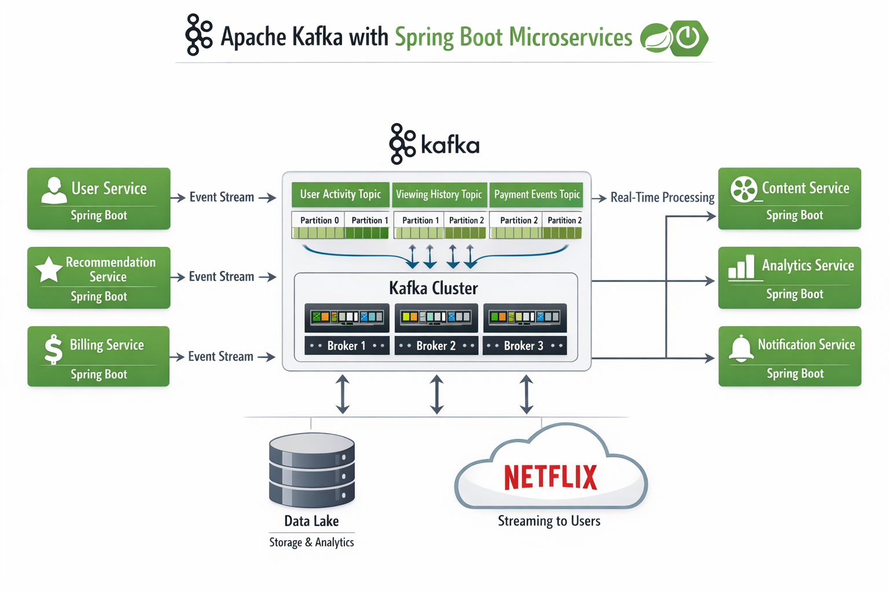

# Apache Kafka – Short Notes

---

## 1. Introduction

**Apache Kafka** is a distributed event-streaming platform used for building real-time data pipelines and streaming applications.

It allows applications to:
- Publish and subscribe to streams of records
- Store event data durably
- Process data in real time

Kafka is commonly used in microservices architectures and event-driven systems.

---

## 2. Core Concepts

### Producer
An application that sends (publishes) messages to a Kafka topic.

### Consumer
An application that reads (subscribes to) messages from a Kafka topic.

### Topic
A logical category or channel where messages are stored.

Example:
```java
user-events
order-service
payment-transactions
```


### Partition
- Each topic is divided into partitions.
- Enables parallel processing.
- Maintains ordering within a partition.
- Each record has a unique offset.

### Broker
A Kafka server that stores and serves data.  
A Kafka cluster consists of multiple brokers.

### Consumer Group
A group of consumers that work together to read from a topic in parallel.

---

## 3. Architecture Overview

```java
Producer → Topic (Partitioned) → Broker Cluster → Consumer Group
```


Data Flow:
1. Producer sends message to a topic.
2. Kafka stores it in partitions.
3. Consumers read messages using offsets.
4. Offsets track consumption progress.

---

## 4. Key Features

- High throughput
- Horizontal scalability
- Distributed and fault-tolerant
- Durable message storage
- Message ordering (within partition)
- Real-time stream processing

---

## 5. Important Components

| Component        | Purpose |
|------------------|----------|
| Kafka Broker     | Stores and manages data |
| ZooKeeper        | Cluster coordination (legacy) |
| KRaft            | ZooKeeper replacement in newer versions |
| Kafka Connect    | Integrates external systems |
| Kafka Streams    | Stream processing library |

---

## 6. Message Structure

Each Kafka record contains:

- Key (optional)
- Value (payload data)
- Offset
- Timestamp
- Partition ID

---

## 7. Delivery Guarantees

Kafka supports:
- At most once
- At least once
- Exactly once (with configuration)

---

## 8. Common Use Cases

- Event-driven microservices
- Log aggregation
- Real-time analytics
- Financial transaction systems
- Monitoring and IoT systems

---

## 9. Advantages

- Scalable
- Fault tolerant
- High performance
- Durable storage
- Enables event replay

---

## 10. Limitations

- Operational complexity in large clusters
- Ordering guaranteed only within partitions
- Requires proper monitoring and tuning

---

## Summary

Apache Kafka is a distributed, scalable, and fault-tolerant event streaming platform that enables real-time data processing and decoupled system communication using a publish-subscribe model.


------

# Traditional Messaging System vs Apache Kafka (Streaming Platform)

---

## 1️⃣ Traditional Messaging System

### Key Characteristics

- **Transient Message Persistence**
  - Messages are typically removed once consumed.
  - Not designed for long-term storage.

- **Broker Tracks Consumption**
  - Broker maintains which messages are delivered.
  - Keeps track of acknowledged messages.

- **Targets Specific Consumer**
  - Messages are delivered to a specific consumer.
  - Once consumed, other consumers cannot access the same message.

- **Not Fully Distributed**
  - Often centralized architecture.
  - Scaling can be limited.
  - Single point of failure risk (depending on implementation).

### Typical Examples
- Traditional message queues
- Request-response messaging systems

---

## 2️⃣ Apache Kafka – Streaming Platform

### Key Characteristics

- **Retention-Based Storage**
  - Events are stored based on configured retention time (e.g., 7 days).
  - Messages are not deleted immediately after consumption.

- **Immutable Events**
  - Once written, events cannot be modified.
  - Only appended (log-based architecture).

- **Consumer Tracks Offsets**
  - Kafka does not track consumed messages per consumer.
  - Each consumer maintains its own offset.
  - Enables replay of events.

- **Any Consumer Can Read**
  - Multiple consumers can read the same message independently.
  - Supports parallel processing using consumer groups.

- **Distributed Streaming System**
  - Runs as a distributed cluster.
  - Data replicated across brokers.
  - Highly scalable and fault tolerant.

---

## 3️⃣ Comparison Table

| Feature | Traditional Messaging | Apache Kafka |
|----------|----------------------|--------------|
| Message Storage | Temporary | Retention-based |
| Message Mutability | May be removed after read | Immutable |
| Consumption Tracking | Broker-managed | Consumer-managed (offset) |
| Message Access | One consumer | Multiple consumers |
| Scalability | Limited | Highly distributed |
| Replay Capability | No | Yes |

---

## 4️⃣ Summary

Traditional messaging systems focus on **message delivery**,  
while Apache Kafka focuses on **event streaming and durable log storage**.

Kafka enables:
- Event replay
- Multiple independent consumers
- High scalability
- Distributed fault-tolerant architecture

Kafka Terminology & Client APIs


- Kafka Cluster
- Kafka Broker
- Kafka Producers
- Kafka Consumers
- Source Connector
- Sink Connector
- DB
- File System
- Kafka Streams

- ProducerAPI
- ConsumerAPI
- ConnectAPI
- StreamsAPI

# Apache Kafka – Detailed Component Explanation

---

# 1️⃣ Core Kafka Infrastructure Components

---

## 1. Kafka Cluster

A **Kafka Cluster** is a group of multiple Kafka brokers working together.

### Purpose
- Distribute data across multiple servers
- Provide fault tolerance
- Ensure high availability
- Enable horizontal scalability

### How it works
- Topics are divided into partitions.
- Partitions are distributed across brokers.
- Partitions are replicated for fault tolerance.
- If one broker fails, another replica becomes leader.

### Key Concepts
- Leader partition
- Follower replicas
- Replication factor
- Controller node (manages cluster metadata)

---

## 2. Kafka Broker

A **Kafka Broker** is a single Kafka server instance.

### Responsibilities
- Store topic partitions
- Serve producer write requests
- Serve consumer read requests
- Replicate data to other brokers
- Maintain metadata about partitions

### Important
- Each broker has a unique ID.
- Brokers coordinate to form a cluster.
- Brokers do NOT track consumer state (consumers manage offsets).

---

## 3. Kafka Producers

A **Producer** is an application that publishes records to Kafka topics.

### Responsibilities
- Send data to specific topic
- Decide which partition to write to
- Optionally use message key for partitioning
- Handle retries and acknowledgments

### Producer Delivery Modes
- At most once
- At least once
- Exactly once (idempotent producer)

### Partitioning Strategy
- Round-robin
- Key-based hashing
- Custom partitioner

---

## 4. Kafka Consumers

A **Consumer** reads records from Kafka topics.

### Responsibilities
- Subscribe to topic(s)
- Poll for new messages
- Track offsets
- Process records

### Important Concept: Consumer Groups
- Consumers in same group share partitions
- Each partition is read by only one consumer in a group
- Enables parallel processing

### Offset Management
- Automatic commit
- Manual commit
- Stored in internal Kafka topic (__consumer_offsets)

---

# 2️⃣ Kafka Connect Ecosystem

---

## 5. Source Connector

A **Source Connector** imports data INTO Kafka from external systems.

### Examples
- Database → Kafka
- File system → Kafka
- REST API → Kafka

### Flow

```java
External System → Source Connector → Kafka Topic
```

### Example
Debezium CDC connector capturing DB changes and publishing to Kafka.

---

## 6. Sink Connector

A **Sink Connector** exports data FROM Kafka to external systems.

### Examples
- Kafka → Database
- Kafka → Elasticsearch
- Kafka → S3
- Kafka → File system

### Flow
```java
Kafka Topic → Sink Connector → External System
```

---

## 7. Database (DB)

Kafka integrates with databases in two ways:

### As Source
- Capture changes (CDC)
- Insert/Update/Delete events published to Kafka

### As Sink
- Consume events and persist them
- Used for materialized views

Common Databases:
- MySQL
- PostgreSQL
- MongoDB

---

## 8. File System

Kafka integrates with file systems:

### As Source
- Read log files
- Stream file updates

### As Sink
- Archive Kafka data to:
  - HDFS
  - Amazon S3
  - Local storage

Used for:
- Data lake
- Backup
- Analytics storage

---

# 3️⃣ Stream Processing

---

## 9. Kafka Streams

Kafka Streams is a **Java library** for building real-time stream processing applications.

### Characteristics
- Lightweight library (not a separate cluster)
- Runs inside your Spring Boot app
- Processes records in real time

### Capabilities
- Filtering
- Mapping
- Aggregation
- Windowing
- Joins
- Stateful processing

### Example Flow
```java
Input Topic → Kafka Streams App → Output Topic

```


---

# 4️⃣ Kafka APIs

---

## 10. Producer API

Used to publish messages to Kafka.

### Key Classes
- KafkaProducer
- ProducerRecord

### Features
- Async and sync send
- Acknowledgment configuration
- Compression support
- Transactions support

---

## 11. Consumer API

Used to read messages from Kafka.

### Key Classes
- KafkaConsumer

### Features
- Subscribe to topics
- Poll records
- Commit offsets
- Rebalance handling

---

## 12. Connect API

Used for building connectors.

### Purpose
- Define reusable connectors
- Handle data movement
- Scalable integration framework

Supports:
- Distributed mode
- Standalone mode

---

## 13. Streams API

Used for stream processing.

### Core Concepts
- KStream
- KTable
- GlobalKTable
- Topology

### Operations
- map()
- filter()
- groupBy()
- aggregate()
- join()

---

# 5️⃣ Overall Architecture Summary

```java
[ DB / File System ]
↓
Source Connector
↓
Kafka Cluster
↓
Producers & Consumers
↓
Kafka Streams App
↓
Sink Connector
↓
[ DB / File System / Analytics ]

```


---

# Final Understanding

Kafka is not just a message broker.

It is:

- A distributed commit log
- A streaming platform
- An integration backbone
- A real-time processing engine
- A scalable event-driven infrastructure