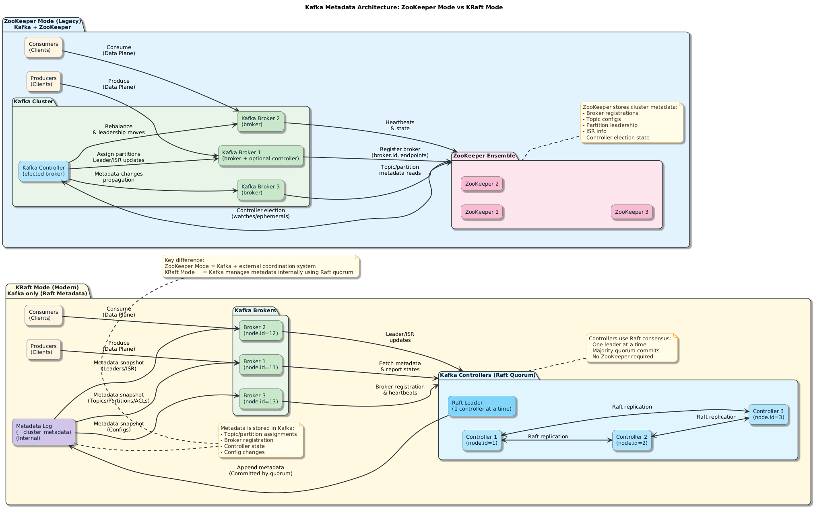

## Kafka Topics & Partitions

# Apache Kafka Topics – Detailed Explanation

---

# 1️⃣ What is a Kafka Topic?

A **Kafka Topic** is a logical category or channel where messages (events) are published and stored.

Think of a topic as a **named event log**.

Examples:

```java
user-signup-events
order-events
payment-transactions
video-stream-events
```


Producers write data to topics.  
Consumers read data from topics.

---

# 2️⃣ Topics are Distributed Logs

A Kafka topic is internally implemented as a **distributed, append-only log**.

Key characteristics:

- Messages are appended at the end.
- Messages are immutable (cannot be modified).
- Messages are ordered within a partition.
- Each message has a unique offset.

---

# 3️⃣ Topic Partitions

## What is a Partition?

Each topic is divided into one or more **partitions**.

Example:
```java
Topic: order-events

Partition 0
Partition 1
Partition 2

```


### Why Partitions?

- Enable parallel processing
- Improve scalability
- Distribute data across brokers
- Allow high throughput

---

## Ordering Guarantee

Kafka guarantees **ordering only within a partition**, not across partitions.

Example:

Partition 0:
```java
Offset 0 → Order A
Offset 1 → Order B
Offset 2 → Order C
```

This order is guaranteed.

---

# 4️⃣ Offsets in Topics

Each record in a partition has a unique **offset**.

Offset properties:

- Sequential number
- Assigned automatically
- Used by consumers to track progress
- Offset is unique only within a partition

Example:

```java
Partition 1:
Offset 0
Offset 1
Offset 2

```

Consumers store offsets to resume consumption.

---

# 5️⃣ Replication in Topics

For fault tolerance, partitions are replicated across brokers.

## Replication Factor

Defines how many copies of a partition exist.

Example:

```java
Replication Factor = 3
```

Means:
- 1 Leader
- 2 Followers

### Leader
- Handles reads and writes.

### Followers
- Replicate data from leader.
- Take over if leader fails.

---

# 6️⃣ Topic Retention Policy

Kafka does NOT delete messages after consumption.

Messages are retained based on:

- Time (e.g., 7 days)
- Size (e.g., 100 GB)
- Log compaction

---

## Time-Based Retention

Example:
```java
retention.ms = 604800000 (7 days)
```

Messages older than 7 days are deleted.

---

## Size-Based Retention

```java
retention.bytes = 10737418240 (10 GB)
```

If log size exceeds limit, older messages are removed.

---

## Log Compaction

Instead of deleting old messages:

- Keeps latest value per key.
- Useful for state updates.

Used in:
- Change Data Capture
- Configuration topics

---

# 7️⃣ Topic Configuration Parameters

Common configurations:

| Configuration | Purpose |
|--------------|----------|
| partitions | Number of partitions |
| replication.factor | Number of replicas |
| retention.ms | Time retention |
| retention.bytes | Size retention |
| cleanup.policy | delete / compact |
| min.insync.replicas | Minimum replicas required for write |

---

# 8️⃣ Creating a Topic

Using CLI:

```java
kafka-topics.sh --create
--topic order-events
--bootstrap-server localhost:9092
--partitions 3
--replication-factor 2
```

---

# 9️⃣ Topic Naming Best Practices

- Use lowercase
- Use hyphens
- Avoid spaces
- Use clear domain-based names

Good Examples:
```java
user-events
payment-transactions
inventory-updates
```

Bad Examples:
```java
Topic1
Test
Data
```

---

# 🔟 Topic Scalability

You can:

- Increase partitions (not decrease)
- Add brokers to cluster
- Increase replication factor (with caution)

Note:
Increasing partitions changes partition distribution and can affect ordering.

---

# 1️⃣1️⃣ Topic in Event-Driven Architecture

In microservices:

Example:

```java
User Service → user-created-topic
Order Service → order-created-topic
Payment Service → payment-completed-topic
```

Each service reacts to events via topics.

This enables:

- Loose coupling
- Asynchronous communication
- Replay capability
- Scalability

---

# 1️⃣2️⃣ Internal Kafka Topics

Kafka uses internal topics such as:

```java
__consumer_offsets
```

Used for:
- Storing consumer offsets
- Group management

---

# 1️⃣3️⃣ Summary

A Kafka Topic is:

- A distributed, partitioned, replicated log
- Append-only and immutable
- Scalable and fault tolerant
- Retention-based (not queue-based)
- Core abstraction in Kafka architecture

Topics enable high-throughput, event-driven, real-time systems.


------
# Apache Kafka Metadata Management  
## ZooKeeper vs KRaft — Detailed Notes

---

# 🟢 ZooKeeper Mode (Legacy Architecture)

## 1️⃣ What is ZooKeeper?

**Apache ZooKeeper** is a distributed coordination system used by Kafka (historically) to manage:

- Broker metadata
- Controller election
- Topic configurations
- Partition leadership
- Cluster state

Kafka depended on ZooKeeper as an **external coordination service**.

---

## 2️⃣ How ZooKeeper Works with Kafka

### Architecture

```java
Kafka Brokers ←→ ZooKeeper Ensemble (3 or 5 nodes)
```


ZooKeeper stores:
- Broker IDs
- Topic metadata
- Partition assignment
- ISR (In-Sync Replica) info
- Controller election data

---

## 3️⃣ Controller Election (ZooKeeper Mode)

1. Brokers register with ZooKeeper.
2. One broker becomes **controller**.
3. ZooKeeper watches for failures.
4. If controller dies → ZooKeeper triggers new election.

ZooKeeper is the authority.

---

## 4️⃣ Required Components

| Component | Purpose |
|------------|----------|
| ZooKeeper Ensemble (3–5 nodes) | Metadata + coordination |
| Kafka Brokers | Data storage + message handling |

---

## 5️⃣ Configuration Example (ZooKeeper Mode)

```properties
zookeeper.connect=localhost:2181
broker.id=1
```
No controller quorum config.
No cluster ID required.


## 6️⃣ Advantages

| Advantage        | Explanation                  |
| ---------------- | ---------------------------- |
| Proven system    | Used in production for years |
| Stable           | Mature ecosystem             |
| Clear separation | Metadata outside Kafka       |


## 7️⃣ Limitations
| Limitation           | Explanation                      |
| -------------------- | -------------------------------- |
| Extra dependency     | Must manage ZooKeeper cluster    |
| Operational overhead | Monitor 2 distributed systems    |
| Scaling complexity   | Metadata bottleneck              |
| Higher latency       | Metadata round-trip to ZooKeeper |
| Harder upgrades      | Coordination between Kafka & ZK  |

---
# 🔵 KRaft Mode (Modern Architecture)

KRaft = **Kafka Raft Metadata mode**

Introduced to remove ZooKeeper completely.

## 1️⃣ What is KRaft?

KRaft replaces ZooKeeper with:

> An internal Raft-based consensus system inside Kafka.

Kafka now manages its own metadata using a **metadata log**.

## 2️⃣ Architecture

```
Kafka Controllers (Raft quorum)
            ↓
Kafka Brokers

```
Controllers form a **Raft quorum**.
Metadata is stored in an internal Kafka topic-like log.

No ZooKeeper required.

## 3️⃣ Process Roles

Kafka nodes can run as:

| Role              | Purpose                           |
| ----------------- | --------------------------------- |
| broker            | Handles client traffic            |
| controller        | Manages metadata quorum           |
| broker,controller | Combined node (dev/small cluster) |

## 4️⃣ Required Configuration (KRaft)
```properties
process.roles=broker,controller
node.id=1
controller.quorum.voters=1@kafka1:9093
cluster.id=generated-id
```

ZooKeeper config is NOT used.

## 5️⃣ How Controller Election Works (KRaft)

1. Controllers form a Raft quorum.
2. One becomes leader.
3. Metadata changes written to Raft log.
4. Majority quorum required for commit.

Consensus handled natively by Kafka.

## 6️⃣ Advantages

| Advantage              | Explanation                  |
| ---------------------- | ---------------------------- |
| No external dependency | Simpler architecture         |
| Lower latency          | Metadata handled internally  |
| Easier deployment      | Fewer components             |
| Better scalability     | Designed for modern clusters |
| Cleaner upgrades       | Single system management     |

## 7️⃣ Operational Improvements

| Area                  | Improvement in KRaft  |
| --------------------- | --------------------- |
| Monitoring            | Only Kafka to monitor |
| Backup                | Single system         |
| Failure recovery      | Faster                |
| Cloud-native support  | Much better           |
| Kubernetes deployment | Simplified            |


### 🟡 ZooKeeper vs KRaft — Direct Comparison
| Feature               | ZooKeeper Mode  | KRaft Mode         |
| --------------------- | --------------- | ------------------ |
| External dependency   | Yes             | No                 |
| Metadata storage      | ZooKeeper       | Kafka internal log |
| Controller election   | ZooKeeper-based | Raft-based         |
| Cluster ID required   | No              | Yes                |
| Production future     | Deprecated      | Recommended        |
| Deployment complexity | Higher          | Lower              |
| Architecture          | Two systems     | One system         |

### 🔴 Why ZooKeeper is Being Removed

Reasons:
- Architectural complexity
- Operational burden
- Scaling limitations
- Separate upgrade cycles
- Modern distributed systems prefer Raft consensus

Kafka roadmap removes ZooKeeper entirely in future major releases.

### 🧠 Conceptual Mental Model
**ZooKeeper Mode**

Kafka depends on an external coordinator.
```
Kafka → ZooKeeper → Metadata decisions
```
**KRaft Mode**

Kafka manages itself using Raft consensus.
```code
Kafka Controllers → Raft Log → Metadata
```
### 🚀 Recommended Practice
| Scenario                    | Recommendation       |
| --------------------------- | -------------------- |
| New project                 | Use KRaft            |
| Learning modern Kafka       | Learn KRaft          |
| Legacy system maintenance   | Understand ZooKeeper |
| Cloud/Kubernetes deployment | Use KRaft            |


### 📌 Final Takeaway
- ZooKeeper mode = Legacy coordination model
- KRaft mode = Native Kafka self-managed consensus model
- Modern Kafka architecture **= KRaft**

For system design going forward, always choose **KRaft mode**.

# Apache Kafka: ZooKeeper vs KRaft (Summary Tables)

---

# 1️⃣ High-Level Architecture Difference

| Feature | ZooKeeper Mode | KRaft Mode |
|----------|----------------|------------|
| Metadata storage | Stored in ZooKeeper | Stored inside Kafka itself |
| External dependency | Requires ZooKeeper cluster | No external dependency |
| Architecture complexity | 2 distributed systems (Kafka + ZK) | Single distributed system |
| Introduced | Original Kafka design | Modern Kafka (production-ready from 3.x) |
| Operational overhead | Higher | Lower |
| Future direction | Deprecated | Official future of Kafka |

---

# 2️⃣ Component Structure

| Aspect | ZooKeeper Mode | KRaft Mode |
|---------|----------------|------------|
| Metadata manager | ZooKeeper | Kafka Controller quorum |
| Leader election | ZooKeeper handles it | Built-in Raft consensus |
| Controller | Selected via ZooKeeper | Dedicated KRaft controller |
| Cluster ID | Optional concept | Mandatory |
| Startup requirement | ZooKeeper must start first | Kafka starts independently |

---

# 3️⃣ Deployment Comparison

| Deployment Type | ZooKeeper Mode | KRaft Mode |
|----------------|----------------|------------|
| Single-node dev setup | Kafka + ZooKeeper container | Kafka only |
| Multi-node cluster | Kafka brokers + ZooKeeper ensemble | Kafka brokers + controller quorum |
| Minimum nodes for production | 3 ZK + 3 brokers | 3 controllers + brokers |
| Docker compose complexity | Higher | Simpler |

---

# 4️⃣ Networking & Roles

| Concept | ZooKeeper Mode | KRaft Mode |
|----------|---------------|------------|
| Inter-broker communication | Yes | Yes |
| Controller role | Broker elected via ZK | Explicit role (`broker`, `controller`) |
| Controller quorum | ZooKeeper ensemble | `KAFKA_CONTROLLER_QUORUM_VOTERS` |
| Required config flags | `zookeeper.connect` | `KAFKA_PROCESS_ROLES`, `KAFKA_NODE_ID`, `CLUSTER_ID` |

---

# 5️⃣ Configuration Differences

| ZooKeeper Config | KRaft Equivalent |
|------------------|------------------|
| `zookeeper.connect=localhost:2181` | ❌ Not used |
| No `process.roles` | `KAFKA_PROCESS_ROLES=broker,controller` |
| No `node.id` | `KAFKA_NODE_ID=1` |
| No controller quorum voters | `KAFKA_CONTROLLER_QUORUM_VOTERS=1@kafka1:9093` |
| No cluster id required | `CLUSTER_ID=...` required |

---

# 6️⃣ Performance & Scalability

| Factor | ZooKeeper Mode | KRaft Mode |
|---------|---------------|------------|
| Metadata latency | Higher (external round-trip) | Lower (internal log) |
| Scaling metadata | Limited by ZK | Better horizontal scaling |
| Failover speed | Slower | Faster |
| Controller stability | Depends on ZK | Native Raft consensus |
| Large cluster support | Good but complex | Designed for better scalability |

---

# 7️⃣ Operational Complexity

| Area | ZooKeeper Mode | KRaft Mode |
|-------|---------------|------------|
| Monitoring | Monitor Kafka + ZooKeeper | Monitor Kafka only |
| Backup strategy | ZK + Kafka | Kafka only |
| Debugging issues | Two systems to inspect | Single system |
| Rolling upgrades | More complex | Simpler |
| Learning curve | Higher | Lower |

---

# 8️⃣ Production Recommendation

| Environment | Recommended Mode |
|-------------|------------------|
| Legacy clusters | ZooKeeper (if already running) |
| New deployments | ✅ KRaft |
| Cloud-native | ✅ KRaft |
| Microservices architecture | ✅ KRaft |
| Modern Kafka (3.5+) | ✅ KRaft only |

---

# 9️⃣ Quick Mental Model

| ZooKeeper Mode | KRaft Mode |
|----------------|------------|
| Kafka depends on ZooKeeper | Kafka manages itself |
| Two distributed systems | One distributed system |
| External metadata store | Internal metadata log |
| More moving parts | Cleaner architecture |

---

# 🔟 Final Summary

| Question | Answer |
|----------|--------|
| Is ZooKeeper still required? | ❌ No (in modern Kafka) |
| Is KRaft production ready? | ✅ Yes |
| Is ZooKeeper deprecated? | Yes (removal planned in future versions) |
| Should new systems use ZooKeeper? | ❌ No |
| Should you learn KRaft? | ✅ Absolutely |

---

# Core Takeaway

> ZooKeeper mode = Old architecture  
> KRaft mode = Modern, simplified, self-managed Kafka architecture  

For new system design, always choose **KRaft**.



# Kafka Controller — Detailed Notes

## 1️⃣ What is a Kafka Controller?

The **Kafka Controller** is a special broker (or dedicated node in KRaft mode) responsible for:

> Managing cluster metadata and coordinating partition leadership.

It does **not** handle normal message traffic (produce/consume).  
It manages the control plane, not the data plane.

---

# 2️⃣ Control Plane vs Data Plane

| Plane | Responsibility |
|--------|---------------|
| Data Plane | Producers send messages, Consumers read messages |
| Control Plane | Cluster coordination, metadata updates, leader election |

The controller operates in the **control plane**.

---

# 3️⃣ What Does the Controller Actually Do?

| Responsibility | Explanation |
|---------------|-------------|
| Broker registration | Tracks which brokers are alive |
| Partition leader election | Chooses which broker leads each partition |
| ISR management | Maintains in-sync replica list |
| Topic creation | Assigns partitions & replicas |
| Metadata updates | Propagates changes across cluster |
| Broker failure handling | Reassigns leadership if broker dies |

---

# 4️⃣ Controller in ZooKeeper Mode (Legacy)

## How It Works

- All brokers register in ZooKeeper.
- ZooKeeper elects one broker as controller.
- That broker becomes the controller.
- If it crashes → ZooKeeper elects another.

### Architecture
Kafka Brokers → ZooKeeper → Controller elected


Controller depends on ZooKeeper for election and state tracking.

---

# 5️⃣ Controller in KRaft Mode (Modern)

In KRaft mode:

- Controllers form a **Raft quorum**
- One becomes the **Raft leader**
- Metadata is stored in Kafka’s internal metadata log
- No ZooKeeper involved

### Roles

```properties
process.roles=broker,controller
```

or

```properties
process.roles=controller
```

# 6️⃣ Controller Election — Simplified
**ZooKeeper Mode**
1. Brokers register in ZooKeeper.
2. ZooKeeper selects one broker.
3. That broker acts as controller.

**KRaft Mode**
1. Controllers form quorum.
2. Raft election happens.
3. One controller becomes leader.
4. Majority quorum required for commit.

# 7️⃣ Partition Leadership Example

Suppose:

- Topic: orders
- 3 partitions
- 3 brokers


Controller decides:
| Partition | Leader   | Replicas |
| --------- | -------- | -------- |
| 0         | Broker 1 | 1,2,3    |
| 1         | Broker 2 | 1,2,3    |
| 2         | Broker 3 | 1,2,3    |

If Broker 1 crashes:
- Controller elects new leader for partition 0
- Updates metadata
- Notifies cluster

# 8️⃣ Important Clarification

The controller is:
- Not a separate Kafka product
- Not a separate process (unless configured that way)
- Just a role assigned to a Kafka node

# 9️⃣ Single Broker Case (Your Docker Setup)

You configured:
```properties
process.roles=broker,controller
node.id=1
```

Meaning:
- The same node handles data traffic
- The same node manages metadata
- No distributed election required (single-node)

# 🔟 Why Controller Is Critical

Without controller:
- No partition leader assignment
- No topic creation
- No metadata updates
- No cluster coordination

The cluster becomes unusable.

## 🧠 Mental Model

Think of Kafka like a company:
| Component  | Role                                          |
| ---------- | --------------------------------------------- |
| Producers  | Customers placing orders                      |
| Consumers  | Customers reading orders                      |
| Brokers    | Warehouses storing goods                      |
| Controller | Operations manager assigning responsibilities |

The controller decides:
- Which warehouse handles which product
- What happens if a warehouse fails
- How responsibilities shift

# Final Definition

> The Kafka Controller is the cluster coordinator responsible for metadata management, partition leadership decisions, and broker state tracking.

It runs:
- Via ZooKeeper (legacy mode)
- Via Raft quorum (KRaft mode, modern)

For modern architecture, the controller is part of the KRaft consensus system.


PPT 27 :Kafka Message•Kafka Message these sent from producer has two properties•Key (optional)•Value


Consumer Offsets [diagram]

group.id=group1
-consumer_offsets 


Consumer Groups [diagram]

Commit Log & Retention Policy  [diagram]


Kafka  as a  Distributed Streaming System [diagram]

Availability and Fault Tolerance•Reliable Work Distribution•Easily Scalable•Handling Concurrency is fairly easySystem 1System 2System 3ClientClientSystem 4


=======
How Topics are distributed?