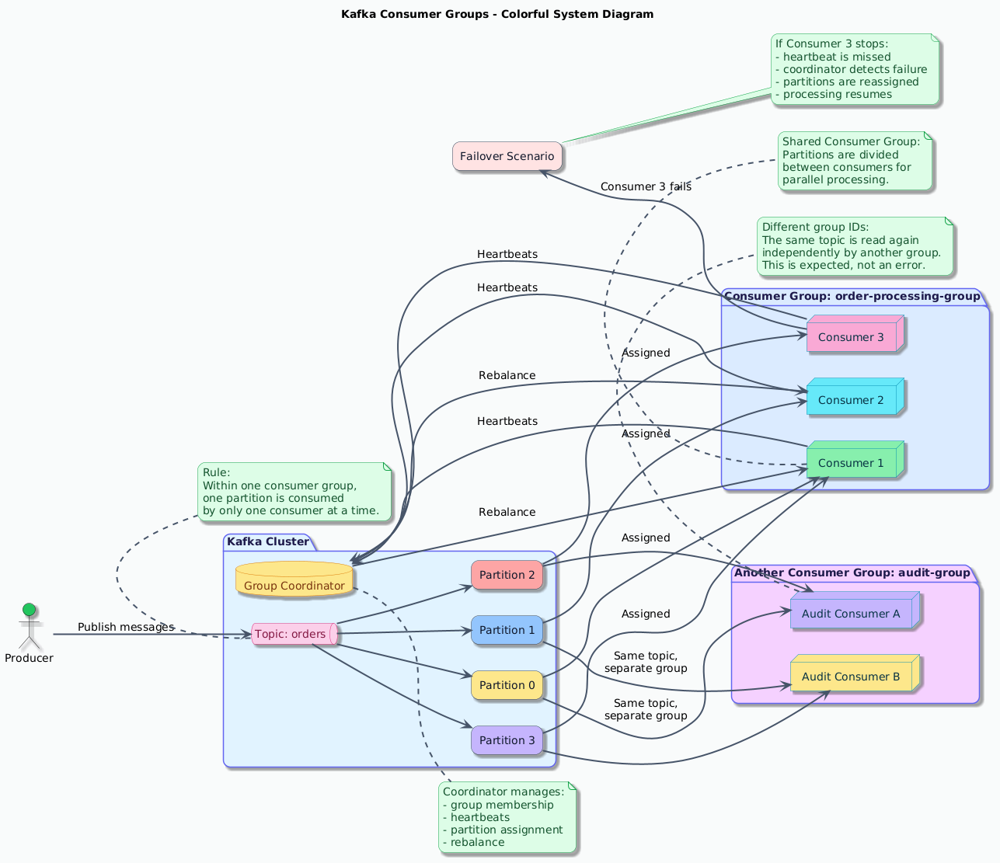
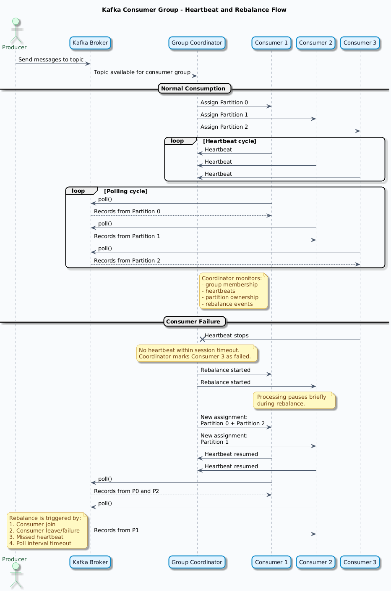
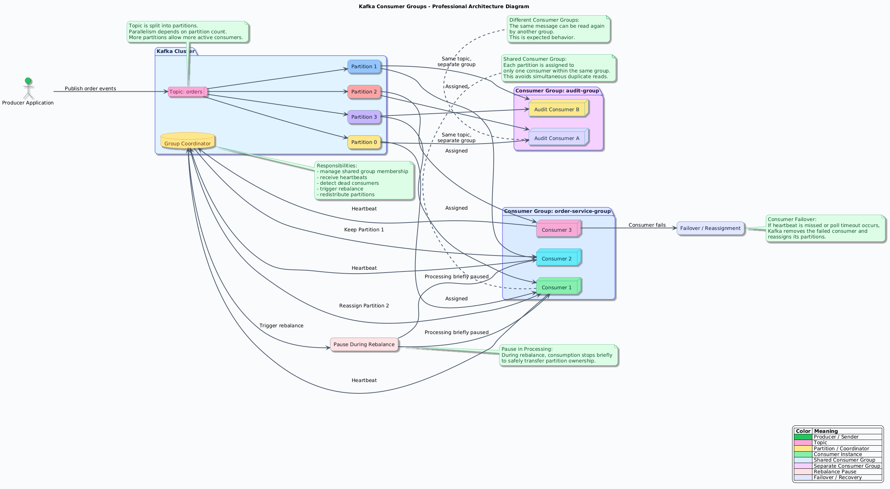

https://github.com/lydtechconsulting/introduction-to-kafka-with-spring-boot/tree/09-consumer-groups

# Consumer Groups (Kafka) — Explanation

Consumer Groups in Apache Kafka allow multiple consumers to work together to read messages from a topic.  
They provide **high throughput**, **parallel processing**, and **fault tolerance**.

---

## 1. Throughput

Throughput means how fast messages can be consumed from Kafka.

### ▸ Multiple Consumers
- A consumer group can have many consumers.
- Kafka distributes partitions of a topic among consumers.
- Each partition is read by only one consumer in the group.

Example:
Topic → 3 partitions  
Consumer Group → 3 consumers  

Result:
- Consumer1 → Partition1
- Consumer2 → Partition2
- Consumer3 → Partition3

✔ Faster processing  
✔ Load shared between consumers

---

### ▸ Parallel Processing
- Since partitions are processed by different consumers,
- Messages can be processed at the same time.

Benefits:
- Faster execution
- Better performance
- Scalable system

Example:

Partition1 → Consumer1
Partition2 → Consumer2
Partition3 → Consumer3


All consumers run in parallel.

---

## 2. Fault Tolerance

Fault tolerance means Kafka can recover if a consumer fails.

Kafka uses:
- Heartbeat
- Poll interval
- Consumer rebalance

---

### ▸ Heartbeat
- Consumers send heartbeat to Kafka broker.
- Heartbeat tells Kafka → "I am alive".

If heartbeat stops:
- Kafka thinks consumer is dead.

Example:

Consumer → heartbeat → Broker
Consumer → heartbeat → Broker
(no heartbeat)
Broker → consumer failed


---

### ▸ Poll Interval
Poll interval = time between calls to `poll()` method.

Consumer must call:

poll()


within a configured time.

If not:
- Kafka assumes consumer is stuck
- Consumer removed from group

Important config:

max.poll.interval.ms


---

### ▸ New Consumer
When a new consumer joins the group:

Kafka does **rebalance**

Rebalance means:
- Partitions redistributed
- Load shared again

Example:

Before:

Consumer1 → P1, P2
Consumer2 → P3


New consumer joins:

After rebalance:

Consumer1 → P1
Consumer2 → P2
Consumer3 → P3


✔ Better load balancing

---

### ▸ Dead Consumer
Dead consumer = consumer crashed / stopped

Kafka detects using:
- Missing heartbeat
- Poll timeout

Then Kafka:
- Removes dead consumer
- Reassigns partitions

Example:

Before:

Consumer1 → P1
Consumer2 → P2
Consumer3 → P3


Consumer2 dies

After rebalance:

Consumer1 → P1, P2
Consumer3 → P3


✔ No message loss  
✔ Processing continues

---

### ▸ Lost Consumer
Lost consumer = consumer alive but not responding correctly

Reasons:
- Long processing
- poll() not called
- Network issue
- GC pause
- Thread blocked

Kafka thinks consumer failed → rebalance happens

Config related:

session.timeout.ms
heartbeat.interval.ms
max.poll.interval.ms

# Consumer Groups — Scaling, Heartbeating, Rebalancing (Kafka)

This section explains important concepts of Kafka Consumer Groups related to  
**Scaling, Heartbeating, and Rebalancing**.

---

## 1. Scaling

Scaling means increasing the ability of the system to process more messages.

Kafka allows scaling using **consumer groups**.

### How scaling works
- A topic has multiple partitions
- Each partition can be consumed by only one consumer in a group
- More consumers = more parallel processing

Example

Topic → 4 partitions  
Consumer Group → 2 consumers  


Consumer1 → P1, P2
Consumer2 → P3, P4


Add one more consumer


Consumer1 → P1
Consumer2 → P2
Consumer3 → P3
Consumer4 → P4


✔ Higher throughput  
✔ Parallel processing  
✔ Better performance

Rule:

Number of active consumers ≤ Number of partitions


---

## 2. Heartbeating

Heartbeating is how Kafka checks if a consumer is alive.

Each consumer sends heartbeat messages to the broker.


Consumer → Heartbeat → Broker
Consumer → Heartbeat → Broker


If heartbeat stops:
- Broker assumes consumer failed
- Rebalancing starts

Important configs


heartbeat.interval.ms
session.timeout.ms


Meaning

| Config | Meaning |
|--------|---------|
| heartbeat.interval.ms | How often heartbeat sent |
| session.timeout.ms | Time broker waits before marking dead |

Example


heartbeat.interval.ms = 3s
session.timeout.ms = 10s


If no heartbeat for 10s → consumer removed

---

## 3. Rebalancing

Rebalancing happens when consumer group changes.

Kafka redistributes partitions between consumers.

Rebalance happens when:

- New consumer joins
- Consumer dies
- Consumer stops polling
- Partition count changes

During rebalance:
- Processing pauses
- Partitions reassigned
- Consumers resume

---

## 3.1 Heartbeat (in rebalancing)

Heartbeat failure can trigger rebalance.

If consumer does not send heartbeat:


Broker → consumer lost
→ start rebalance


Reasons heartbeat stops:

- Crash
- Network issue
- Long processing
- Thread blocked

---

## 3.2 Polling Interval

Consumer must call


poll()


regularly.

Kafka expects poll within:


max.poll.interval.ms


If poll not called in time:

- Kafka thinks consumer stuck
- Consumer removed
- Rebalance starts

Example


max.poll.interval.ms = 5 min


If consumer takes longer → rebalance

Common cause:
- Long business logic
- Blocking code
- Slow DB call

---

## 3.3 Rebalancing Strategy

Strategy decides how partitions are reassigned.

Kafka supports different strategies.

### Range Strategy (default)

Partitions assigned in order.

Example

Partitions: P0 P1 P2 P3  
Consumers: C1 C2


C1 → P0 P1
C2 → P2 P3


---

### Round Robin Strategy

Partitions assigned one by one.


C1 → P0
C2 → P1
C1 → P2
C2 → P3


Better balance.

---

### Sticky Strategy

Keeps previous assignment if possible.

✔ Less movement  
✔ Faster rebalance  
✔ Less pause

Best for production.

Config


partition.assignment.strategy


---

## 3.4 Pause in Processing

During rebalance:


Consumers stop reading
Partitions reassigned
Consumers start again


So there is a short pause.

Flow

```bash

Consumer joins/leaves
↓
Rebalance start
↓
Processing paused
↓
Partitions reassigned
↓
Processing resumes
```

Why pause is needed:

- Avoid duplicate reads
- Avoid message loss
- Keep correct offsets

Important note

Rebalance should be fast  
Too many rebalances = bad performance

---

## Summary


| Feature | Meaning |
|--------|---------|
| Consumer Group | Group of consumers reading same topic |
| Throughput | Multiple consumers increase speed |
| Parallel Processing | Partitions processed at same time |
| Heartbeat | Consumer sends alive signal |
| Poll Interval | Consumer must poll regularly |
| New Consumer | Rebalance happens |
| Dead Consumer | Removed, partitions reassigned |
| Lost Consumer | Timeout → rebalance |
| Scaling | More consumers = more parallel processing |
| Heartbeating | Consumer sends alive signal |
| Rebalancing | Redistribute partitions |
| Heartbeat failure | Causes rebalance |
| Poll interval | Consumer must poll regularly |
| Rebalancing strategy | How partitions reassigned |
| Pause in processing | Happens during rebalance |


---

## Key Idea

Consumer Group provides

✔ Scaling  
✔ Fault tolerance  
✔ Load balancing  
✔ Automatic recovery  
✔ Safe processing


---


=======

Consumer Group Exercise
- Shared consumer Group
- Consumer Failover
- Duplicate Consumption

# Consumer Group Exercise — Shared Group, Failover, Duplicate Consumption

This exercise explains how Kafka Consumer Groups behave in real scenarios:
- Shared Consumer Group
- Consumer Failover
- Duplicate Consumption

These are very important to understand how Kafka handles load balancing and failures.

---

## 1. Shared Consumer Group

When multiple consumers use the **same group.id**, they form one consumer group.

All consumers in the same group share the partitions.

Rule:

One partition → one consumer (inside a group)


Example

Topic → 3 partitions  
Group → order-group  
Consumers → C1, C2


C1 → P0
C2 → P1, P2


Messages are shared between consumers.

✔ Load balancing  
✔ Parallel processing  
✔ No duplicate messages inside group

Important


spring.kafka.consumer.group-id=order-group


If group id is same → shared consumption

---

## 2. Consumer Failover

Failover means when one consumer dies, another consumer takes over.

Kafka detects failure using:

- Heartbeat
- Session timeout
- Poll timeout

Example

Before failure


C1 → P0
C2 → P1
C3 → P2


C2 crashes

Kafka rebalances

After rebalance


C1 → P0, P1
C3 → P2


✔ No message lost  
✔ Processing continues  
✔ Automatic recovery

This is called **Consumer Failover**

Flow
```bash

Consumer dies
↓
Heartbeat missing
↓
Broker detects failure
↓
Rebalance
↓
Partitions reassigned
```

Configs related


session.timeout.ms
heartbeat.interval.ms
max.poll.interval.ms


---

## 3. Duplicate Consumption

Duplicate consumption happens when the same message is read more than once.

This can happen in some situations.

### Case 1 — Different Consumer Groups

If consumers use different group ids,
each group reads all messages.

Example

Group A


A1 → P0
A2 → P1


Group B


B1 → P0
B2 → P1


Result

Message is consumed twice.

✔ Expected behavior

Kafka rule:


Different group → separate consumption
Same group → shared consumption


---

### Case 2 — Rebalance before commit

If consumer processes message but offset not committed,
rebalance may cause reprocessing.

Flow


Consumer reads message
Processing not finished
Rebalance happens
New consumer reads same message again


Result

Duplicate processing.

Reason


Offset not committed yet


---

### Case 3 — Manual commit error

If using manual commit and commit fails.


enable.auto.commit=false


If commit not done


Message read again


---

### Case 4 — Crash after processing


Process message
Crash before commit
Restart
Message read again


Kafka guarantees


At least once delivery


So duplicates are possible.

---

## How to avoid duplicate problems

Use

- Idempotent processing
- Unique message id
- Database check
- Exactly-once (advanced)

Example

```java
if (alreadyProcessed(id)) {
skip
}
```

---

## Summary

| Topic | Meaning |
|--------|---------|
| Shared Consumer Group | Consumers share partitions |
| Same group id | Load balanced consumption |
| Consumer Failover | Dead consumer replaced automatically |
| Rebalance | Happens when consumer joins/leaves |
| Duplicate Consumption | Message read more than once |
| Different groups | Each group gets all messages |
| No commit | Message read again |
| Crash before commit | Duplicate processing |

---

## Key Idea

Consumer Group gives

✔ Load balancing  
✔ Failover  
✔ Scalability  
✔ Fault tolerance  

But Kafka guarantees


Monitor tool for Kafka

--- 



### What this diagram shows

- **Producer** sends messages to the **orders** topic.
- The topic has **4 partitions**.
- Inside **one consumer group**, partitions are split across consumers.
- This gives **parallel processing** and **scaling**.
- The **Group Coordinator** handles:
    - membership
    - heartbeat checks
    - rebalance
    - failover
- A **different consumer** group can read the same topic independently.
- If one consumer fails, Kafka does **failover + rebalance**.

### Quick meaning of each part

**Shared consumer group**

Consumers `C1`, `C2`, and `C3` are in the same group, so they share the partitions.

**Heartbeating**

Each consumer sends heartbeat messages to the coordinator to say, **"I am alive."**

**Rebalancing**

If a new consumer joins or one fails, `Kafka` redistributes partitions.

**Duplicate consumption**

Inside the **same group**, duplicates do not normally happen for the same partition at the same time.
Across **different groups**, the same message is consumed again, which is normal.

# Kafka Consumer Groups — Professional PlantUML Diagrams

Below are **two colorful PlantUML diagrams**:

1. **Sequence Diagram** for heartbeat and rebalance flow  
2. **Professional System Diagram** with remarks and color legend

---

## 1. Sequence Diagram — Heartbeat and Rebalance Flow



## 2. Professional System Diagram — Consumer Groups with Remarks and Color Legend



------


# Testing:

##  Testing Notes — Shared Consumer Kafka Consumer Group Behavior

## 1. Start Two Application Instances

Run two instances of the same Spring Boot application to observe consumer group behavior.

### Run first application (App)

```bash
mvn spring-boot:run
```
Console output:
```bash
dispatch.order.created.consumer: partitions assigned: []
```
Comment:
- No partition assigned yet.
- Consumer is waiting for partition assignment.

### Run second application (App2)
```bash
mvn spring-boot:run
```

Console output:
```bash
dispatch.order.created.consumer: partitions assigned: [order.created-0]
```
Comment:
- Topic currently has only **one partition**
- Kafka assigns the partition to only **one consumer in the group**
- Other consumer remains idle

Important note:
> In a consumer group, one partition can be consumed by only one consumer.

Check logs carefully:
- Each application instance has a different client id
- Both share the same group id
- Partition assigned to only one consumer

### 2. Run Kafka Console Consumer

Use console consumer to monitor messages from the output topic.

```bash
kafka-console-consumer \
--bootstrap-server localhost:9092 \
--topic order.dispatched
```

Comment:
- This consumer listens to dispatched orders
- Useful to verify processing result

### 3. Run Kafka Console Producer

Send test message to input topic.
```bash
kafka-console-producer \
--bootstrap-server localhost:9092 \
--topic order.created
```
Send message:
```json
{"orderId":"550e8400-e29b-41d4-a716-446655440000","item":"book-5"}
```
Comment:
- Message is produced to `order.created`
- Only one consumer in the group processes it
- Result should appear in `order.dispatched`

### 4. Observation
| Scenario           | Result                                |
| ------------------ | ------------------------------------- |
| One partition      | Only one consumer active              |
| Multiple consumers | Idle consumers if no extra partitions |
| Same group id      | Shared consumption                    |
| Different group id | Duplicate consumption                 |
| Console consumer   | Used for verification                 |
| Console producer   | Used for testing                      |


# Kafka Failover Consumer Failover ( Fault tolerance )

Testing:

Run 2 application: Stop it
- run Application (App1)
    mvn spring-boot:run

- run Application (App2)
    mvn spring-boot:run    
- Check in console at last there will find different group id


# Consumer running
- kafka-console-consumer --bootstrap-server localhost:9092 --topic order.dispatched

# Producer running
- kafka-console-producer --bootstrap-server localhost:9092 --topic order.created
>{"orderId":"550e8400-e29b-41d4-a716-446655440000","item":"book-6"} 


#  Kafka Duplicate Consumption


Testing:

Run 2 application:
- run Application (App1)
    mvn spring-boot:run

- Modify group id 
- https://github.com/lydtechconsulting/introduction-to-kafka-with-spring-boot/blob/09-consumer-groups/src/main/java/dev/lydtech/dispatch/handler/OrderCreatedHandler.java
- run Application (App2)
 groupId = "dispatch.order.created.consumer2",
    mvn spring-boot:run    
- Check in console at last there will find different group id


# Consumer running
- kafka-console-consumer --bootstrap-server localhost:9092 --topic order.dispatched

# Producer running
- kafka-console-producer --bootstrap-server localhost:9092 --topic order.created
>{"orderId":"550e8400-e29b-41d4-a716-446655440000","item":"book-7"} 

proceessByID

In both App1 and App2  both consumer accept with different processById. at the in both Application

