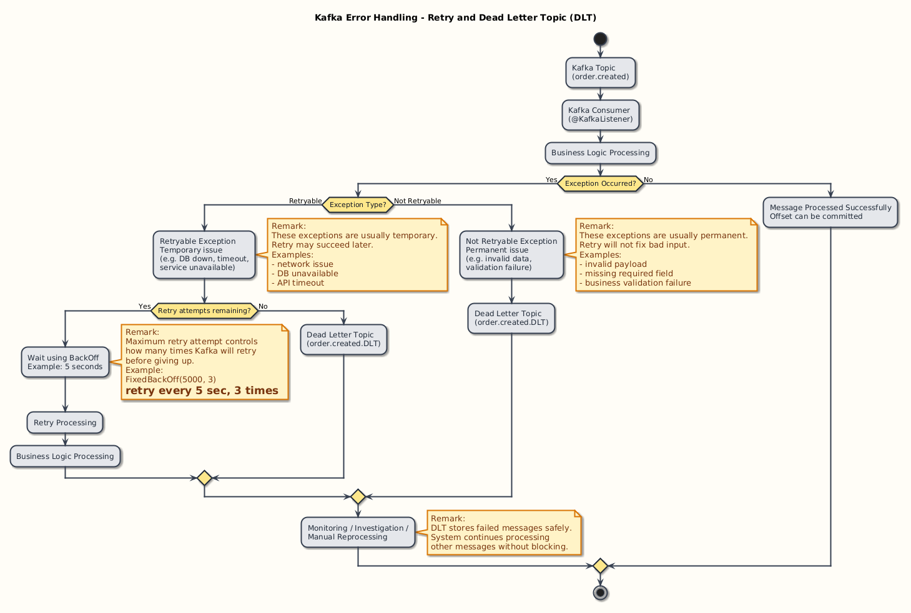
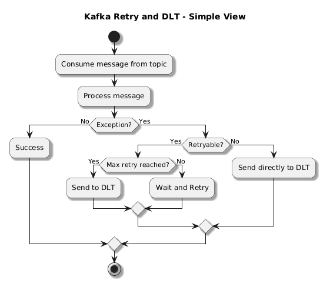

[Project](../projects/12_retry_dispatch/)

https://github.com/lydtechconsulting/introduction-to-kafka-with-spring-boot/tree/12-retry

# Kafka Error Handling — Retry & Dead Letter Topics (DLT)

Kafka error handling is about **what to do when message processing fails**.  
Instead of losing data or crashing consumers, Kafka (with frameworks like Spring Kafka) gives you controlled strategies:

- Retry the message
- Skip the message
- Send it to a Dead Letter Topic (DLT)

---

## 1. Core Flow (How Kafka Handles Errors)

| Step | What Happens |
|-----|-------------|
| 1 | Consumer reads a message |
| 2 | Processing logic runs |
| 3 | Exception occurs |
| 4 | Kafka decides: Retry OR Send to DLT |
| 5 | After retries exhausted → message goes to DLT |

---

## 2. Retry Mechanism

Retry means Kafka will **try processing the same message again**.

### ▸ Why Retry?
- Temporary failures
- External service down
- Network issues
- Timeout errors

---

### ▸ Retry Configuration (Spring Kafka Example)

| Config | Meaning |
|-------|--------|
| `FixedBackOff(5000, 3)` | Retry every 5 seconds, max 3 times |
| `DefaultErrorHandler` | Handles retry + failure logic |

Example:
```java
new DefaultErrorHandler(new FixedBackOff(5000, 3));
```

**▸ Retry Flow**

| Attempt            | Action           |
| ------------------ | ---------------- |
| 1st attempt        | Processing fails |
| Retry 1            | Wait → retry     |
| Retry 2            | Wait → retry     |
| Retry 3            | Wait → retry     |
| After max attempts | Send to DLT      |


✔ Controlled retries
✔ Avoids immediate failure

## 3. Dead Letter Topic (DLT)

DLT is a **separate Kafka topic** where failed messages are stored.

**▸ Purpose**
| Use Case   | Explanation             |
| ---------- | ----------------------- |
| Debugging  | Inspect failed messages |
| Recovery   | Reprocess later         |
| Monitoring | Track failure patterns  |


**▸ Naming Convention**
| Original Topic  | DLT Topic           |
| --------------- | ------------------- |
| `order.created` | `order.created.DLT` |


**▸ DLT Flow**
| Step                      | Description         |
| ------------------------- | ------------------- |
| Message fails all retries | Cannot be processed |
| Kafka sends to DLT        | Stored safely       |
| Consumer moves on         | No blocking         |


✔ No message loss
✔ System continues processing

## 4. Exception Categories

Kafka allows you to **classify exceptions** to decide behavior.

### 4.1 Not Retryable Exceptions

These are permanent failures. Retrying will not help.

**▸ Examples**
| Example                           | Reason        |
| --------------------------------- | ------------- |
| Validation error                  | Bad data      |
| Null pointer due to missing field | Data issue    |
| Illegal argument                  | Invalid input |


**▸ Behavior**
| Action               | Result                     |
| -------------------- | -------------------------- |
| No retry             | Skip retries               |
| Send directly to DLT | Immediate failure handling |


**▸ Configuration Example**
```java
errorHandler.addNotRetryableExceptions(NotRetryableException.class);
```

✔ Saves time
✔ Avoids useless retries

### 4.2 Retryable Exceptions

These are temporary failures. Retrying may succeed.

**▸ Examples**
| Example                     | Reason                |
| --------------------------- | --------------------- |
| Database connection failure | DB temporarily down   |
| Network timeout             | External service slow |
| Service unavailable (503)   | Temporary outage      |


**▸ Behavior**
| Action         | Result            |
| -------------- | ----------------- |
| Retry enabled  | Multiple attempts |
| If still fails | Send to DLT       |

**▸ Configuration Example**
```java
errorHandler.addRetryableExceptions(RetryableException.class);
```

✔ Improves reliability
✔ Handles transient issues

## 5. Maximum Retry Attempt

This defines **how many times Kafka retries before giving up**.

**▸ Configuration**

| Parameter         | Meaning               |
| ----------------- | --------------------- |
| `maxAttempts`     | Total retry count     |
| `backoffInterval` | Delay between retries |


Example:
```java
new FixedBackOff(5000, 3)
```
| Value | Meaning         |
| ----- | --------------- |
| 5000  | 5 seconds delay |
| 3     | Retry 3 times   |

**▸ Behavior Summary**
| Scenario                  | Outcome     |
| ------------------------- | ----------- |
| Retryable + attempts left | Retry       |
| Retryable + max reached   | Send to DLT |
| Not retryable             | Direct DLT  |


## 6. Complete Flow Summary

| Exception Type | Retry?            | DLT?              | Behavior                 |
| -------------- | ----------------- | ----------------- | ------------------------ |
| Retryable      | Yes               | After max retries | Temporary issue handling |
| Not Retryable  | No                | Immediate         | Skip retries             |
| Unknown        | Depends on config | Yes               | Usually retried first    |


## 7. Real Example Flow
| Step | Event                                 |
| ---- | ------------------------------------- |
| 1    | Message consumed from `order.created` |
| 2    | Processing fails (DB down)            |
| 3    | Retry 1 → fails                       |
| 4    | Retry 2 → fails                       |
| 5    | Retry 3 → fails                       |
| 6    | Sent to `order.created.DLT`           |


## 8. Key Best Practices

| Practice                     | Why                        |
| ---------------------------- | -------------------------- |
| Classify exceptions properly | Avoid unnecessary retries  |
| Use DLT                      | Never lose messages        |
| Keep retry count limited     | Prevent delays             |
| Monitor DLT topics           | Detect system issues early |


## 9. Key Idea

Kafka Error Handling =
✔ Retry for temporary failures
✔ Skip permanent failures
✔ Store failed messages in DLT
✔ Keep system stable and resilient

# Kafka Error Handling: Retry and DLT  
## Colourful  Diagram with Remarks

Use this image to explain **Retryable Exceptions**, **Not Retryable Exceptions**, **Maximum Retry Attempts**, and **DLT flow** in a clean visual way.


---


# WireMock — Overview

WireMock is a tool used to **mock (simulate) HTTP-based services** during development and testing.  
It allows you to test your application **without depending on real external APIs**.

---

## 1. What is WireMock?

| Item | Description |
|-----|-------------|
| Tool Type | HTTP mock server |
| Purpose | Simulate external APIs/services |
| Usage | Testing, development, integration testing |
| Protocol | HTTP / HTTPS |

✔ Acts like a fake API  
✔ Returns predefined responses  
✔ Helps isolate your system from real dependencies  

---

## 2. Why Use WireMock?

| Problem | Solution with WireMock |
|--------|------------------------|
| External API not available | Mock it |
| API is slow or unstable | Simulate fast responses |
| Testing edge cases is hard | Create custom responses |
| Cost of API calls | Avoid real API usage |

---

## 3. How WireMock Works

| Step | Description |
|-----|-------------|
| 1 | Start WireMock server |
| 2 | Define stub (request + response) |
| 3 | Application sends HTTP request |
| 4 | WireMock intercepts request |
| 5 | Returns mocked response |

---

## 4. Key Concepts

### ▸ Stub

| Item | Description |
|-----|-------------|
| Stub | Predefined request-response mapping |
| Purpose | Tell WireMock how to respond |

Example:
```json
{
  "request": {
    "method": "GET",
    "url": "/orders/1"
  },
  "response": {
    "status": 200,
    "body": "{ \"orderId\": 1 }"
  }
}
```

### ▸ Mock Server

| Item         | Description                  |
| ------------ | ---------------------------- |
| Mock Server  | WireMock runs as HTTP server |
| Default Port | 8080 (configurable)          |


### ▸ Verification

| Item     | Description                   |
| -------- | ----------------------------- |
| Verify   | Check if request was received |
| Use Case | Ensure API call happened      |


## 5. Types of Usage
| Type                | Description                |
| ------------------- | -------------------------- |
| Unit Testing        | Mock dependencies          |
| Integration Testing | Simulate external services |
| Contract Testing    | Validate API behavior      |
| Development         | Work without real backend  |


## 6. Example (Java + Spring Boot)

### ▸ Dependency
```xml
<dependency>
  <groupId>org.wiremock</groupId>
  <artifactId>wiremock-standalone</artifactId>
  <version>3.x.x</version>
  <scope>test</scope>
</dependency>
```

### ▸ Simple Stub Setup
```java
WireMock.stubFor(
    get(urlEqualTo("/orders/1"))
        .willReturn(aResponse()
            .withStatus(200)
            .withBody("{\"orderId\":1}"))
);

```

### ▸ Verification Example
```java
WireMock.verify(getRequestedFor(urlEqualTo("/orders/1")));
```

## 7. WireMock vs Real API

| Aspect      | WireMock         | Real API            |
| ----------- | ---------------- | ------------------- |
| Speed       | Fast             | Depends on network  |
| Reliability | Fully controlled | External dependency |
| Cost        | Free             | May cost            |
| Data        | Custom           | Real data           |
| Testing     | Easy edge cases  | Limited control     |


## 8. Advantages
| Benefit             | Explanation                       |
| ------------------- | --------------------------------- |
| Isolation           | No dependency on external systems |
| Deterministic tests | Same result every time            |
| Faster testing      | No network delays                 |
| Flexible            | Simulate any scenario             |


## 9. Limitations
| Limitation        | Explanation                |
| ----------------- | -------------------------- |
| Not real data     | Only simulated             |
| Maintenance       | Need to update stubs       |
| Over-mocking risk | May miss real-world issues |


## 10. Key Idea

WireMock =
- ✔ Fake HTTP server
- ✔ Simulates external APIs
- ✔ Enables reliable and fast testing
- ✔ Essential for microservices and integration testing

----

- https://github.com/lydtechconsulting/introduction-to-kafka-with-spring-boot/blob/12-retry/pom.xml

- https://github.com/lydtechconsulting/introduction-to-kafka-with-spring-boot/blob/12-retry/src/main/java/dev/lydtech/dispatch/client/StockServiceClient.java

```bash
kafka-console-consumer --bootstrap-server kafka1:9092 --topic order.created>DLT --property.key= true --property.value=true
```

mvn clean test 

- 14 test

---

Retry Integration Test

59 Lect revise

60 Lect Demo

- mvn spring


=======


- Lect 62

Dead Letter Topics

