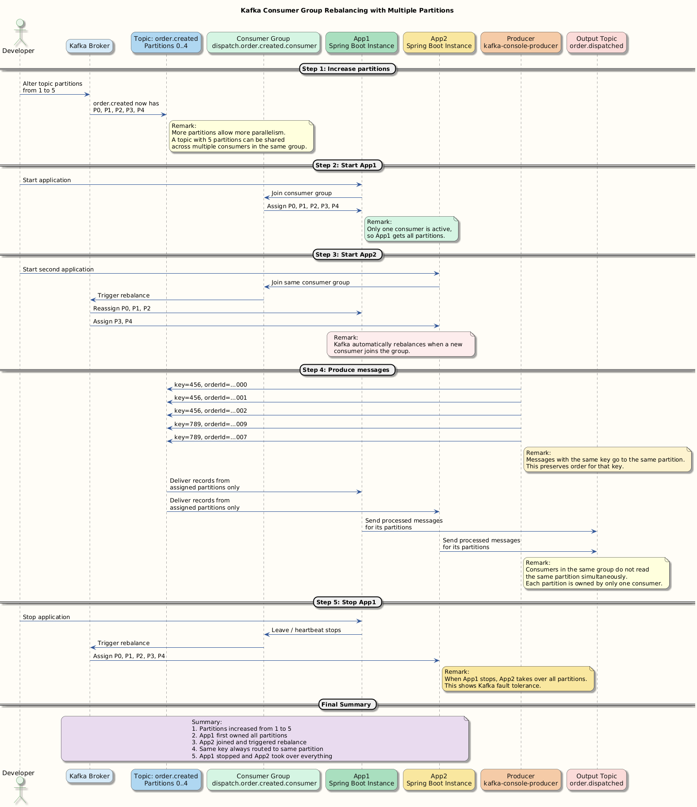
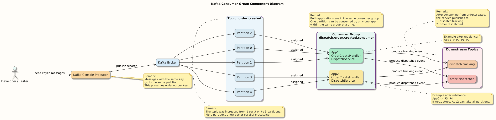

# OrderCreateHandler 
```java
@Slf4j
@RequiredArgsConstructor
@Component
public class OrderCreateHandler {

    private final DispatchService dispatchService;


    @KafkaListener(
            id = "orderConsumerClient",
            topics = "order.created",
            groupId = "dispatch.order.created.consumer",
            containerFactory = "kafkaListenerContainerFactory"
    )
    public void listen(@Header(KafkaHeaders.RECEIVED_PARTITION) Integer partition,
                       @Header(KafkaHeaders.RECEIVED_KEY) String key,
                       @Payload OrderCreated payload) throws Exception {
        log.info("Received message: partition: {} - key: {} - payload: {}", partition, key, payload);
        try {
            dispatchService.process(key, payload);
        } catch (Exception e) {
            log.error("Processing failure : {}", e);
        }
    }
}

```

## 1. Class Overview

| Component | Description |
|----------|-------------|
| Class Name | `OrderCreateHandler` |
| Annotation | `@Component` → Spring-managed bean |
| Logging | `@Slf4j` → Enables logging |
| Constructor Injection | `@RequiredArgsConstructor` → Injects dependencies automatically |
| Dependency | `DispatchService` → Handles business logic |

---

## 2. Kafka Listener Configuration

| Attribute | Value | Meaning |
|----------|------|--------|
| Listener ID | `orderConsumerClient` | Unique identifier for this consumer |
| Topic | `order.created` | Kafka topic being consumed |
| Group ID | `dispatch.order.created.consumer` | Consumer group name |
| Container Factory | `kafkaListenerContainerFactory` | Custom Kafka configuration (deserialization, error handling, etc.) |

---

## 3. Method: `listen(...)`

| Parameter | Source | Purpose |
|----------|--------|---------|
| `partition` | `@Header(KafkaHeaders.RECEIVED_PARTITION)` | Partition number from which message is received |
| `key` | `@Header(KafkaHeaders.RECEIVED_KEY)` | Message key (used for partitioning) |
| `payload` | `@Payload` | Actual message data (`OrderCreated`) |

---

## 4. Message Processing Flow

| Step | Action | Description |
|-----|--------|-------------|
| 1 | Message Received | Kafka sends message to listener |
| 2 | Logging | Logs partition, key, and payload |
| 3 | Business Call | Calls `dispatchService.process(key, payload)` |
| 4 | Exception Handling | Catches any exception during processing |
| 5 | Error Logging | Logs error if processing fails |

---

## 5. Logging Behavior

| Log Type | Example | Purpose |
|---------|--------|---------|
| Info Log | `"Received message: partition: {} - key: {} - payload: {}"` | Tracks incoming messages |
| Error Log | `"Processing failure : {}"` | Captures processing issues |

---

## 6. Error Handling Strategy

| Aspect | Behavior |
|-------|----------|
| Try-Catch | Wraps business logic |
| Failure Handling | Logs error only |
| Retry | ❌ Not handled here (depends on container factory) |
| Message Acknowledgement | Kafka may still commit offset (depends on config) |

⚠️ Note: Since exception is caught and not re-thrown →  
Kafka may treat message as **successfully consumed**

---

## 7. Dependency Responsibility

| Component | Responsibility |
|----------|----------------|
| `OrderCreateHandler` | Receives Kafka messages |
| `DispatchService` | Processes business logic |

---

## 8. Key Kafka Concepts Used

| Concept | Usage |
|--------|------|
| Consumer Group | `dispatch.order.created.consumer` |
| Partition | Extracted using header |
| Message Key | Used for partition routing |
| Listener | `@KafkaListener` |
| Payload Mapping | JSON → `OrderCreated` object |

---

## 9. Important Observations

| Observation | Explanation |
|------------|-------------|
| Tight Coupling | Handler directly depends on service |
| No Retry Logic | Errors only logged |
| No Dead Letter Handling | Not implemented here |
| Offset Risk | Messages may be lost if error occurs |
| Good Logging | Helps debugging |

---

## 10. Summary

| Area | Outcome |
|-----|--------|
| Message Consumption | Done via `@KafkaListener` |
| Processing | Delegated to `DispatchService` |
| Error Handling | Basic (logging only) |
| Scalability | Controlled by Kafka consumer group |
| Reliability | Needs improvement (retry/DLT) |

---

## Final Insight

This class is a **Kafka Consumer Adapter**:

✔ Receives messages  
✔ Logs metadata  
✔ Delegates processing  

-----
# DispatchService

```java

@Slf4j
@RequiredArgsConstructor
@Service
public class DispatchService {

    private static final String DISPATCH_TRACKING_TOPIC="dispatch.tracking";
    private static final String ORDER_DISPATCHED_TOPIC="order.dispatched";
    private static final UUID APPLICATION_ID=randomUUID();

    private final KafkaTemplate<String,Object> kafkaProducer;

    public void process(String key,OrderCreated orderCreated) throws Exception{
        DispatchPreparing dispatchPreparing= DispatchPreparing.builder()
                .orderId(orderCreated.getOrderId())
                .build();
        kafkaProducer.send(DISPATCH_TRACKING_TOPIC, key,dispatchPreparing).get();

        OrderDispatched orderDispatched= OrderDispatched.builder()
                .orderId(orderCreated.getOrderId())
                .processedById(APPLICATION_ID)
                .notes("Dispatched: "+orderCreated.getItem())
                .build();
        kafkaProducer.send(ORDER_DISPATCHED_TOPIC,key,orderDispatched).get();
        log.info("Sent messages: key: {}  - orderId:{} - processedById :{}", key, orderCreated.getOrderId(), APPLICATION_ID);


    }
}
```


## 1. Class Overview

| Component | Description |
|----------|-------------|
| Class Name | `DispatchService` |
| Annotation | `@Service` → Business logic layer |
| Logging | `@Slf4j` → Enables logging |
| Constructor Injection | `@RequiredArgsConstructor` |
| Dependency | `KafkaTemplate<String, Object>` → Produces messages to Kafka |

---

## 2. Constants

| Constant | Value | Purpose |
|---------|------|---------|
| `DISPATCH_TRACKING_TOPIC` | `dispatch.tracking` | Topic for tracking dispatch preparation |
| `ORDER_DISPATCHED_TOPIC` | `order.dispatched` | Topic for final dispatched event |
| `APPLICATION_ID` | `randomUUID()` | Unique identifier of this service instance |

---

## 3. Method: `process(...)`

| Parameter | Type | Purpose |
|----------|------|---------|
| `key` | `String` | Kafka message key (ensures partition consistency) |
| `orderCreated` | `OrderCreated` | Incoming event payload |

---

## 4. Processing Flow

| Step | Action | Description |
|-----|--------|-------------|
| 1 | Build Object | Create `DispatchPreparing` event |
| 2 | Send Event | Send to `dispatch.tracking` topic |
| 3 | Wait | `.get()` blocks until send is complete |
| 4 | Build Object | Create `OrderDispatched` event |
| 5 | Send Event | Send to `order.dispatched` topic |
| 6 | Wait | `.get()` ensures delivery |
| 7 | Log | Logs success details |

---

## 5. Event Creation

### ▸ DispatchPreparing

| Field | Value Source |
|------|-------------|
| `orderId` | From `orderCreated.getOrderId()` |

---

### ▸ OrderDispatched

| Field | Value Source |
|------|-------------|
| `orderId` | From `orderCreated.getOrderId()` |
| `processedById` | `APPLICATION_ID` |
| `notes` | `"Dispatched: " + orderCreated.getItem()` |

---

## 6. Kafka Producer Behavior

| Aspect | Behavior |
|-------|----------|
| Producer | `KafkaTemplate` |
| Key Usage | Same key used for both topics |
| Partitioning | Ensures same partition for same key |
| Send Mode | Synchronous (`.get()`) |
| Reliability | High (waits for broker acknowledgment) |

---

## 7. Synchronous Send Impact

| Advantage | Disadvantage |
|----------|-------------|
| Guaranteed delivery confirmation | Slower performance |
| Easier error handling | Blocks thread |
| Better consistency | Not scalable under high load |

---

## 8. Logging

| Log Type | Example | Purpose |
|---------|--------|---------|
| Info Log | `"Sent messages: key: {} - orderId:{} - processedById:{}"` | Tracks successful processing |

---

## 9. Error Handling

| Aspect | Behavior |
|-------|----------|
| Exception Handling | Method throws `Exception` |
| Retry | ❌ Not implemented |
| Transaction | ❌ Not transactional |
| Failure Scenario | First send may succeed, second may fail |

⚠️ Risk:
- Partial processing possible (inconsistent state)

---

## 10. Message Flow Across Topics

| Step | Topic | Event |
|-----|------|-------|
| 1 | `dispatch.tracking` | `DispatchPreparing` |
| 2 | `order.dispatched` | `OrderDispatched` |

Flow:

order.created → DispatchService → dispatch.tracking
↓
order.dispatched


---

## 11. Key Design Observations

| Observation | Explanation |
|------------|-------------|
| Event Chaining | One input → multiple output events |
| Same Key Usage | Maintains ordering across topics |
| No Transaction | No guarantee both messages succeed together |
| Blocking Calls | Reduces throughput |
| Stateless Service | Uses constant `APPLICATION_ID` |

---

## 12. Improvements (Production)

| Area | Suggestion |
|-----|------------|
| Reliability | Use Kafka Transactions |
| Performance | Use async send (remove `.get()`) |
| Error Handling | Add retry / DLT |
| Observability | Add tracing (e.g., correlationId) |
| Idempotency | Prevent duplicate processing |

---

## 13. Summary

| Area | Outcome |
|-----|--------|
| Role | Produces events after processing |
| Input | `OrderCreated` |
| Output | Two Kafka events |
| Processing | Sequential and synchronous |
| Reliability | Medium (no transaction) |
| Scalability | Limited due to blocking |

---

## Final Insight

This service acts as an **Event Producer / Processor**:

✔ Transforms incoming event  
✔ Produces multiple downstream events  
✔ Ensures ordering using same key  


------

# Kafka Testing Guide — Consumer Group Behavior

---

## 📌 Overview

This guide demonstrates how a **single Kafka consumer group behaves** when:
- Producing messages
- Consuming messages
- Scaling consumers
- Inspecting consumer group state

---

## 🚀 1. Start Application Instances

Run your Spring Boot application.

### ▶️ Start First Instance
```bash
mvn spring-boot:run
```

**🖥️ Console Output**
```bash
dispatch.order.created.consumer: partitions assigned: []
```

✔ Indicates consumer started but no partitions assigned yet (or waiting for rebalance)

## 📥 2. Start Kafka Consumer (Output Topic)

### Run a console consumer to listen to processed events:
```bash
kafka-console-consumer \
--bootstrap-server kafka1:9092 \
--topic order.dispatched \
--property print.key=true \
--property key.separator=:
```


**✔ This will display messages produced by your application**

## 📤 3. Start Kafka Producer (Input Topic)

**Send test messages to trigger processing:**
```bash
kafka-console-producer \
--bootstrap-server kafka1:9092 \
--topic order.created \
--property parse.key=true \
--property key.separator=:
```

**▶️ Sample Message**

```bash
"456":{"orderId":"550e8400-e29b-41d4-a716-446655440000","item":"book-456"}
```

## 🔄 4. Verify Application Processing


Check your Spring Boot console logs:

```bash
Sent messages: key: 456  - orderId:550e8400-e29b-41d4-a716-446655440000 - processedById :f5d0d044-8ea3-405f-b25e-b59392fa764a
```

**✔ Confirms:**
- Message consumed from `order.created`
- Processed by `DispatchService`
- Produced to downstream topics

## 📊 5. List Consumer Groups

View all active consumer groups:
```bash
kafka-consumer-groups --bootstrap-server localhost:9092 --list
```

**🖥️ Output Example**
```bash
dispatch.order.created.consumer
console-consumer-41373
console-consumer-95726
dispatch.order.created.consumer2
console-consumer-13198
```

**✔ Shows:**

- Your application consumer group
- Console consumers (auto-generated groups)

## 🔍 6. Describe Consumer Group

Inspect partition assignment and offsets:

```bash
kafka-consumer-groups \
--bootstrap-server localhost:9092 \
--describe \
--group dispatch.order.created.consumer
```

**🖥️ Output Example**

```bash
GROUP                           TOPIC           PARTITION  CURRENT-OFFSET  LOG-END-OFFSET  LAG             CONSUMER-ID                                                                     HOST            CLIENT-ID
dispatch.order.created.consumer order.created   0          46              46              0               consumer-dispatch.order.created.consumer-1-aa326c0a-d351-42ab-a40c-49a43610bf1b /192.168.65.1   consumer-dispatch.order.created.consumer-1

```

## 📌 7. Understanding Output (Summary Table)
| Field          | Meaning                     |
| -------------- | --------------------------- |
| GROUP          | Consumer group name         |
| TOPIC          | Topic being consumed        |
| PARTITION      | Partition number            |
| CURRENT-OFFSET | Last consumed message       |
| LOG-END-OFFSET | Latest message in partition |
| LAG            | Messages not yet consumed   |
| CONSUMER-ID    | Unique consumer instance    |
| HOST           | Consumer machine            |
| CLIENT-ID      | Kafka client identifier     |


## ✅ Key Observations
| Scenario           | Behavior                        |
| ------------------ | ------------------------------- |
| Single Consumer    | Consumes all partitions         |
| Multiple Consumers | Partitions distributed          |
| Same Key           | Goes to same partition          |
| Lag = 0            | Consumer is up-to-date          |
| Rebalance          | Happens when new consumer joins |


**🧠 Final Insight**

This setup demonstrates:
- ✔ End-to-end Kafka flow (produce → process → consume)
- ✔ Consumer group coordination
- ✔ Partition assignment and load balancing
- ✔ Real-time monitoring using Kafka CLI tools


-----

# Kafka Testing Guide — Multiple Partition and Rebalancing

---

## 📌 Objective

This test shows how Kafka behaves when:

- the number of partitions is increased
- multiple application instances run under the same consumer group
- Kafka automatically rebalances partitions when a new consumer joins or an existing consumer stops

---

## 1. Increase Topic Partitions

### Describe the Current Topic

```bash
bin/kafka-topics.sh --bootstrap-server localhost:9092 --describe --topic order.created
```

**Output**
```bash
Topic: order.created    TopicId: RfCmltvjThagIZ-TsqlTjw PartitionCount: 1       ReplicationFactor: 1    Configs:
        Topic: order.created    Partition: 0    Leader: 1       Replicas: 1     Isr: 1

```        
**Meaning**
| Field             | Value           | Meaning                             |
| ----------------- | --------------- | ----------------------------------- |
| Topic             | `order.created` | Topic name                          |
| PartitionCount    | `1`             | Currently only one partition exists |
| ReplicationFactor | `1`             | Only one replica                    |
| Partition         | `0`             | The only available partition        |


## 2. Alter the Topic to 5 Partitions
```bash
bin/kafka-topics.sh --bootstrap-server localhost:9092 --alter --topic order.created --partitions 5
```
> Kafka allows increasing partitions, but not decreasing them.

## 3. Verify the Updated Partition Count
```bash
bin/kafka-topics.sh --bootstrap-server localhost:9092 --describe --topic order.created
```

**Output**
```bash
Topic: order.created    TopicId: RfCmltvjThagIZ-TsqlTjw PartitionCount: 5       ReplicationFactor: 1    Configs:
        Topic: order.created    Partition: 0    Leader: 1       Replicas: 1     Isr: 1
        Topic: order.created    Partition: 1    Leader: 1       Replicas: 1     Isr: 1
        Topic: order.created    Partition: 2    Leader: 1       Replicas: 1     Isr: 1
        Topic: order.created    Partition: 3    Leader: 1       Replicas: 1     Isr: 1
        Topic: order.created    Partition: 4    Leader: 1       Replicas: 1     Isr: 1

```

**Summary Table**

| Partition | Leader | Replicas | ISR |
| --------- | ------ | -------- | --- |
| 0         | 1      | 1        | 1   |
| 1         | 1      | 1        | 1   |
| 2         | 1      | 1        | 1   |
| 3         | 1      | 1        | 1   |
| 4         | 1      | 1        | 1   |

## 4. Run Two Application Instances
**App1**

Start the first Spring Boot application:
```bash
mvn spring-boot:run
```


**App1 Console Output**
```bash
dispatch.order.created.consumer: partitions assigned: [order.created-0, order.created-1, order.created-2, order.created-3, order.created-4]
```

**Meaning**

Since only one consumer instance is running in the group, it receives all 5 partitions.

**App2**

Now start the second application instance.

**App2 Console Output**

```bash
dispatch.order.created.consumer: partitions assigned: [order.created-3, order.created-4]
```

**App1 Console After Rebalance**
```bash
dispatch.order.created.consumer: partitions assigned: [order.created-0, order.created-1, order.created-2]

```
## 5. Automatic Rebalancing

When **App2** joins the same consumer group, Kafka automatically redistributes partitions.

**Before App2 Joined**
| Application | Assigned Partitions |
| ----------- | ------------------- |
| App1        | 0, 1, 2, 3, 4       |


**After App2 Joined**
| Application | Assigned Partitions |
| ----------- | ------------------- |
| App1        | 0, 1, 2             |
| App2        | 3, 4                |


**Explanation**

This is called **rebalance**.

Kafka rebalances when:

- a new consumer joins the group
- a consumer leaves the group
- a consumer dies
- partitions change

## 6. List Consumer Groups

```bash
kafka-consumer-groups --bootstrap-server localhost:9092 --list
```

**Output**
```bash
dispatch.order.created.consumer
console-consumer-41373
console-consumer-95726
dispatch.order.created.consumer2
console-consumer-13198
```

**Summary**

| Consumer Group                     | Description                     |
| ---------------------------------- | ------------------------------- |
| `dispatch.order.created.consumer`  | Main Spring Boot consumer group |
| `dispatch.order.created.consumer2` | Another application group       |
| `console-consumer-*`               | Kafka console consumer groups   |


**7. Describe the Consumer Group**

```bash
kafka-consumer-groups --bootstrap-server localhost:9092 --describe --group dispatch.order.created.consumer
```

**Output**
```bash
GROUP                           TOPIC           PARTITION  CURRENT-OFFSET  LOG-END-OFFSET  LAG             CONSUMER-ID                                                                     HOST            CLIENT-ID
dispatch.order.created.consumer order.created   0          46              46              0               consumer-dispatch.order.created.consumer-1-1560b722-d0d5-4e00-b501-75fe86b3353d /192.168.65.1   consumer-dispatch.order.created.consumer-1
dispatch.order.created.consumer order.created   1          0               0               0               consumer-dispatch.order.created.consumer-1-1560b722-d0d5-4e00-b501-75fe86b3353d /192.168.65.1   consumer-dispatch.order.created.consumer-1
dispatch.order.created.consumer order.created   2          0               0               0               consumer-dispatch.order.created.consumer-1-1560b722-d0d5-4e00-b501-75fe86b3353d /192.168.65.1   consumer-dispatch.order.created.consumer-1
dispatch.order.created.consumer order.created   3          0               0               0               consumer-dispatch.order.created.consumer-1-33b1284e-2a1e-449a-92ff-c9dd9ac5e343 /192.168.65.1   consumer-dispatch.order.created.consumer-1
dispatch.order.created.consumer order.created   4          0               0               0               consumer-dispatch.order.created.consumer-1-33b1284e-2a1e-449a-92ff-c9dd9ac5e343 /192.168.65.1   consumer-dispatch.order.created.consumer-1
```

**Interpretation Table**

| Partition | Consumer Instance | Offset | Lag | Meaning             |
| --------- | ----------------- | ------ | --- | ------------------- |
| 0         | Consumer 1        | 46     | 0   | Fully consumed      |
| 1         | Consumer 1        | 0      | 0   | No pending messages |
| 2         | Consumer 1        | 0      | 0   | No pending messages |
| 3         | Consumer 2        | 0      | 0   | No pending messages |
| 4         | Consumer 2        | 0      | 0   | No pending messages |


**Key Point**

Two different `CONSUMER-IDs `show that **two application instances** are actively sharing the same topic partitions under one consumer group.

## 8. Run Consumer and Producer
**Consumer**

Listen to the downstream topic:

```bash
kafka-console-consumer --bootstrap-server localhost:9092 --topic order.dispatched --property print.key=true --property key.separator=:
```

**Producer**

Send input messages to the source topic:
```bash
kafka-console-producer --bootstrap-server localhost:9092 --topic order.created --property parse.key=true --property key.separator=:
```

## 9. Sample Messages
```bash
"456":{"orderId":"550e8400-e29b-41d4-a716-446655440000","item":"book-456"}
"456":{"orderId":"550e8400-e29b-41d4-a716-446655440001","item":"book-456"}
"456":{"orderId":"550e8400-e29b-41d4-a716-446655440002","item":"book-456"}

"789":{"orderId":"550e8400-e29b-41d4-a716-446655440009","item":"book-789"}
"789":{"orderId":"550e8400-e29b-41d4-a716-446655440007","item":"book-789"}
```

## 10. Important Observation About Message Keys
**Summary Table**
| Key   | Expected Behavior                                    |
| ----- | ---------------------------------------------------- |
| `456` | All messages with key `456` go to the same partition |
| `789` | All messages with key `789` go to the same partition |


**Explanation**

Kafka uses the message key to decide the partition.

So:
- same key → same partition
- same partition → same consumer instance within the group
- ordering is preserved for messages with the same key

This means all messages with key `456` are processed in order by one consumer, and all messages with key 789 are processed in order by one consumer.

## 11. Stop App1 and Observe Rebalance

Now stop `App1`.

Kafka will automatically detect that one consumer is gone and rebalance again.

**Expected Result**
| Application | Assigned Partitions After App1 Stops |
| ----------- | ------------------------------------ |
| App2        | 0, 1, 2, 3, 4                        |


**Explanation**

When App1 leaves:
- Kafka marks it as unavailable
- partitions owned by App1 become unassigned
- App2 takes over those partitions
- message consumption continues without manual intervention

This demonstrates Kafka's fault tolerance.

## 12. Overall Summary

| Scenario              | Result                                       |
| --------------------- | -------------------------------------------- |
| 1 partition + 1 app   | One consumer handles all messages            |
| 5 partitions + 1 app  | One consumer handles all 5 partitions        |
| 5 partitions + 2 apps | Partitions shared across two apps            |
| New app joins         | Kafka rebalances automatically               |
| One app stops         | Remaining app takes over partitions          |
| Same key used         | Messages go to same partition and keep order |


## 13. Key Concepts Demonstrated
| Concept             | What You Observed                                           |
| ------------------- | ----------------------------------------------------------- |
| Partition Scaling   | Topic increased from 1 to 5 partitions                      |
| Consumer Group      | Two apps share same group                                   |
| Rebalancing         | Partitions redistributed automatically                      |
| Parallel Processing | Different partitions can be consumed by different instances |
| Fault Tolerance     | Remaining consumer takes over after failure                 |
| Key-based Routing   | Same key always goes to same partition                      |


## Final Insight

This test proves that Kafka consumer groups provide:
- **scalability** through multiple partitions
- **parallel processing** through multiple consumer instances
- **ordering** for messages with the same key
- **fault tolerance** through automatic rebalancing

In short:

>More partitions allow more parallelism, and Kafka automatically balances the load across active consumers in the same group.


```bash
"1":{"orderId":"550e8400-e29b-41d4-a716-446655440001","item":"book-001"} 
"2":{"orderId":"550e8400-e29b-41d4-a716-446655440001","item":"book-456"} 
"3":{"orderId":"550e8400-e29b-41d4-a716-446655440001","item":"book-456"} 
"4":{"orderId":"550e8400-e29b-41d4-a716-446655440001","item":"book-456"} 
"5":{"orderId":"550e8400-e29b-41d4-a716-446655440001","item":"book-456"} 
"6":{"orderId":"550e8400-e29b-41d4-a716-446655440001","item":"book-456"} 
```

# PlantUML Diagram — Kafka Multiple Partitions and Rebalancing

Below is a colorful sequence-style diagram that explains:

- topic partition increase
- App1 consuming all partitions first
- App2 joining the same consumer group
- Kafka rebalancing partitions
- producer sending keyed messages
- App1 stopping
- App2 taking over all partitions



## What this diagram explains
| Topic             | Meaning                                                     |
| ----------------- | ----------------------------------------------------------- |
| Partition scaling | More partitions allow more consumers to work in parallel    |
| Consumer group    | App1 and App2 belong to the same group                      |
| Rebalancing       | Kafka redistributes partitions when consumers join or leave |
| Key-based routing | Same key always goes to the same partition                  |
| Fault tolerance   | If one app stops, the other takes over                      |


#  Component Diagram — Kafka Consumer Group with Multiple Partitions

Below is a colorful **component diagram** to explain:

- producer sends messages to `order.created`
- topic has multiple partitions
- two Spring Boot apps are in the same consumer group
- partitions are shared between consumers
- processed messages are sent to downstream topics
- rebalance happens when one app joins or leaves

