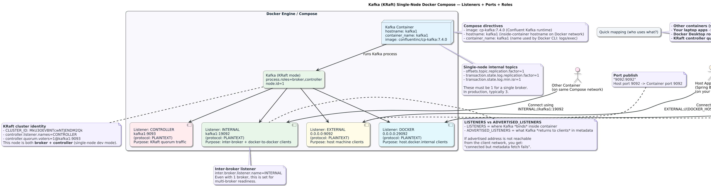

## Setting up Kafka Broker

# Docker Compose Notes: Single Kafka Broker (KRaft mode) — Line-by-line Explanation

This `docker-compose.yml` snippet runs **one Kafka broker** using Confluent’s Kafka image (`cp-kafka:7.4.0`) and configures it in **KRaft mode** (Kafka without ZooKeeper).

## Full snippet (for reference)

```bash
services:
  kafka1:
    image: confluentinc/cp-kafka:7.4.0
    hostname: kafka1
    container_name: kafka1
    ports:
      - "9092:9092"
      - "29092:29092"
    environment:
      KAFKA_NODE_ID: 1
      KAFKA_LISTENER_SECURITY_PROTOCOL_MAP: CONTROLLER:PLAINTEXT,INTERNAL:PLAINTEXT,EXTERNAL:PLAINTEXT,DOCKER:PLAINTEXT
      KAFKA_ADVERTISED_LISTENERS: INTERNAL://kafka1:19092,EXTERNAL://${DOCKER_HOST_IP:-127.0.0.1}:9092,DOCKER://host.docker.internal:29092
      KAFKA_INTER_BROKER_LISTENER_NAME: INTERNAL
      KAFKA_CONTROLLER_LISTENER_NAMES: CONTROLLER
      KAFKA_CONTROLLER_QUORUM_VOTERS: 1@kafka1:9093
      KAFKA_PROCESS_ROLES: broker,controller
      KAFKA_LISTENERS: CONTROLLER://kafka1:9093,INTERNAL://kafka1:19092,EXTERNAL://0.0.0.0:9092,DOCKER://0.0.0.0:29092
      KAFKA_OFFSETS_TOPIC_REPLICATION_FACTOR: 1
      KAFKA_TRANSACTION_STATE_LOG_MIN_ISR: 1
      KAFKA_TRANSACTION_STATE_LOG_REPLICATION_FACTOR: 1
      CLUSTER_ID: MkU3OEVBNTcwNTJENDM2Qk

```

## 1) `services.kafka1` — what you’re running
`image: confluentinc/cp-kafka:7.4.0`

Runs Kafka from Confluent Platform **7.4.0** image.

`hostname`: **kafka1** and `container_name`: **kafka1**
- `hostname`: what the container calls itself on the Docker network. Is `hostname` the machine name given to Kafka? Short answer: **No — not your physical machine name.**. It is the **container’s internal network hostname inside Docker**.
- `container_name`: the actual Docker container name (useful for logs, exec, etc).

## 2) Port mapping (host ↔ container)

```yml
ports:
  - "9092:9092"
  - "29092:29092"

```
This exposes **two Kafka listener** ports to your machine:
| Host Port (Your Machine) | Container Port (Kafka Inside Docker) | Intended client                                                         |
| --------: | -------------: | ----------------------------------------------------------------------- |
|      9092 |           9092 | Typical “connect from my laptop” port.Laptop → Docker → Kafka                                   |
|     29092 |          29092 | Special case for *Docker Desktop host routing* (`host.docker.internal`). Special routing path via Docker Desktop |

> Kafka commonly needs different ports/addresses depending on where the client runs (same docker network vs your local machine vs another container using host routing).

## 3) Key concept: Kafka Listeners vs Advertised Listeners

Kafka networking has **two related settings**:

**A) KAFKA_LISTENERS**

Where Kafka **binds** and listens inside the container.
- Think: “Which network interfaces/ports should Kafka open?”

**B) KAFKA_ADVERTISED_LISTENERS**

What Kafka **tells clients** to connect to.
- Think: “When a client asks for broker address, what host:port should Kafka return?”

If these don’t match your real network reality, you get classic errors like:
- client connects but then fails on metadata fetch
- “connection to node -1 could not be established”
- works in container but not from host (or vice versa)


## 4) Environment variables — detailed explanation

`KAFKA_NODE_ID: 1`

A unique integer ID for this node in KRaft mode.
- In multi-node setups each broker/controller has its own node id.

`KAFKA_PROCESS_ROLES: broker,controller`

This is the big KRaft flag.

It means this single node is:
- **broker** (handles produce/consume requests)
- **controller** (handles cluster metadata leadership)

So this is a **combined broker+controller** node (common for dev/single-node).

`CLUSTER_ID: MkU3OEVBNTcwNTJENDM2Qk`

KRaft clusters require a **cluster id**.
- It’s used to format and identify the cluster metadata log.
- In real setups you usually generate it once and keep it stable.

`KAFKA_CONTROLLER_LISTENER_NAMES: CONTROLLER`

Tells Kafka: “The listener named `CONTROLLER` is the one controllers use to talk to each other / run controller quorum traffic”.

`KAFKA_CONTROLLER_QUORUM_VOTERS: 1@kafka1:9093`

Defines the controller quorum membership.

Format:

<nodeId>@<host>:<controllerPort>

Here it means:
- node 1
- reachable at kafka1:9093
- and it’s the only voter (single-node quorum)

`KAFKA_LISTENER_SECURITY_PROTOCOL_MAP`

```yaml
KAFKA_LISTENER_SECURITY_PROTOCOL_MAP: CONTROLLER:PLAINTEXT,INTERNAL:PLAINTEXT,EXTERNAL:PLAINTEXT,DOCKER:PLAINTEXT
```

Kafka supports multiple listeners, each with a “name”.
This mapping says each listener uses **PLAINTEXT** (no TLS, no SASL).

Listener names in this file:
- `CONTROLLER` — controller quorum traffic
- `INTERNAL` — inter-broker + container-to-container traffic on docker network
- `EXTERNAL` — host machine clients connecting via `localhost` (or host IP)
- `DOCKER` — clients connecting using `host.docker.internal`

`KAFKA_LISTENERS`

```yaml
KAFKA_LISTENERS: CONTROLLER://kafka1:9093,INTERNAL://kafka1:19092,EXTERNAL://0.0.0.0:9092,DOCKER://0.0.0.0:29092
```

This is where the broker **binds**:

| Listener name | Bind address    | Purpose                                                    |
| ------------- | --------------- | ---------------------------------------------------------- |
| CONTROLLER    | `kafka1:9093`   | KRaft controller quorum                                    |
| INTERNAL      | `kafka1:19092`  | broker-to-broker + other containers on same Docker network |
| EXTERNAL      | `0.0.0.0:9092`  | allow connections coming into container on 9092            |
| DOCKER        | `0.0.0.0:29092` | allow connections coming into container on 29092           |


Notes:
- `0.0.0.0` means “listen on all interfaces” (inside container).
- `kafka1:19092` is a common “internal docker listener” pattern.

`KAFKA_ADVERTISED_LISTENERS`

```yaml
KAFKA_ADVERTISED_LISTENERS: INTERNAL://kafka1:19092,EXTERNAL://${DOCKER_HOST_IP:-127.0.0.1}:9092,DOCKER://host.docker.internal:29092
```

This is what Kafka returns to clients as “connect here”.

| Listener name | Advertised address                  | Who it helps                                                      |
| ------------- | ----------------------------------- | ----------------------------------------------------------------- |
| INTERNAL      | `kafka1:19092`                      | other containers using docker DNS (same compose network)          |
| EXTERNAL      | `${DOCKER_HOST_IP:-127.0.0.1}:9092` | your laptop apps using localhost (or a specific host IP)          |
| DOCKER        | `host.docker.internal:29092`        | containers that need to reach the host via Docker Desktop routing |


Key detail:
- `${DOCKER_HOST_IP:-127.0.0.1}` means:
    - if `DOCKER_HOST_IP` env var exists, use it
    - otherwise default to `127.0.0.1`
- Useful when `localhost` is not correct (remote docker host, VM, etc).

`KAFKA_INTER_BROKER_LISTENER_NAME: INTERNAL`

This picks which listener name Kafka uses for **broker-to-broker communication**.

Here:
- brokers talk to each other via `INTERNAL` (even though you only have 1 broker right now)

Why it matters:
- In multi-broker clusters, this must be reachable between brokers (usually docker network DNS).

## 5) Single-node replication + transactions settings (dev-friendly)


`KAFKA_OFFSETS_TOPIC_REPLICATION_FACTOR: 1`

Kafka’s internal `__consumer_offsets` topic replication factor.
- In production this is usually **>= 3**
- In a single-broker dev setup it **must be 1**.

`KAFKA_TRANSACTION_STATE_LOG_REPLICATION_FACTOR: 1`

Replication factor for transaction state log.
- Must be 1 for single broker.

`KAFKA_TRANSACTION_STATE_LOG_MIN_ISR: 1`

Minimum in-sync replicas for transaction log.
- Single broker means min ISR must be 1 or transactions won’t work.

## 6) How to connect (common cases)

**From your host machine (your laptop)**

Use the `EXTERNAL` listener:
 - `localhost:9092` (if `DOCKER_HOST_IP` not set)
- or `${DOCKER_HOST_IP}:9092`

**From another container on the same docker-compose network**

Use the `INTERNAL` listener:

- `kafka1:19092`

**From a container that uses host routing (Docker Desktop specific)**

Use the `DOCKER` listener:
- `host.docker.internal:29092`

## 7) Why have 3 listener types (INTERNAL / EXTERNAL / DOCKER)?

Because Kafka clients need different “return addresses” depending on where they run:
- **Inside docker network**: `kafka1` is resolvable via Docker DNS → `kafka1:19092`
- **On your laptop**: `kafka1` is NOT resolvable → you need `127.0.0.1:9092` (or host IP)
- **Some docker host routing scenarios**: easiest is `host.docker.internal:29092`

This compose is basically making Kafka “work everywhere” in a dev environment without constantly changing configs.

## 8) Common pitfalls (and quick checks)
- If host apps connect to `9092` but fail after initial connection:
    - usually `KAFKA_ADVERTISED_LISTENERS` is wrong (Kafka returns an unreachable address).

- If a container can’t connect using `localhost:9092`:
 - inside containers, `localhost` means that container, not your host.
 - use `kafka1:19092` or `host.docker.internal:29092` depending on scenario.

### memorize this
- `LISTENERS` = where Kafka binds
- `ADVERTISED_LISTENERS` = what Kafka **announces**
- `INTERNAL` = container-to-container
- `EXTERNAL` = your laptop (localhost / host IP)
- `DOCKER` = Docker Desktop host routing (host.docker.internal)
- KRaft mode is enabled by:
    - `KAFKA_PROCESS_ROLES`
    - `KAFKA_NODE_ID`
    - `KAFKA_CONTROLLER_*`
    - `CLUSTER_ID`

----------
# In Details

🟢━━━━━━━━━━━  image: confluentinc/cp-kafka:7.4.0  ━━━━━━━━━━━🟢
# image: confluentinc/cp-kafka:7.4.0 — Detailed Explanation

This line tells Docker **which image to pull and run** for your Kafka container.

```yaml
image: confluentinc/cp-kafka:7.4.0
```

## 1️⃣ Image Name Structure

Docker image format:

```code
<repository>/<image-name>:<tag>
```
| Part           | Meaning                             |
| -------------- | ----------------------------------- |
| `confluentinc` | Docker Hub organization (publisher) |
| `cp-kafka`     | Image name                          |
| `7.4.0`        | Version tag                         |


## 2️⃣ What is `confluentinc`?

`confluentinc` is the official Docker Hub organization of **Confluent**, the company founded by Kafka’s original creators.

Confluent maintains production-grade Kafka container images.

This is not a random community image.

## 3️⃣ What is `cp-kafka`?

`cp-kafka` stands for:
```code
Confluent Platform - Kafka
```

This image contains:
- Apache Kafka broker
- Confluent packaging scripts
- KRaft mode support
- Production-ready configurations
- Health checks and startup logic

It is not just **“vanilla Apache Kafka binaries.”**
It includes Confluent’s runtime tooling.

## 4️⃣ What Does Version 7.4.0 Mean?

This is **Confluent Platform version 7.4.0**.

Important:

Confluent Platform version ≠ Kafka version directly.

Confluent Platform 7.4.0 includes:
- Apache Kafka 3.4.x
- KRaft improvements
- Performance updates
- Bug fixes
- Compatibility patches

So when you use:
```yaml
image: confluentinc/cp-kafka:7.4.0
```

You are pinning your setup to:
- Specific Kafka version
- Specific Confluent runtime
- Predictable behavior

## 5️⃣ Why Pin the Version (Very Important)

If you wrote:
```yaml
image: confluentinc/cp-kafka:latest
```

You risk:
- Breaking changes
- Config incompatibility
- Unexpected cluster errors
- KRaft behavior differences

Pinning `7.4.0` ensures:
- Reproducibility
- Stability
- Same behavior across machines
- Safer production deployments

This is best practice.

## 6️⃣ What Happens When Docker Sees This Line?

When you run:
```bash
docker compose up
```
Docker:
- Checks if image exists locally
- If not → pulls it from Docker Hub
- Creates a container from that image
- Applies your environment variables
- Runs Kafka startup script inside container

## 7️⃣ What’s Inside This Image?

The image contains:

- Linux base OS
- Java Runtime (JDK)
- Kafka binaries
- Confluent startup scripts
- Log directories
- Metadata storage support
- KRaft formatting tools

It also contains entrypoint logic that:
- Reads environment variables
- Converts them into Kafka `server.properties`
- Formats storage if needed
- Starts Kafka process

## 8️⃣ Difference Between cp-kafka and Other Kafka Images

| Image                   | Maintainer | ZooKeeper Required?  | KRaft Support | Production Ready?  |
| ----------------------- | ---------- | -------------------- | ------------- | ------------------ |
| `apache/kafka`          | Apache     | Depends              | Yes           | Minimal packaging  |
| `bitnami/kafka`         | Bitnami    | Optional             | Yes           | Simplified configs |
| `confluentinc/cp-kafka` | Confluent  | No (KRaft supported) | Yes           | Enterprise-grade   |

Your image supports:
- ZooKeeper-less Kafka (KRaft)
- Controller quorum mode
- Multi-listener configuration
- Advanced clustering

## 9️⃣ Why This Image is Good for Learning Microservices

Since you're working with:
- Kafka
- Spring Boot
- Microservices architecture
- Distributed systems

This image:
- Supports multi-broker clusters
- Supports transactions
- Works cleanly with Docker Compose
- Mirrors production-like setups

It is much closer to real-world infra than simple Kafka demos.

## 🔟 What This Line Does NOT Do
It does NOT:
- Start ZooKeeper
- Create topics
- Configure replication automatically
- Handle volumes unless you define them
- Persist data unless you mount storage

It only defines the base runtime.

## 1️⃣1️⃣ Under-the-Hood Startup Flow

When container starts:
1. Entrypoint script reads env vars
2. Converts `KAFKA_...` variables into server config
3. Validates cluster id
4. Formats storage (if first run)
5. Starts Kafka broker process

That logic is built into the image.

## 1️⃣2️⃣ Production Considerations

In real production:
**You would additionally configure:**
- Persistent volumes
- TLS encryption
- SASL authentication
- Proper replication factor
- Multiple brokers
- Resource limits (CPU/memory)

This image supports all of that.

## Final Understanding
```yaml
image: confluentinc/cp-kafka:7.4.0
```
Means:

> You are running a **Confluent-maintained Kafka broker image**, at a **fixed stable platform version**, with support for **modern KRaft mode**, designed for **real-world distributed systems usage**.

----

# 🟢━━━━━━━━━━━  hostname: kafka1  and container_name: kafka1    ━━━━━━━━━━━🟢

# hostname: kafka1  
# container_name: kafka1  

These two properties look similar, but they serve **different purposes** inside Docker.

---

# 1️⃣ hostname: kafka1

```yaml
hostname: kafka1
```

## What it does

Sets the **internal hostname of the container**.

Inside the container:
```bash
hostname
```
will return:
```bash
kafka1
```
So this is the name the container uses to identify itself on the Docker network.

**Why it matters for Kafka**

Kafka configuration references:
```yaml
KAFKA_CONTROLLER_QUORUM_VOTERS: 1@kafka1:9093
```
and

```yaml
INTERNAL://kafka1:19092
```

That means:
- Other containers must resolve `kafka1`
- `Kafka controller quorum` expects `kafka1` to be valid DNS name

Docker Compose automatically provides internal DNS.
Setting `hostname` ensures consistency between:
- Kafka listeners
- Controller quorum
- Internal networking

**Important Clarification**

`hostname`:
- ❌ Does NOT change your laptop hostname
- ❌ Does NOT affect your operating system
- ❌ Is NOT globally visible

It only exists inside Docker networking.

## 2️⃣ container_name: kafka1
```yaml
container_name: kafka1
```

**What it does**

Sets the actual **Docker container** name.

Without this, Docker Compose auto-generates a name like:

```code
projectname_kafka1_1
```
With this defined:
```code
kafka1
```

becomes the container’s fixed name.

**Why it is useful**

You can run:

```bash
docker logs kafka1
docker exec -it kafka1 bash
docker stop kafka1
```
instead of remembering the long auto-generated name.

**Does container_name affect networking?**

Not directly.

Docker Compose networking uses:
- Service name
- Internal DNS
- Hostname (if set)

`container_name` mainly affects:

- CLI commands
- Monitoring tools
- Logging references


## 3️⃣ Difference Between Them
| Property       | Scope                 | Used For                           |
| -------------- | --------------------- | ---------------------------------- |
| hostname       | Internal container OS | Kafka listeners, controller quorum |
| container_name | Docker engine         | CLI interaction, logs, management  |

## 4️⃣ How They Work Together in Your Kafka Setup

Because your Kafka config references:

```yaml
kafka1:19092
kafka1:9093
```

It is clean and consistent to:
- Set `hostname: kafka1`
- Set `container_name: kafka1`

So everything aligns:
- Docker DNS
- Kafka internal references
- Controller quorum
- CLI management

## 5️⃣ If You Removed Them

If you removed both:

Docker would auto-generate names like:

```code
myproject_kafka1_1
```

Kafka controller quorum config would break unless you updated:
```
KAFKA_CONTROLLER_QUORUM_VOTERS
```
because `kafka1` would no longer resolve.

## Final Mental Model

Think of it like this:
- `hostname` = the container’s internal machine name
- `container_name` = the Docker engine’s label for that container

They can be the same value, but they serve different roles.

In your Kafka cluster, `hostname` is technically more important for networking.


------

# 🟢━━━━━━━━━━━  "9092:9092"  and "29092:29092"   ━━━━━━━━━━━🟢
# ports:
#   - "9092:9092"
#   - "29092:29092"

This section exposes Kafka’s internal ports to your host machine.

```yaml
ports:
  - "9092:9092"
  - "29092:29092"
```
## 1️⃣ Basic Port Mapping Concept

Docker port format:

```bash
HOST_PORT:CONTAINER_PORT
```
So:
```bash
"9092:9092"
```

means:
- Port **9092 on your laptop**
- forwards traffic to
- Port **9092 inside the container**

## 2️⃣ Why Port Mapping Is Needed

Containers run in an isolated network.

Without `ports`::
- Kafka would be reachable only inside Docker network.
- Your laptop apps (Spring Boot, Kafka CLI, etc.) could NOT connect.

Port mapping creates a tunnel:

```code
Your Laptop (localhost:9092)
        ↓
Docker Engine
        ↓
Kafka Container (9092)

```


## 3️⃣ First Mapping: "9092:9092"
```yaml
- "9092:9092"
```

This is the standard Kafka port.

**What it enables:**

From your laptop:

```bash
localhost:9092
```

Clients that can use this:
- Spring Boot apps running on your host
- Kafka CLI tools
- Kafka UI tools
- Postman / custom producers

**Important**

This only works correctly if:
```yaml
KAFKA_ADVERTISED_LISTENERS
```

returns an address your laptop can reach.

If advertised listeners are wrong, you’ll connect initially but metadata fetch will fail.

## 4️⃣ Second Mapping: "29092:29092"
```yaml
- "29092:29092"
```

This is an additional Kafka listener port.

Why do we need it?

Because Kafka often needs multiple network entry points depending on where the client runs. Kafka must return a broker address that matches **where the client is running from**.

Kafka is not like a normal web server. It gives clients metadata that contains its own address.  
If that address is wrong for the client’s network location, things break.

# Step 1 — The Core Problem Kafka Has

When a client connects to Kafka:

1. Client connects to a bootstrap server (example: `localhost:9092`)
2. Kafka responds with metadata:
   - “Here is the broker address: connect to X:PORT”

If Kafka returns an address the client cannot reach → connection fails.

---

# Step 2 — Why One Port Is Not Enough

You have **three different network worlds**:

| Client Location | How it sees Kafka |
|-----------------|------------------|
| Your laptop (host) | `localhost:9092` |
| Another container in same Docker network | `kafka1:19092` |
| Container accessing host via Docker Desktop | `host.docker.internal:29092` |

Each of these needs a **different advertised address**.

That’s why your config defines:

- INTERNAL (19092)
- EXTERNAL (9092)
- DOCKER (29092)

---

# Step 3 — What 29092 Specifically Solves

Port **29092** is tied to this:

```yaml
DOCKER://host.docker.internal:29092
```

This is for containers that:
- Are NOT on the same Docker network
- Need to reach Kafka through the host machine
- Use Docker Desktop routing

Example scenario:

You run another container separately:
```bash
docker run my-spring-app
```

That container cannot resolve:

```bash
kafka1
```

And inside that container:

```bash
localhost
```

means itself — not your host.

So Docker Desktop provides:

```code
host.docker.internal
```

Which means:
> “Connect to the host machine from inside a container”

Port 29092 allows that path.

## Step 4 — Visual Comparison

**Case A — From your laptop**
```code
Spring Boot (host)
        ↓
localhost:9092
        ↓
Kafka container
```

Uses port 9092

**Case B — From another container (same docker-compose network)**
```code
Container A
        ↓
kafka1:19092
        ↓
Kafka container
```

Uses port **19092** (internal only)

**Case C — From container using host routing**

```code
Container B
        ↓
host.docker.internal:29092
        ↓
Host machine
        ↓
Kafka container
```

Uses port **29092**

## Step 5 — Why Not Just Use 9092 Everywhere?

Because:
- Inside a container, `localhost` ≠ your laptop
- `kafka1` may not resolve outside docker-compose network
- Kafka metadata must return the correct address per listener

If Kafka advertises the wrong address:
- You connect successfully
- Then metadata fetch fails
- You get `Connection to node -1 failed`

That’s the classic Kafka networking issue.

## Step 6 — When Do You Actually Need 29092?

You need it when:
- You run containers separately (not same compose network)
- You run Kafka UI tools in separate container
- You run integration tests in container
- You use Docker Desktop networking on Mac/Windows

If everything is:
- Running only from your laptop
- Or inside the same docker-compose network

You may not strictly need 29092.

## Step 7 — Simplified Mental Model
Think of Kafka like a person with:
- Internal phone number (19092)
- Office phone (9092)
- Special forwarding number (29092)

Different callers must dial different numbers.

## Final Clear Answer

Port **29092** exists to support Docker host routing using:
```code
host.docker.internal
```

It allows containers to reach Kafka via the host machine when direct Docker network DNS (`kafka1`) is not available.

It is not random. It solves a very specific Docker networking limitation.


In your config:
```yaml
DOCKER://host.docker.internal:29092
```

So port 29092 is used for:
- Docker Desktop host routing
- Special container-to-host communication scenarios

## 5️⃣ Why Not Just Use One Port?

Because Kafka returns metadata with broker addresses.

Example problem:

If a container connects using:
```code
localhost:9092
```

Inside Docker, `localhost` means itself, not your host.

So we separate listeners:

| Port  | Purpose                                             |
| ----- | --------------------------------------------------- |
| 9092  | Host machine clients                                |
| 29092 | Docker-specific routing                             |
| 19092 | Internal container networking (not exposed to host) |
| 9093  | Controller quorum (not exposed externally)          |


Kafka networking is more complex than simple web apps.

## 6️⃣ What Happens Internally

When a client connects to:
```docker
localhost:9092
```
Docker:
1. Receives traffic on host port 9092
2. Forwards it to container port 9092
3. Kafka listener EXTERNAL handles the connection

Same logic applies to port `29092`.

## 7️⃣ What If You Removed This Section?

If you removed:

```yaml
ports:
```

Then:

- Kafka still runs
- Other containers can connect via internal network
- BUT your laptop cannot connect

You would only be able to access Kafka from inside Docker.

## 8️⃣ Production vs Development

In production:
- Kafka usually runs behind load balancers
- Or on cloud VMs
- Ports may not be mapped like this
- Security (TLS, SASL) would be added

In development:

Port mapping is essential for testing locally.

## 9️⃣ Common Errors Related to Ports
❌ Port already in use

If another Kafka or service runs on 9092:
```code
Bind for 0.0.0.0:9092 failed
```
Fix:

Change host port:
```code
- "19092:9092"
```

Now access using:
```code
localhost:19092
```

❌ Connected but metadata fails

Usually means:

`KAFKA_ADVERTISED_LISTENERS` mismatch.

Port mapping alone is not enough for Kafka.

## 🔟 Mental Model

Think of it like this:

Container = house
Kafka = person inside house
Port mapping = front door opening

Without port mapping, the house has no door to outside world.

## Final Understanding
```yaml
ports:
  - "9092:9092"
  - "29092:29092"
```
Means:

> Expose Kafka’s internal ports 9092 and 29092 to the same ports on your host machine, so clients outside Docker can connect.

----

# 🟢━━━━━━━━━━━  KAFKA_NODE_ID  ━━━━━━━━━━━🟢


# KAFKA_NODE_ID: 1 — Detailed Explanation

```yaml
KAFKA_NODE_ID: 1
```

This setting defines the **unique identifier of this Kafka server in a KRaft cluster**.

It is mandatory when running Kafka in **KRaft mode (ZooKeeper-less Kafka)**.

## 1️⃣ What is a Node in Kafka?

In KRaft mode, every Kafka server process is called a **node**.
A node can have one or both roles:
- `broker` → handles produce/consume traffic
- `controller` → manages cluster metadata

Each node must have a **unique numeric ID**.

That ID is defined by:
```yaml
KAFKA_NODE_ID
```
## 2️⃣ Why is Node ID Required?

In older ZooKeeper-based Kafka:
- The broker ID was managed via ZooKeeper
- `broker.id `was used

In KRaft mode:
- There is no ZooKeeper
- Metadata is stored internally
- Each node must explicitly declare its identity

So:
```yaml
KAFKA_NODE_ID: 1
```

means:
> "This Kafka server is node number 1 in the cluster."

## 3️⃣ Where is Node ID Used?

Node ID is used in:

**A) Controller Quorum Configuration**

Example from your config:

```
KAFKA_CONTROLLER_QUORUM_VOTERS: 1@kafka1:9093
```

Format:
```code
<nodeId>@<host>:<port>
```
Here:
- `1` matches `KAFKA_NODE_ID: 1`
- This node participates in controller quorum voting

If IDs don’t match → cluster will fail to start.

**B) Metadata Log**

In KRaft mode:
- Kafka stores metadata in an internal log
- Each node is registered using its node ID
- Controller elections use node IDs

**C) Cluster Membership**

When multiple nodes exist:

| Node ID | Host   | Role                |
| ------- | ------ | ------------------- |
| 1       | kafka1 | broker + controller |
| 2       | kafka2 | broker              |
| 3       | kafka3 | broker              |


Each must have a distinct ID.

Duplicate IDs cause startup failure.

## 4️⃣ Single-Node Setup (Your Case)

You have:
```yaml
KAFKA_NODE_ID: 1
KAFKA_PROCESS_ROLES: broker,controller
```
So this node:
- Is broker
- Is controller
- Is the only quorum voter
- Has ID = 1

This is normal for development.

## 5️⃣ Multi-Node Example (Production Style)

Example 3-node cluster:

**kafka1**

```yaml
KAFKA_NODE_ID: 1
```

**kafka2**

```yaml
KAFKA_NODE_ID: 2
```
**kafka3**

```yaml
KAFKA_NODE_ID: 3
```

Controller quorum:

```yaml
KAFKA_CONTROLLER_QUORUM_VOTERS: 1@kafka1:9093,2@kafka2:9093,3@kafka3:9093
```

Each node ID must:
- Be unique
- Match the quorum voter list
- Never change after formatting

## 6️⃣ Important Rule: Node ID Must Be Stable

Once the cluster is formatted:

You must NOT change:

```yaml
KAFKA_NODE_ID
```

Why?

Because:
- Metadata log stores node ID
- Cluster identity depends on it
- Changing it can corrupt cluster state

## 7️⃣ Difference Between Old `broker.id` and `node.id`

| ZooKeeper Mode       | KRaft Mode                      |
| -------------------- | ------------------------------- |
| `broker.id`          | `node.id` (via `KAFKA_NODE_ID`) |
| Managed by ZooKeeper | Managed internally              |
| Only brokers had IDs | All nodes have IDs              |


KRaft unifies broker and controller identity under one node ID.

## 8️⃣ What Happens If You Remove It?

In KRaft mode:

Kafka will refuse to start.

Error example:

```code
Missing required configuration "node.id"
```

It is mandatory.

## 9️⃣ Does Node ID Affect Client Connections?

No.

Clients do NOT connect using node ID.

Clients use:
- Advertised listeners
- Hostnames
- Ports

Node ID is purely cluster-internal identity.

## 🔟 Mental Model

Think of `KAFKA_NODE_ID` like:
- A primary key in a database
- A unique server ID
- A voting identity in elections

It is not:
- A port
- A hostname
- A cluster ID
- A machine name

## Final Understanding
```yaml
KAFKA_NODE_ID: 1
```

Means:

This Kafka server process identifies itself as **node 1** within the KRaft cluster and controller quorum.


# 🟢━━━━━━━━━━━  KAFKA_LISTENER_SECURITY_PROTOCOL_MAP: CONTROLLER:PLAINTEXT,INTERNAL:PLAINTEXT,EXTERNAL:PLAINTEXT,DOCKER:PLAINTEXT  ━━━━━━━━━━━🟢

# KAFKA_LISTENER_SECURITY_PROTOCOL_MAP — Detailed Explanation

```yaml
KAFKA_LISTENER_SECURITY_PROTOCOL_MAP: 
  CONTROLLER:PLAINTEXT,
  INTERNAL:PLAINTEXT,
  EXTERNAL:PLAINTEXT,
  DOCKER:PLAINTEXT
```

This property tells Kafka

> “For each named listener, which security protocol should be used?”

It connects listener names to actual security mechanisms.

## 1️⃣ First Understand: What Is a Listener Name?

In your setup, you defined multiple listeners:
- `CONTROLLER`
- `INTERNAL`
- `EXTERNAL`
- `DOCKER`

These are just **logical names**.

They are not protocols.

They are labels you invented to separate network paths.

Example from your config:
```yaml
KAFKA_LISTENERS:
  CONTROLLER://kafka1:9093,
  INTERNAL://kafka1:19092,
  EXTERNAL://0.0.0.0:9092,
  DOCKER://0.0.0.0:29092
```

Each one needs a **security protocol** attached.

That’s what this map does.

## 2️⃣ Structure of the Map

Format:
```text
<LISTENER_NAME>:<SECURITY_PROTOCOL>
```

So:

| Listener Name | Security Protocol |
| ------------- | ----------------- |
| CONTROLLER    | PLAINTEXT         |
| INTERNAL      | PLAINTEXT         |
| EXTERNAL      | PLAINTEXT         |
| DOCKER        | PLAINTEXT         |

## 3️⃣ What Does PLAINTEXT Mean?

`PLAINTEXT` means:
- No SSL/TLS encryption
- No SASL authentication
- No certificates
- No username/password
- Raw TCP communication

It is:
- Simple
- Fast
- Unsafe for public networks

Perfect for:
- Local development
- Docker setups
- Internal testing

Not suitable for:
- Internet-facing clusters
- Production environments

## 4️⃣ Why Is This Mapping Required?

Because Kafka supports multiple security protocols:

| Protocol       | Encryption | Authentication |
| -------------- | ---------- | -------------- |
| PLAINTEXT      | ❌          | ❌              |
| SSL            | ✅          | ❌              |
| SASL_PLAINTEXT | ❌          | ✅              |
| SASL_SSL       | ✅          | ✅              |


Kafka needs to know:
> “When traffic comes through this listener, what security rules apply?”

Without this map:
- Kafka cannot validate connections
- Startup will fail

## 5️⃣ Why Separate Listener Names At All?

You separated listeners by **network purpose**:

| Listener   | Purpose                                |
| ---------- | -------------------------------------- |
| CONTROLLER | KRaft controller quorum traffic        |
| INTERNAL   | Inter-broker + container communication |
| EXTERNAL   | Host machine clients                   |
| DOCKER     | Special Docker Desktop routing         |


Even though all use `PLAINTEXT` now, you could later secure only specific ones.

**Example production setup:**
```text
CONTROLLER:SSL
INTERNAL:SSL
EXTERNAL:SASL_SSL
```

This allows:
- Encrypted broker communication
- Authenticated client access
- Separate security policies per network path

That flexibility is why Kafka separates:
- Listener name
- Security protocol

## 6️⃣ What Happens During Connection?

Example: Client connects to port 9092.

Kafka:
1. Identifies listener name (`EXTERNAL`)
2. Looks up security protocol in the map
3. Applies protocol rules
4. Accepts or rejects connection

Since yours are all `PLAINTEXT`, Kafka:
- Accepts connection
- Performs no encryption
- Performs no authentication

## 7️⃣ Why CONTROLLER Also Needs a Protocol

In KRaft mode:

Controllers communicate over a dedicated listener:

```yaml
CONTROLLER://kafka1:9093
```

This traffic also needs a security definition.

Even though it's internal cluster traffic, Kafka still requires a protocol assignment.

## 8️⃣ Common Production Pattern

Typical secure production mapping:
```yaml
KAFKA_LISTENER_SECURITY_PROTOCOL_MAP:
  CONTROLLER:SSL,
  INTERNAL:SSL,
  EXTERNAL:SASL_SSL
```
Meaning:
- **CONTROLLER**: Controller communication encrypted
- **INTERNAL**: Broker communication encrypted
- **EXTERNAL**:Clients must authenticate and use SSL

Your config simplifies everything to `PLAINTEXT`.

## 9️⃣ Important Design Insight

This setting does NOT:
- Define ports
- Define hostnames
- Define bind addresses

It only defines:
> "When traffic arrives via listener X, use protocol Y."

Ports and hostnames are defined in:
- `KAFKA_LISTENERS`
- `KAFKA_ADVERTISED_LISTENERS`

## 🔟 Why Your Setup Works for Dev

Because:
- All communication is inside Docker or localhost
- No internet exposure
- No security requirement
- Easier debugging
- Less configuration complexity

It reduces friction while learning Kafka.

## Mental Model to Remember

Listener name = network path label
Security protocol = communication rule applied to that path

Mapping connects the two.

## Final Understanding
```yaml
KAFKA_LISTENER_SECURITY_PROTOCOL_MAP:
  CONTROLLER:PLAINTEXT,
  INTERNAL:PLAINTEXT,
  EXTERNAL:PLAINTEXT,
  DOCKER:PLAINTEXT
```

Means:

> Every listener in this Kafka setup communicates using raw, unencrypted TCP without authentication.This is development-friendly, but not production-safe.


# 🟢━━━━━━━━━━━  KAFKA_ADVERTISED_LISTENERS: INTERNAL://kafka1:19092,EXTERNAL://${DOCKER_HOST_IP:-127.0.0.1}:9092,DOCKER://host.docker.internal:29092  ━━━━━━━━━━━🟢

## KAFKA_ADVERTISED_LISTENERS: INTERNAL://kafka1:19092,EXTERNAL://${DOCKER_HOST_IP:-127.0.0.1}:9092,DOCKER://host.docker.internal:29092

# KAFKA_ADVERTISED_LISTENERS — Deep Explanation

```yaml
KAFKA_ADVERTISED_LISTENERS: 
  INTERNAL://kafka1:19092,
  EXTERNAL://${DOCKER_HOST_IP:-127.0.0.1}:9092,
  DOCKER://host.docker.internal:29092
```


This is one of the most important Kafka networking settings.

If this is wrong, Kafka appears to start correctly — but clients fail after initial connection.

## 1️⃣ What "Advertised Listeners" Really Means

Kafka has two related concepts:

| Setting                      | Meaning                                    |
| ---------------------------- | ------------------------------------------ |
| `KAFKA_LISTENERS`            | Where Kafka **binds and listens**          |
| `KAFKA_ADVERTISED_LISTENERS` | What Kafka **tells clients to connect to** |


>A client connects once, then asks Kafka:
>“Where is the broker really located?”

Kafka responds using **advertised listeners**.

If Kafka advertises an unreachable address → client fails.

## 2️⃣ Why Multiple Listener Types Exist

Kafka brokers may need to serve:
- Other containers
- Applications running on your laptop
- Containers using Docker Desktop host routing
- Other brokers

Each environment needs a different reachable hostname.

Your config defines 3:

| Listener Name | Purpose                       |
| ------------- | ----------------------------- |
| INTERNAL      | Docker container-to-container |
| EXTERNAL      | Host machine (your laptop)    |
| DOCKER        | Docker Desktop host routing   |


## 3️⃣ Breakdown of Each Listener
### 🔹 INTERNAL://kafka1:19092
```code
INTERNAL://kafka1:19092
```

Used for:
- Other containers in same docker-compose network
- Inter-broker communication (since `KAFKA_INTER_BROKER_LISTENER_NAME=INTERNAL`)

Why kafka1 works:
- Docker Compose provides internal DNS
- Service name `kafka1` becomes resolvable inside network

Example:
```yaml
spring.kafka.bootstrap-servers=kafka1:19092
```

Only works inside Docker network.

###  🔹 EXTERNAL://${DOCKER_HOST_IP:-127.0.0.1}:9092
```code
EXTERNAL://${DOCKER_HOST_IP:-127.0.0.1}:9092
```

Used for:
- Applications running on your laptop
- IntelliJ, Spring Boot local apps, CLI tools

What `${DOCKER_HOST_IP:-127.0.0.1}` Means

Shell fallback syntax:
```code
${VAR:-default}
```

Means:
- If DOCKER_HOST_IP exists → use it
- Otherwise → use 127.0.0.1

So effectively:

```code
EXTERNAL://127.0.0.1:9092
```

unless overridden.

Why this matters:
- On Mac/Windows → localhost usually works
- On remote Docker hosts → you may need a real IP

Example:
```bash
kafka-console-producer --bootstrap-server localhost:9092
```

### 🔹 DOCKER://host.docker.internal:29092
```code
DOCKER://host.docker.internal:29092
```

Used when:
- A container needs to reach the host machine
- Docker Desktop networking scenarios

`host.docker.internal` is a special DNS entry provided by Docker Desktop.

It resolves to your host machine.

Why port 29092?
- Avoid conflict with normal 9092
- Separate routing scenario
- Helps avoid confusion in complex setups

## 4️⃣ Why This Complexity Exists

Kafka works like this:
1. Client connects to bootstrap server.
2. Client requests cluster metadata.
3. Broker returns broker addresses from `advertised.listeners`.
4. Client reconnects using those addresses.


If those returned addresses are unreachable → everything fails.

Classic failure scenario:
- Client connects to localhost:9092
- Kafka advertises kafka1:19092
- Host OS doesn’t know what kafka1 is
- Connection fails

That’s why we advertise different addresses for different environments.

## 5️⃣ Visual Flow

**Case 1: Spring Boot running inside Docker**
```code
Spring Boot container
        ↓
bootstrap: kafka1:19092
        ↓
Kafka advertises: kafka1:19092
        ↓
Works
```

**Case 2: Spring Boot running on your laptop**
```code
Spring Boot (localhost)
        ↓
bootstrap: localhost:9092
        ↓
Kafka advertises: localhost:9092
        ↓
Works
```

**Case 3: Wrong advertised listener**

```code
Spring Boot (localhost)
        ↓
bootstrap: localhost:9092
        ↓
Kafka advertises: kafka1:19092
        ↓
Host cannot resolve kafka1
        ↓
Connection fails

```

## 6️⃣ Why Listener Names Matter

Listener names (`INTERNAL, EXTERNAL, DOCKER`) are arbitrary labels.

They allow:
- Mapping protocols via `KAFKA_LISTENER_SECURITY_PROTOCOL_MAP`
- Selecting inter-broker listener
- Defining controller listener separately

Example:
- KAFKA_INTER_BROKER_LISTENER_NAME=INTERNAL

This means brokers communicate using the INTERNAL advertised address.

## 7️⃣ Production vs Development

Your setup is development-friendly:
- Multiple listeners
- Localhost fallback
- Docker Desktop compatibility
- No TLS
- No SASL

In production you would typically:
- Use DNS names
- Use TLS
- Avoid localhost references
- Avoid host.docker.internal

## 8️⃣ Mental Model to Remember

Advertised listeners answer:

> “If someone asks Kafka where it lives, what address should Kafka give them?”

Listeners answer:

> “On which ports should Kafka open sockets?”

## 9️⃣ Final Summary
```yaml
KAFKA_ADVERTISED_LISTENERS:
  INTERNAL://kafka1:19092      # Docker-to-Docker communication
  EXTERNAL://127.0.0.1:9092    # Your laptop apps
  DOCKER://host.docker.internal:29092  # Docker Desktop host routing

```

This configuration ensures:
- Containers can talk to Kafka
- Your local machine can talk to Kafka
- Docker Desktop routing works
- Inter-broker communication works
- KRaft controller quorum works

Without properly configured advertised listeners, Kafka networking breaks — even if the broker is running.

# 🟢━━━━━━━━━━━  KAFKA_INTER_BROKER_LISTENER_NAME: INTERNAL  ━━━━━━━━━━━🟢

# KAFKA_INTER_BROKER_LISTENER_NAME: INTERNAL

This setting tells Kafka:

> “When brokers talk to each other, which listener should they use?”

---

## 1️⃣ What Is Inter-Broker Communication?

In a Kafka cluster with multiple brokers:

- Brokers replicate partitions
- Leaders and followers sync data
- Metadata updates are exchanged
- Consumer group coordination happens

All of that traffic is called **inter-broker communication**.

Kafka needs a specific network endpoint for this internal communication.

---

## 2️⃣ Your Configuration Context

You defined multiple listeners:

```yaml
KAFKA_LISTENERS: 
  CONTROLLER://kafka1:9093,
  INTERNAL://kafka1:19092,
  EXTERNAL://0.0.0.0:9092,
  DOCKER://0.0.0.0:29092
``` 

And you mapped listener names to protocols:
```yaml
KAFKA_LISTENER_SECURITY_PROTOCOL_MAP:
  CONTROLLER:PLAINTEXT,
  INTERNAL:PLAINTEXT,
  EXTERNAL:PLAINTEXT,
  DOCKER:PLAINTEXT
```

So you created **four listener types**.

Now Kafka must choose one of them for broker-to-broker traffic.

That’s what this does:
```yaml
KAFKA_INTER_BROKER_LISTENER_NAME: INTERNAL
```

## 3️⃣ What It Actually Means

Kafka will use the listener named:
```text
INTERNAL
```
for:
- Replication traffic
- Partition synchronization
- Cluster metadata exchange
- Leader ↔ follower communication

It will NOT use:
- EXTERNAL
- DOCKER
- CONTROLLER

## 4️⃣ Why INTERNAL Is the Correct Choice

Look at how INTERNAL is defined:
```yaml
INTERNAL://kafka1:19092
```
This address:
- Is resolvable inside Docker
- Uses Docker DNS (`kafka1`)
- Is not dependent on localhost
- Is stable for container networking

If you accidentally set:
```
KAFKA_INTER_BROKER_LISTENER_NAME: EXTERNAL
```
Kafka would try to replicate using:
```
127.0.0.1:9092
```

That would break in multi-broker setups because:
- 127.0.0.1 refers to itself
- Brokers cannot reach each other via localhost

## 5️⃣ Important Rule

The inter-broker listener must:
- Be reachable by all brokers
- Use internal DNS (not localhost)
- Be stable inside cluster network
- Not depend on host-level routing

That’s why `INTERNAL` is typically used.

## 6️⃣ In Your Current Setup (Single Broker)

Right now you only have:
```text
1 broker
```

So technically inter-broker traffic is minimal.

But this setting still matters because:
- Kafka requires it
- Future scaling requires it
- It keeps config production-ready

If you add:
```text
kafka2
kafka3
```

They will communicate via:
```text
kafkaX:19092
```

## 7️⃣ Relationship With Advertised Listeners

When brokers discover each other, they look at:
```yaml
KAFKA_ADVERTISED_LISTENERS
```
But for replication traffic, Kafka specifically uses the listener defined by:
```yaml
KAFKA_INTER_BROKER_LISTENER_NAME
```
So even if you have multiple advertised listeners, only one is used internally between brokers.

## 8️⃣ How It Works Internally

Startup flow:

1. Kafka starts
2. Reads all defined listeners
3. Maps protocols
4. Identifies inter-broker listener name
5. Uses that endpoint for replication connections

If this is misconfigured, you get:
- Broker not joining cluster
- Leader election failures
- Replication stuck
- ISR shrinking

## 9️⃣ Common Misconfiguration Example

Bad config:
```yaml
KAFKA_INTER_BROKER_LISTENER_NAME: EXTERNAL
```
Symptoms:
- Works with one broker
- Fails when adding second broker
- Replication timeout errors
- Brokers cannot sync partitions

Reason:
- EXTERNAL usually resolves to localhost or host IP.
- That is not routable inside Docker cluster.

## 🔟 Mental Model

Think of listeners like entrances:

| Listener   | Who Uses It                   |
| ---------- | ----------------------------- |
| CONTROLLER | Controller quorum only        |
| INTERNAL   | Brokers talking to each other |
| EXTERNAL   | Your laptop apps              |
| DOCKER     | Special Docker routing        |

This setting selects which entrance brokers must use.

## 1️⃣1️⃣ Final Understanding
```yaml
KAFKA_INTER_BROKER_LISTENER_NAME: INTERNAL
```
**Means:**
> Kafka brokers will use the listener named `INTERNAL` for all broker-to-broker communication, ensuring stable internal cluster networking. 

# 🟢━━━━━━━━━━━  KAFKA_CONTROLLER_LISTENER_NAMES: CONTROLLER  ━━━━━━━━━━━🟢
# KAFKA_CONTROLLER_LISTENER_NAMES: CONTROLLER

This property is used in **KRaft mode** (Kafka without ZooKeeper).

```yaml
KAFKA_CONTROLLER_LISTENER_NAMES: CONTROLLER
```

It tells Kafka:

> “The listener named `CONTROLLER` is the one used for controller quorum communication.”

To understand this fully, we need to break down how Kafka works in KRaft mode.

## 1️⃣ Background: What Is the Controller in Kafka?

In Kafka, the **controller** is the node responsible for:
- Managing topic metadata
- Leader elections for partitions
- Handling broker join/leave events
- Maintaining cluster metadata log

In ZooKeeper-based Kafka:
- ZooKeeper handled metadata coordination.

In `KRaft mode`:
- Kafka itself runs a controller quorum.
- No ZooKeeper required.
- Controllers communicate with each other directly.

## 2️⃣ What Is a Controller Listener?

Kafka can have multiple listeners:

Example from your config:
```yaml
KAFKA_LISTENERS: 
  CONTROLLER://kafka1:9093,
  INTERNAL://kafka1:19092,
  EXTERNAL://0.0.0.0:9092,
  DOCKER://0.0.0.0:29092
```
Each listener has:
- A name (`CONTROLLER, INTERNAL`, etc.)
- A host
- A port

The `CONTROLLER` listener is specifically used for:
- Controller-to-controller communication
- Controller quorum traffic
- Metadata replication between controllers

## 3️⃣ What This Property Actually Does

```yaml
KAFKA_CONTROLLER_LISTENER_NAMES: CONTROLLER
```

This tells Kafka:
- When acting as a controller,
- Use the listener named CONTROLLER
- For all controller quorum communication.

Kafka then looks up the matching listener definition from:
```yaml
KAFKA_LISTENERS
```
So it binds to:

```yaml
CONTROLLER://kafka1:9093
```

## 4️⃣ Why This Is Required in KRaft Mode

In KRaft mode, Kafka must:
1. Separate controller traffic from broker traffic
2. Clearly identify which listener handles metadata quorum communication

Without this setting:
- Kafka won’t know which listener handles controller communication
- Startup will fail

## 5️⃣ How It Connects With Controller Quorum

This line:
```yaml
KAFKA_CONTROLLER_QUORUM_VOTERS: 1@kafka1:9093
```
Defines:
- Node ID = 1
- Controller address = kafka1:9093

Now Kafka must know:
Which listener handles port 9093?

Answer:
```yaml
KAFKA_CONTROLLER_LISTENER_NAMES: CONTROLLER
```
So:
- Listener name = CONTROLLER
- Port = 9093
- Used for quorum traffic

Everything must align.

## 6️⃣ In Your Single-Node Setup

You configured:
```yaml
KAFKA_PROCESS_ROLES: broker,controller
```

This means:
- The same node acts as broker AND controller.

So:
- Broker clients use `INTERNAL`, `EXTERNAL`, `DOCKER`
- Controller quorum uses `CONTROLLER`

Even though you have only one controller,
Kafka still requires a defined controller listener.

## 7️⃣ What Happens Internally

Startup flow:

1. Kafka reads `KAFKA_PROCESS_ROLES`
2. Sees it includes `controller`
3. Reads `KAFKA_CONTROLLER_LISTENER_NAMES`
4. Matches it to a listener in `KAFKA_LISTENERS`
5. Binds controller communication to that port
6. Forms quorum using `KAFKA_CONTROLLER_QUORUM_VOTERS`

If mismatch exists → Kafka fails to start.

## 8️⃣ Why Separate Controller Traffic?

In production clusters:
- Controllers communicate frequently
- Metadata changes must replicate reliably
- You may want:
  - Different network interfaces
  - Different security settings
  - Separate TLS config
  - Isolated ports

So Kafka enforces explicit separation.

## 9️⃣ What If You Removed It?

If you remove:
```yaml
KAFKA_CONTROLLER_LISTENER_NAMES
```

Kafka in KRaft mode will:
- Fail during startup
- Throw configuration validation error
- Refuse to run controller quorum

It is mandatory in KRaft mode.

## 🔟 Mental Model

Think of Kafka as having:
- **Public doors**→ for producers/consumers
- **Private control room door** → for controller quorum

`KAFKA_CONTROLLER_LISTENER_NAMES` tells Kafka:

> “Use this door for control-room communication.”

## Final Understanding
```yaml
KAFKA_CONTROLLER_LISTENER_NAMES: CONTROLLER
```

Means:
- The listener named CONTROLLER
- Is dedicated for controller quorum traffic
- Used only in KRaft mode
- Must match a listener defined in KAFKA_LISTENERS
- Works together with KAFKA_CONTROLLER_QUORUM_VOTERS
- Is mandatory for broker/controller roles


# 🟢━━━━━━━━━━━  KAFKA_CONTROLLER_QUORUM_VOTERS: 1@kafka1:9093  ━━━━━━━━━━━🟢
# KAFKA_CONTROLLER_QUORUM_VOTERS: 1@kafka1:9093

This setting is one of the **most important configs in KRaft mode** (Kafka without ZooKeeper).

It defines **who the controllers are and how they find each other**.

---

# 1️⃣ First: What is a Controller in Kafka?

In KRaft mode, Kafka removed ZooKeeper.

Instead, Kafka brokers themselves manage cluster metadata using a **controller quorum**.

The controller is responsible for:

- Managing topic metadata
- Partition leadership
- Broker registration
- ISR (in-sync replicas)
- Cluster state updates

Only one controller is active at a time, but multiple can participate in elections.

---

# 2️⃣ What is a Quorum?

A quorum is a group of controller nodes that:

- Vote for a leader
- Replicate metadata logs
- Maintain cluster consistency

Kafka uses a Raft-based consensus algorithm internally.

---

# 3️⃣ Format of KAFKA_CONTROLLER_QUORUM_VOTERS

General format:

```text
<nodeId>@<host>:<controllerPort>
```

Multiple nodes are comma-separated:
```text
1@kafka1:9093,2@kafka2:9093,3@kafka3:9093
```

## 4️⃣ Your Configuration Explained
```yaml
KAFKA_CONTROLLER_QUORUM_VOTERS: 1@kafka1:9093
```

Break it down:

| Part     | Meaning                       |
| -------- | ----------------------------- |
| `1`      | Node ID                       |
| `@`      | Separator                     |
| `kafka1` | Hostname of controller        |
| `9093`   | Controller communication port |


This means:

Node 1 is a controller and is reachable at:
```text
kafka1:9093

```
## 5️⃣ Why 9093?

Look at your listeners:
```yaml
KAFKA_LISTENERS: CONTROLLER://kafka1:9093
```

The controller listener binds to port 9093.

So:
- Broker traffic uses 9092 / 19092
- Controller quorum traffic uses 9093

This separation is intentional.

## 6️⃣ Why It Must Match KAFKA_NODE_ID

You also defined:
```yaml
KAFKA_NODE_ID: 1
```

That means this container is node 1.

So in quorum voters:
```text
1@kafka1:9093
```

The node ID must match `KAFKA_NODE_ID`.

If they mismatch, Kafka will fail to start.

## 7️⃣ Single-Node Cluster Case

You only have:

```
1@kafka1:9093
```
So your quorum size = 1.

This means:
- No election complexity
- No replication of metadata
- Single controller node
- If it crashes, cluster goes down

This is fine for development.

## 8️⃣ Multi-Node Production Example

In real production:
```yaml
KAFKA_CONTROLLER_QUORUM_VOTERS: 1@kafka1:9093,2@kafka2:9093,3@kafka3:9093
```

Now:
- 3 controllers
- Majority vote required (2 out of 3)
- Fault tolerance
- One controller leader
- Others standby

If one fails, cluster still runs.

## 9️⃣ What Happens Internally

When Kafka starts:
1. Reads `KAFKA_CONTROLLER_QUORUM_VOTERS`
2. Builds controller membership list
3. Starts Raft consensus layer
4. Elects controller leader
5. Replicates metadata log across voters

In your case:
- Election trivial (only one node)
- Node 1 becomes controller leader immediately

## 🔟 What Happens If This Is Wrong?

Common failure cases:
**❌ Wrong hostname**

If `kafka1` cannot resolve internally → startup fails.

**❌ Wrong port**

If port doesn’t match controller listener → connection refused.

**❌ Node ID mismatch**

If `KAFKA_NODE_ID=2` but quorum says `1@...` → Kafka crashes.

## 1️⃣1️⃣ Relationship With ZooKeeper (Historical Context)

Before Kafka 3.x:
- ZooKeeper handled metadata
- No controller quorum config required

Now in KRaft mode:

ZooKeeper is removed.

`KAFKA_CONTROLLER_QUORUM_VOTERS` replaces ZooKeeper ensemble configuration.

## 1️⃣2️⃣ Mental Model

Think of it like this:
- Broker = handles messages
- Controller quorum = manages cluster brain

`KAFKA_CONTROLLER_QUORUM_VOTERS` tells Kafka:

> "These are the brain nodes of the cluster. Use them to elect a leader and replicate metadata."

## Final Understanding
```yaml
KAFKA_CONTROLLER_QUORUM_VOTERS: 1@kafka1:9093
```
Means:
- Node 1 is a controller
- It is reachable at kafka1:9093
- It is the only quorum member
- This is a single-node KRaft cluster
- Metadata consensus runs via Raft on port 9093


# 🟢━━━━━━━━━━━  KAFKA_PROCESS_ROLES: broker,controller  ━━━━━━━━━━━🟢

# KAFKA_PROCESS_ROLES: broker,controller

```yaml
KAFKA_PROCESS_ROLES: broker,controller
```

This setting enables **KRaft mode** (Kafka without ZooKeeper) and defines **what role this node plays inside the cluster.**

## 1️⃣ Background — Old Kafka vs KRaft
#### Old Architecture (ZooKeeper-based)

Before Kafka 2.8:
- Kafka brokers handled:
  - Producing
  - Consuming
  - Partition leadership

- ZooKeeper handled:
  - Cluster metadata
  - Broker registration
  - Controller election

So you needed:
- Kafka brokers
- ZooKeeper cluster

#### New Architecture (KRaft Mode)

In modern Kafka:

ZooKeeper is removed.

Kafka now manages its own metadata using an internal Raft-based quorum.

This mode is called:
```text
KRaft (Kafka Raft Metadata mode)
```

Now Kafka nodes can have roles:
- `broker`
- `controller`
- or both

## 2️⃣ What `KAFKA_PROCESS_ROLES` Controls

This variable tells Kafka:

> What responsibilities should this node take?

Possible values:

| Role       | What it does                                                                     |
| ---------- | -------------------------------------------------------------------------------- |
| broker     | Handles client requests (produce/consume)                                        |
| controller | Manages cluster metadata (leader election, topic configs, partition assignments) |

You can run:
- Dedicated controllers
- Dedicated brokers
- Or combined nodes

## 3️⃣ What `broker` Role Does

When a node is a broker:

It handles:
- Producing messages
- Consuming messages
- Storing partitions
- Replication
- Fetch requests
- Transaction coordination

This is the data plane.

If you remove `broker`, the node cannot serve client traffic.

## 4️⃣ What `controller` Role Does

When a node is a controller:

It handles:
- Topic creation
- Partition assignment
- Leader election
- Metadata changes
- Broker health tracking
- Cluster configuration changes

This is the control plane.

In KRaft mode, controllers form a quorum using Raft consensus.

## 5️⃣ What `broker,controller` Means

```yaml
KAFKA_PROCESS_ROLES: broker,controller
```

This means:
- This node acts as BOTH:
- A broker (data handler)

A controller (cluster manager)
- This is common in:
- Single-node setups
- Development environments

Small clusters

## 6️⃣ Why This Works in Your Setup

You have:
```yaml
KAFKA_NODE_ID: 1
KAFKA_CONTROLLER_QUORUM_VOTERS: 1@kafka1:9093
```

Since there is only one node:

It must:
- Serve client requests
- Manage metadata
- Be the only quorum member

So combining roles is necessary.

## 7️⃣ How It Works Internally

When Kafka starts:
1. It checks `KAFKA_PROCESS_ROLES`
2. Initializes broker components
3. Initializes controller components
4. If controller role present:
  - Joins controller quorum
  - Participates in Raft election
5. If broker role present:
  - Starts network listeners
  - Accepts client connections

In your case:

The node elects itself as controller (single-node quorum).

## 8️⃣ What Happens in Multi-Node Production

In larger clusters, best practice is:

Separate roles.

Example:

**3 dedicated controllers**
```yaml
KAFKA_PROCESS_ROLES: controller
```

**5 brokers**
```yaml
KAFKA_PROCESS_ROLES: broker
```

Why?
- Better fault isolation
- Controller workload separated
- More stable metadata quorum
- Scales better

## 9️⃣ Why Combined Roles Are Fine for Dev

Since you are:
- Running Docker
- Testing microservices
- Learning Kafka architecture

Single node combined role:
- Simplifies setup
- Requires fewer containers
- No need for 3-node quorum
- Uses less CPU and memory

## 🔟 What Happens If You Remove `controller`

If you set:
```yaml
KAFKA_PROCESS_ROLES: broker
```

Kafka will fail to start in KRaft mode because:
- There is no controller
- Metadata quorum cannot form

## 1️⃣1️⃣ What Happens If You Remove broker

If you set:
```yaml
KAFKA_PROCESS_ROLES: controller
```
The node:
- Manages metadata
- But cannot handle produce/consume traffic
It becomes a dedicated controller.

## 1️⃣2️⃣ Why This Setting Replaced ZooKeeper

In old Kafka:
- ZooKeeper was mandatory
- More infrastructure
- More complexity
- More failure points

With:
```yaml
KAFKA_PROCESS_ROLES
```
Kafka becomes self-managed.

Cleaner architecture.

## 1️⃣3️⃣ Mental Model

Think of it like this:

| Role       | Analogy                                         |
| ---------- | ----------------------------------------------- |
| broker     | Warehouse that stores and ships goods           |
| controller | Manager that assigns tasks and tracks inventory |


Your setup:

One person doing both jobs.

Production:

Separate managers and warehouse workers.

## Final Understanding
```yaml
KAFKA_PROCESS_ROLES: broker,controller
```
## Means:

- This Kafka node runs in KRaft mode
- It both handles client traffic (broker)
= and manages cluster metadata (controller)

Perfect for single-node development clusters.


# 🟢━━━━━━━━━━━  KAFKA_LISTENERS: CONTROLLER://kafka1:9093,INTERNAL://kafka1:19092,EXTERNAL://0.0.0.0:9092,DOCKER://0.0.0.0:29092  ━━━━━━━━━━━🟢

# KAFKA_LISTENERS — Detailed Explanation

```yaml
KAFKA_LISTENERS: CONTROLLER://kafka1:9093,INTERNAL://kafka1:19092,EXTERNAL://0.0.0.0:9092,DOCKER://0.0.0.0:29092
```

This defines **where Kafka binds (opens ports) inside the container**.

Important principle:

>`KAFKA_LISTENERS` = where the broker **listens**
>`KAFKA_ADVERTISED_LISTENERS` = what the broker **announces to clients**

If listeners are wrong → Kafka won’t start.
If advertised listeners are wrong → clients fail after connecting.

1️⃣ General Format

Listener syntax:

```
<LISTENER_NAME>://<HOST>:<PORT>
```
So your config defines **four different listeners**:

| Listener Name | Host    | Port  | Purpose                                   |
| ------------- | ------- | ----- | ----------------------------------------- |
| CONTROLLER    | kafka1  | 9093  | KRaft controller quorum                   |
| INTERNAL      | kafka1  | 19092 | Broker-to-broker & container-to-container |
| EXTERNAL      | 0.0.0.0 | 9092  | Host machine access                       |
| DOCKER        | 0.0.0.0 | 29092 | Docker Desktop routing                    |

## 2️⃣ Why Multiple Listeners?

Kafka is not like a simple web app.

It must support:
- Controller traffic
- Inter-broker replication
- Internal container clients
- Host machine clients
- Possibly cloud or VM clients

Each environment requires a different address.

So Kafka allows **named listeners**.

## 3️⃣ CONTROLLER://kafka1:9093
```yaml
CONTROLLER://kafka1:9093
```

This is used only for `KRaft controller communication.`

In KRaft mode:
- Controllers manage metadata
- Controllers elect a leader
- Controllers replicate metadata logs

This port is **not for producers or consumers.**

It is referenced by:
```yaml
KAFKA_CONTROLLER_LISTENER_NAMES: CONTROLLER
KAFKA_CONTROLLER_QUORUM_VOTERS: 1@kafka1:9093
```

So:
- Node 1
- Located at kafka1
- Listening on port 9093

This port is internal cluster infrastructure only.

## 4️⃣ INTERNAL://kafka1:19092
```yaml
INTERNAL://kafka1:19092
```

This listener is used for:
- Inter-broker communication
- Replication
- Other containers in same Docker network

Why `kafka1` instead of `0.0.0.0`?

Because this listener is meant to be resolved via Docker DNS.

Other containers connect using:

```code
kafka1:19092
```

And your config specifies:

```yaml
KAFKA_INTER_BROKER_LISTENER_NAME: INTERNAL
```

So brokers talk to each other via this listener.

Even in single-node setup, Kafka requires this.

## 5️⃣ EXTERNAL://0.0.0.0:9092
```yaml
EXTERNAL://0.0.0.0:9092
```

This is the listener for your host machine.

Important:

`0.0.0.0` means:

> Bind to all network interfaces inside the container.

It does NOT mean clients should connect to 0.0.0.0.

It simply means:
- Kafka will accept traffic on port 9092
- From anywhere allowed by Docker networking

This works with:
```yaml
ports:
  - "9092:9092"
```

So your laptop connects to:
```yaml
localhost:9092
```

Docker forwards it to container 9092.

## 6️⃣ DOCKER://0.0.0.0:29092
```yaml
DOCKER://0.0.0.0:29092
```

This is another externally exposed listener.

Why is it separate?

Because sometimes:
- Containers need to connect using host.docker.internal
- Or Docker Desktop routing requires a different hostname

In your advertised listeners:
```code
DOCKER://host.docker.internal:29092
```
So:
- Kafka listens on 29092
- But announces host.docker.internal to clients

This avoids networking confusion in mixed setups.

## 7️⃣ Why Some Use kafka1 and Some Use 0.0.0.0?

Rule:
- If it’s for internal Docker DNS → use `kafka1`
- If it’s for accepting connections → use `0.0.0.0`

**kafka1**

Means:
- Bind to container’s hostname
- Intended for internal cluster resolution

**0.0.0.0**

Means:
- Accept connections on all container interfaces
- Required for port mapping to work

If you used `localhost` instead:
It would only accept connections from inside container itself.

## 8️⃣ Listener Name vs Port Number

Listener names are logical labels.

They are mapped to protocols via:
```yaml
KAFKA_LISTENER_SECURITY_PROTOCOL_MAP
```

Example:
```code
INTERNAL:PLAINTEXT
EXTERNAL:PLAINTEXT
```
So:
- Listener name ≠ protocol
- Listener name ≠ port
- It is just a logical identifier.

## 9️⃣ What Happens at Runtime


When Kafka starts:

1. It reads KAFKA_LISTENERS
2. Opens sockets:
  - 9093
  - 19092
  - 9092
  - 29092
3. Each socket is tagged with its listener name
4. Security protocol is applied
5. Broker waits for connections

## 🔟 Common Misconfiguration Example

If you remove INTERNAL and keep only EXTERNAL:
- Brokers cannot replicate properly
- Controller may fail
- Metadata sync issues occur

If you bind EXTERNAL to localhost instead of 0.0.0.0:
- Docker port mapping will fail

## 1️⃣1️⃣ Mental Model

Think of Kafka like a building with 4 doors:

| Door       | Who Uses It              |
| ---------- | ------------------------ |
| CONTROLLER | Management staff         |
| INTERNAL   | Employees                |
| EXTERNAL   | Visitors from street     |
| DOCKER     | Special service entrance |

All doors lead to same building, but serve different traffic types.

## Final Understanding
```yaml
KAFKA_LISTENERS: 
  CONTROLLER://kafka1:9093,
  INTERNAL://kafka1:19092,
  EXTERNAL://0.0.0.0:9092,
  DOCKER://0.0.0.0:29092
```

## Means:
- Kafka opens four network sockets:
- One for controller quorum (9093)
- One for broker/internal traffic (19092)
- One for host clients (9092)
- One for Docker routing clients (29092)

This is a proper multi-listener development setup for KRaft mode.


# 🟢━━━━━━━━━━━   KAFKA_OFFSETS_TOPIC_REPLICATION_FACTOR: 1  ━━━━━━━━━━━🟢

# KAFKA_OFFSETS_TOPIC_REPLICATION_FACTOR: 1

This setting controls the **replication factor of Kafka’s internal offsets topic**.

It applies to:

```yaml
__consumer_offsets
```

This is one of the most important internal topics in Kafka.

---

## 1️⃣ What is `__consumer_offsets`?

Kafka stores consumer group progress (offsets) in a special internal topic:

```
__consumer_offsets

```

Every time a consumer commits its offset:

- Kafka writes it into this topic.
- This allows consumers to resume from where they left off.
- It enables consumer group coordination.

Without this topic:
- Consumer groups cannot function properly.
- Offset commits would not be durable.

---

## 2️⃣ What is Replication Factor?

Replication factor means:

> How many copies of a topic partition exist across brokers.

Example:

| Replication Factor | Meaning |
|-------------------|----------|
| 1 | Only one copy exists |
| 3 | Three copies exist on different brokers |

Higher replication:
- Increases fault tolerance
- Increases durability
- Increases availability

---

## 3️⃣ What This Setting Does

```yaml
KAFKA_OFFSETS_TOPIC_REPLICATION_FACTOR: 1
```
Means:
- When Kafka creates the `__consumer_offsets` topic, it will create it with replication factor 1.

So:
- Only one copy of offsets data exists.
- If this broker crashes, offset data is lost.
- Consumer groups may reset or fail.

## 4️⃣ Why Is It Set to 1 Here?

Because your setup has:
- Only **one broker**

You cannot replicate to 3 brokers if only 1 exists.

If you set:
```yaml
KAFKA_OFFSETS_TOPIC_REPLICATION_FACTOR: 3
```
on a single broker cluster:

Kafka will fail to start properly because it cannot satisfy replication requirements.

So in single-node development setups, this must be 1.

## 5️⃣ What Happens in Production?

In real production clusters:

```yaml
KAFKA_OFFSETS_TOPIC_REPLICATION_FACTOR: 3
```
is common.

Why?

Because:
- If one broker dies → data still exists on others
- Consumer group progress is not lost
- High availability is maintained

Recommended production value: **3 or more**

## 6️⃣ What Happens If This Broker Crashes (RF=1)?

If replication factor = 1 and broker crashes:
- Offsets topic disappears
- Consumers may reprocess messages
- Consumer groups may reset to earliest/latest
- Exactly-once guarantees break

This is acceptable for development, not production.

## 7️⃣ Relationship with Other Settings

You also have:
```yaml
KAFKA_TRANSACTION_STATE_LOG_REPLICATION_FACTOR: 1
KAFKA_TRANSACTION_STATE_LOG_MIN_ISR: 1
```
These follow the same principle:
Single broker → replication factor must be 1.

Offsets topic and transaction state log are both internal topics.

## 8️⃣ When Is the Topic Created?

Kafka auto-creates _`_consumer_offsets`:
- When broker starts
- Or when first consumer group commits

The replication factor is decided at creation time.
Changing this setting later does not automatically change existing topic replication.

## 9️⃣ Interview-Level Understanding

If asked:
> Why do we set offsets topic replication factor to 1 in Docker Compose?

Correct reasoning:
- Single broker cluster cannot support higher replication.
- Internal topics must match cluster size.
- In production, this should be ≥ 3.

## 🔟 Practical Rule

| Environment     | Recommended Value |
| --------------- | ----------------- |
| Local Dev       | 1                 |
| Testing Cluster | 2–3               |
| Production      | 3+                |

## Final Understanding

```yaml
KAFKA_OFFSETS_TOPIC_REPLICATION_FACTOR: 1
```

## Means:

Kafka’s internal consumer offset storage topic will have only one copy because this is a single-broker cluster. It trades fault tolerance for simplicity in development.


# 🟢━━━━━━━━━━━  KAFKA_TRANSACTION_STATE_LOG_MIN_ISR: 1  ━━━━━━━━━━━🟢

# KAFKA_TRANSACTION_STATE_LOG_MIN_ISR: 1 — Detailed Explanation

```yaml
KAFKA_TRANSACTION_STATE_LOG_MIN_ISR: 1
```

This setting controls **how many in-sync replicas (ISR)** must acknowledge writes
for Kafka’s internal **transaction state log**.

To understand it properly, we need 4 layers of context.

## 1️⃣ What Is the Transaction State Log?

When you use **Kafka transactions** (exactly-once semantics), Kafka must track:
- Ongoing transactions
- Committed transactions
- Aborted transactions
- Producer IDs
- Transactional metadata

This information is stored in a special internal topic:
```text
__transaction_state
```

This topic:
- Is created automatically
- Stores transactional metadata
- Is critical for exactly-once guarantees

If it becomes unavailable → transactions stop working.

## 2️⃣ What Is ISR (In-Sync Replicas)?

In Kafka, each topic partition has:
- One **leader**
- Zero or more **followers**

Followers replicate data from the leader.

The **ISR (In-Sync Replicas)** is the set of replicas that are:
- Fully caught up
- Not lagging behind the leader

## 3️⃣ What Does MIN_ISR Mean?

`min.insync.replicas` means:
> Minimum number of replicas that must acknowledge a write for it to succeed.

If the number of available in-sync replicas falls below this number:
- The write fails
- Producer receives an error

This protects against data loss.

## 4️⃣ Now Specifically for Transactions
```yaml
KAFKA_TRANSACTION_STATE_LOG_MIN_ISR: 1
```

This applies only to:
```yaml
__transaction_state
```

It means:

At least **1 in-sync** replica must acknowledge transaction metadata writes.

## 5️⃣ Why Is It Set to 1 Here?

Because your setup is:
- Single broker
- Replication factor = 1

You also have:
```yaml
KAFKA_TRANSACTION_STATE_LOG_REPLICATION_FACTOR: 1
```
So:
- There is only 1 replica total.
- That replica must be in ISR.
- Therefore min ISR must be 1.

If you set it to 2 in a single-node cluster:

Kafka would refuse to start or transactions would fail.

## 6️⃣ What Happens If ISR < MIN_ISR?

Example in multi-broker production cluster:
- Replication factor = 3
- min ISR = 2
- 2 replicas must acknowledge

If only 1 replica is alive:
- Writes to transaction log fail
- Producers using transactions fail

This prevents unsafe writes.

## 7️⃣ Why Is This Important?

Transactions require strong consistency.

If Kafka allowed writes when replicas are not synced:
- A broker crash could lose transaction state
- Exactly-once semantics would break
- You could get duplicate messages

So `min ISR` is a safety threshold.

## 8️⃣ Development vs Production
**Development (your setup)**
```yaml
REPLICATION_FACTOR = 1
MIN_ISR = 1
```

This works because:
- Only one broker exists
- No replication
- No redundancy

If broker crashes → everything is lost anyway.

**Production (example)**
```text
REPLICATION_FACTOR = 3
MIN_ISR = 2
```

This ensures:
- At least 2 brokers must confirm writes
- Data survives one broker failure
- Stronger durability

## 9️⃣ Interaction With Producer Acks

If producer uses:
```properties
acks=all
```
Kafka checks:
```code
Is ISR count >= min.insync.replicas?
```
If not:

Producer gets:
```code
NOT_ENOUGH_REPLICAS
```
Transactions will fail.

## 🔟 Why Transactions Are Stricter

Normal topic writes can tolerate some replication delay.

Transaction metadata cannot.

Because it defines:
- Commit or abort status
- Exactly-once guarantees
- Cross-partition atomicity

If transaction state is lost → system consistency is broken.

## 1️⃣1️⃣ Summary Table
Setting	Meaning
| Setting                               | Meaning                                                   |
| ------------------------------------- | --------------------------------------------------------- |
| `KAFKA_TRANSACTION_STATE_LOG_MIN_ISR` | Minimum replicas required for transaction metadata writes |
| Applies to                            | `__transaction_state` internal topic                      |
| In your setup                         | Must be 1 (single broker)                                 |
| In production                         | Usually 2 or more                                         |

## Final Understanding
```yaml
KAFKA_TRANSACTION_STATE_LOG_MIN_ISR: 1
```
## Means:

- Kafka requires **at least 1 in-sync replica** to acknowledge writes to the transaction state log.
- In a single-node development cluster, that is the only possible safe configuration.

# 🟢━━━━━━━━━━━  KAFKA_TRANSACTION_STATE_LOG_REPLICATION_FACTOR: 1  ━━━━━━━━━━━🟢

# KAFKA_TRANSACTION_STATE_LOG_REPLICATION_FACTOR: 1

This setting controls **how many replicas Kafka keeps for its internal transaction state log topic**.

It only matters if you use:

- Idempotent producers
- Exactly-once semantics (EOS)
- Kafka transactions (`transactional.id`)

---

## 1️⃣ What Is the Transaction State Log?

When you use Kafka transactions, Kafka must track:

- Ongoing transactions
- Commit markers
- Abort markers
- Producer IDs
- Transactional IDs
- Transaction timeouts

Kafka stores this metadata in an internal topic called:

```text
__transaction_state
```

## 2️⃣ What Does Replication Factor Mean Here?

Replication factor = number of copies of that topic across brokers.

So:
```yaml
KAFKA_TRANSACTION_STATE_LOG_REPLICATION_FACTOR: 1
```
means:

Kafka will store only 1 copy of `__transaction_state`.

## 3️⃣ Why Is It Set to 1 in Your Setup?

Because you are running:
1. Single broker
2. Single controller
3. KRaft mode
4. Development environment

If you set:
```yaml
KAFKA_TRANSACTION_STATE_LOG_REPLICATION_FACTOR: 3
```
but only have 1 broker:

Kafka will fail to start.

Why?

Because it cannot create 3 replicas if only 1 broker exists.

So in single-node setups:

```yaml
Replication factor must equal 1
```

## 4️⃣ What Happens in Production?

In a real cluster with 3+ brokers:

You would configure:


```yaml
KAFKA_TRANSACTION_STATE_LOG_REPLICATION_FACTOR: 3
```

That means:
- 3 copies of transaction state exist
- If 1 broker crashes, transactions continue safely
- Exactly-once guarantees remain intact

## 5️⃣ Why Is This Important for Exactly-Once?

If the transaction log is lost:
- Kafka forgets which transactions were committed
- Idempotency breaks
- Data consistency may fail

That’s why replication is critical in production.

## 6️⃣ Related Settings (Must Be Consistent)

You also have:

```yaml
KAFKA_TRANSACTION_STATE_LOG_MIN_ISR: 1
```

ISR = In-Sync Replicas

In single broker:
- Replication factor = 1
- Min ISR = 1

In production (3 brokers):
- Replication factor = 3
- Min ISR = 2

This ensures majority consensus.

## 7️⃣ What If You Don’t Use Transactions?

If you:
- Do not set `transactional.id`
- Do not enable idempotent producers

Then this topic is unused.

But Kafka still validates configuration at startup.

## 8️⃣ What Happens If Misconfigured?

Example:

Single broker, but:

```yaml
KAFKA_TRANSACTION_STATE_LOG_REPLICATION_FACTOR: 3
```

Kafka startup error:

```yaml
Replication factor larger than available brokers
```

Broker will refuse to start.

## 9️⃣ Quick Comparison

| Environment   | Brokers | Replication Factor |
| ------------- | ------- | ------------------ |
| Dev (yours)   | 1       | 1                  |
| Small cluster | 3       | 3                  |
| Large cluster | 5       | 3                  |


Usually replication factor = 3 in production.

## 🔟 Mental Model

Think of `__transaction_state` as:

A ledger that remembers every active transaction.

Replication factor defines:

How many copies of that ledger exist across machines.

In your case:

Only one copy exists because there is only one broker.

## Final Understanding
```yaml
KAFKA_TRANSACTION_STATE_LOG_REPLICATION_FACTOR: 1
```

## Means:

Store exactly one copy of Kafka’s internal transaction metadata topic. Required for single-broker development setups. In production clusters, this should typically be 3.


# 🟢━━━━━━━━━━━  CLUSTER_ID: MkU3OEVBNTcwNTJENDM2Qk  ━━━━━━━━━━━🟢

# CLUSTER_ID: MkU3OEVBNTcwNTJENDM2Qk

This property is required when running Kafka in **KRaft mode** (Kafka without ZooKeeper).

```yaml
CLUSTER_ID: MkU3OEVBNTcwNTJENDM2Qk
```

It defines the **unique identity of the Kafka cluster**.

## 1️⃣ What is a Cluster ID?

A Cluster ID is:
- A unique identifier for a Kafka cluster
- Stored in the metadata log
- Used to prevent brokers from joining the wrong cluster
- Required in KRaft mode

Think of it as:
> A permanent fingerprint of your Kafka cluster

## 2️⃣ Why Is It Required in KRaft?

In older Kafka (ZooKeeper mode):
- ZooKeeper stored cluster metadata
- Cluster ID was generated and managed automatically

In KRaft mode:
- Kafka manages its own metadata
- There is no ZooKeeper
- The cluster must be explicitly identified
- The metadata log must be formatted with a Cluster ID

So now you must define:
- `KAFKA_NODE_ID`
- `KAFKA_PROCESS_ROLES`
- `KAFKA_CONTROLLER_QUORUM_VOTERS`
- `CLUSTER_ID`

Without `CLUSTER_ID`, the broker cannot start.

## 3️⃣ What Does This Specific Value Mean?
```code
MkU3OEVBNTcwNTJENDM2Qk
```
It is a Base64-encoded identifier generated by Kafka.

It is not random text you invent manually.

Kafka typically generates it using:
```bash
kafka-storage.sh random-uuid
```

Example output:

```bash
MkU3OEVBNTcwNTJENDM2Qk
```
This is then used to format the storage:

```bash
kafka-storage.sh format -t <cluster-id> -c server.properties
```

In Docker images like `cp-kafka`, this formatting step is handled automatically if you provide `CLUSTER_ID`.

## 4️⃣ What Happens Internally When Kafka Starts

When container starts:
1. Kafka checks if metadata storage is already formatted
2. If not formatted:
  - It uses the provided CLUSTER_ID
  - Initializes metadata log
  - Writes cluster ID to storage
3. If already formatted:
  - It verifies the stored Cluster ID matches
  - If mismatch → broker refuses to start

This prevents accidental data corruption.

## 5️⃣ Why Must It Stay Consistent?

If you:
- Change `CLUSTER_ID`
- But reuse the same volume/data directory

Kafka will fail with:
```code
Inconsistent cluster ID
```

Because the stored metadata contains the original ID.

So:
- Same data → same Cluster ID
- New cluster → new Cluster ID

## 6️⃣ Single-Node vs Multi-Node

In your setup:
```yaml
KAFKA_PROCESS_ROLES: broker,controller
```
You are running:
- One node
- Acting as both broker and controller
- With single cluster ID

In a multi-node cluster:
- All nodes must share the same Cluster ID
- Each node has different KAFKA_NODE_ID
- All nodes participate in same controller quorum

Cluster ID is cluster-wide identity.

## 7️⃣ Development vs Production Behavior

In development:
- You can use a static Cluster ID
- Often regenerated when resetting containers

In production:
- Cluster ID must remain fixed
- Changing it effectively means creating a new cluster
- Persistent volumes must match it

## 8️⃣ What Happens If You Remove It?

If you remove:
```yaml
CLUSTER_ID
```
In KRaft mode:

Kafka will fail to start with error like:

```yaml
No cluster ID found
```
Because KRaft requires explicit cluster identity.

## 9️⃣ Important Distinction

Cluster ID ≠ Broker ID

| Property      | Meaning                                 |
| ------------- | --------------------------------------- |
| CLUSTER_ID    | Identifies entire Kafka cluster         |
| KAFKA_NODE_ID | Identifies individual broker/controller |

## 🔟 Mental Model

Think of it like this:
- Cluster ID = Organization registration number
- Node ID = Employee ID inside that organization

## Final Understanding
```yaml
CLUSTER_ID: MkU3OEVBNTcwNTJENDM2Qk
```
Means:

This Kafka broker belongs to a specific KRaft cluster identified permanently by that unique Base64 ID.

It ensures:
- Cluster integrity
- Metadata consistency
- Safe multi-node coordination
- Prevention of accidental cross-cluster joins


