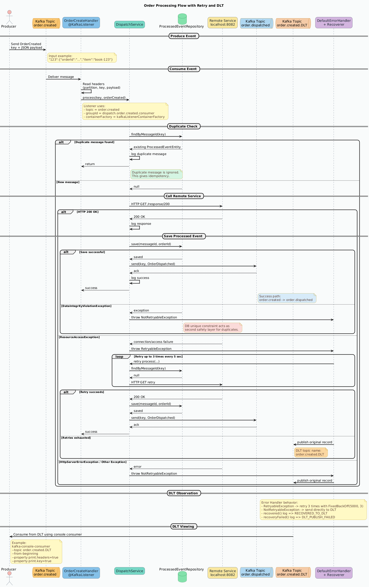
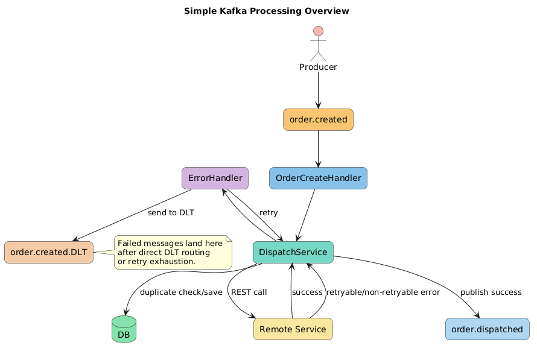

```java

@Slf4j
@EnableKafka
@Configuration
public class DispatchConfiguration {

    @Bean
    public ConcurrentKafkaListenerContainerFactory<String, OrderCreated> kafkaListenerContainerFactory(
            ConsumerFactory<String, OrderCreated> consumerFactory,
            KafkaTemplate<String, Object> kafkaTemplate) {

        DeadLetterPublishingRecoverer recoverer = new DeadLetterPublishingRecoverer(
                kafkaTemplate,
                (record, ex) -> {
                    String dltTopic = record.topic() + ".DLT";

                    if (ex instanceof NotRetryableException) {
                        log.error(
                                "NOT_RETRYABLE -> sending to DLT. topic={}, key={}, partition={}, offset={}, dltTopic={}, cause={}",
                                record.topic(), record.key(), record.partition(), record.offset(), dltTopic, ex.getMessage()
                        );
                    } else {
                        log.error(
                                "RETRIES_EXHAUSTED -> sending to DLT. topic={}, key={}, partition={}, offset={}, dltTopic={}, cause={}",
                                record.topic(), record.key(), record.partition(), record.offset(), dltTopic, ex.getMessage()
                        );
                    }

                    return new TopicPartition(dltTopic, record.partition());
                }
        );

        DefaultErrorHandler errorHandler =
                new DefaultErrorHandler(recoverer, new FixedBackOff(5000L, 3L));

        errorHandler.addNotRetryableExceptions(NotRetryableException.class);
        errorHandler.addRetryableExceptions(RetryableException.class);

        errorHandler.setRetryListeners(new RetryListener() {
            @Override
            public void failedDelivery(org.apache.kafka.clients.consumer.ConsumerRecord<?, ?> record,
                                       Exception ex,
                                       int deliveryAttempt) {
                log.warn(
                        "RETRY_ATTEMPT topic={}, key={}, partition={}, offset={}, attempt={}, exception={}",
                        record.topic(), record.key(), record.partition(), record.offset(),
                        deliveryAttempt, ex.getClass().getSimpleName()
                );
            }

            @Override
            public void recovered(org.apache.kafka.clients.consumer.ConsumerRecord<?, ?> record,
                                  Exception ex) {
                log.error(
                        "RECOVERED_TO_DLT topic={}, key={}, partition={}, offset={}, exception={}",
                        record.topic(), record.key(), record.partition(), record.offset(),
                        ex.getClass().getSimpleName()
                );
            }

            @Override
            public void recoveryFailed(org.apache.kafka.clients.consumer.ConsumerRecord<?, ?> record,
                                       Exception original,
                                       Exception failure) {
                log.error(
                        "DLT_PUBLISH_FAILED topic={}, key={}, partition={}, offset={}, originalException={}, recovererException={}",
                        record.topic(), record.key(), record.partition(), record.offset(),
                        original.getClass().getSimpleName(), failure.getClass().getSimpleName(),
                        failure
                );
            }
        });

        ConcurrentKafkaListenerContainerFactory<String, OrderCreated> factory =
                new ConcurrentKafkaListenerContainerFactory<>();
        factory.setConsumerFactory(consumerFactory);
        factory.setCommonErrorHandler(errorHandler);

        return factory;
    }

    @Bean
    public ConsumerFactory<String, OrderCreated> consumerFactory(
            @Value("${spring.kafka.bootstrap-servers}") String bootstrapServers) {

        Map<String, Object> config = new HashMap<>();
        config.put(ConsumerConfig.BOOTSTRAP_SERVERS_CONFIG, bootstrapServers);
        config.put(ConsumerConfig.KEY_DESERIALIZER_CLASS_CONFIG, StringDeserializer.class);
        config.put(ConsumerConfig.VALUE_DESERIALIZER_CLASS_CONFIG, ErrorHandlingDeserializer.class);
        config.put(ErrorHandlingDeserializer.VALUE_DESERIALIZER_CLASS, JacksonJsonDeserializer.class);
        config.put(JacksonJsonDeserializer.VALUE_DEFAULT_TYPE, OrderCreated.class.getCanonicalName());
        config.put(JacksonJsonDeserializer.TRUSTED_PACKAGES, "dev.lydtech.dispatch.message");
        config.put(ConsumerConfig.AUTO_OFFSET_RESET_CONFIG, "earliest");

        return new DefaultKafkaConsumerFactory<>(config);
    }

    @Bean
    public ProducerFactory<String, Object> producerFactory(
            @Value("${spring.kafka.bootstrap-servers}") String bootstrapServers) {

        Map<String, Object> config = new HashMap<>();
        config.put(ProducerConfig.BOOTSTRAP_SERVERS_CONFIG, bootstrapServers);
        config.put(ProducerConfig.KEY_SERIALIZER_CLASS_CONFIG, StringSerializer.class);
        config.put(ProducerConfig.VALUE_SERIALIZER_CLASS_CONFIG, JacksonJsonSerializer.class);

        return new DefaultKafkaProducerFactory<>(config);
    }

    @Bean
    public KafkaTemplate<String, Object> kafkaTemplate(
            ProducerFactory<String, Object> producerFactory) {
        return new KafkaTemplate<>(producerFactory);
    }
}
```


# DispatchConfiguration Summary

## Overview

This configuration class sets up Kafka consumer and producer components for the `dispatch` service.

It mainly does 4 things:

1. Creates a **Kafka listener container factory**
2. Configures **error handling with retries and DLT**
3. Configures the **consumer factory**
4. Configures the **producer factory and KafkaTemplate**

---

## 1. Class-Level Annotation Summary

| Annotation | Purpose |
|---|---|
| `@Slf4j` | Adds logger support for logging retry, recovery, and DLT events |
| `@EnableKafka` | Enables Kafka listener support in Spring |
| `@Configuration` | Marks this class as a Spring configuration class |

---

## 2. Bean Summary Table

| Bean Name | Return Type | Purpose |
|---|---|---|
| `kafkaListenerContainerFactory` | `ConcurrentKafkaListenerContainerFactory<String, OrderCreated>` | Creates Kafka listener containers with custom error handling |
| `consumerFactory` | `ConsumerFactory<String, OrderCreated>` | Defines how Kafka consumers are created and how messages are deserialized |
| `producerFactory` | `ProducerFactory<String, Object>` | Defines how Kafka producers are created and how messages are serialized |
| `kafkaTemplate` | `KafkaTemplate<String, Object>` | Used to publish messages to Kafka, including DLT messages |

---

## 3. Kafka Listener Container Factory Summary

| Item | Details |
|---|---|
| Consumer type | `String` key and `OrderCreated` value |
| Consumer factory used | `consumerFactory` |
| Error handler used | `DefaultErrorHandler` |
| DLT publishing | Enabled through `DeadLetterPublishingRecoverer` |
| Retry strategy | `FixedBackOff(5000L, 3L)` |
| Retry interval | 5 seconds |
| Retry attempts | 3 retries |
| Final action after retries fail | Send record to `<original-topic>.DLT` |

---

## 4. Error Handling Flow Summary

| Step | What Happens |
|---|---|
| 1 | Consumer reads message from Kafka topic |
| 2 | Listener processes the message |
| 3 | If processing succeeds, offset is committed normally |
| 4 | If `RetryableException` occurs, Spring Kafka retries |
| 5 | Retry happens every 5 seconds |
| 6 | Maximum 3 retry attempts are made |
| 7 | If retries are exhausted, message is sent to DLT |
| 8 | If `NotRetryableException` occurs, message goes directly to DLT |
| 9 | If DLT publishing itself fails, error is logged |

---

## 5. Dead Letter Topic (DLT) Summary

| Item | Details |
|---|---|
| DLT naming rule | Original topic name + `.DLT` |
| Example | `order.created` → `order.created.DLT` |
| Partition used | Same partition as original record |
| Publisher | `DeadLetterPublishingRecoverer` using `KafkaTemplate` |
| When used | For non-retryable exceptions or exhausted retries |

---

## 6. Exception Handling Summary

| Exception Type | Behavior |
|---|---|
| `RetryableException` | Message is retried up to 3 times with 5-second delay |
| `NotRetryableException` | Message is sent directly to DLT without retry |
| Other exceptions | Handled by default error handler and may go through retry/recovery flow depending on classification |

---

## 7. Retry Listener Summary

| Method | When It Runs | Log Meaning |
|---|---|---|
| `failedDelivery(...)` | On every failed retry attempt | Logs retry attempt details |
| `recovered(...)` | When record is successfully recovered to DLT | Logs that message was moved to DLT |
| `recoveryFailed(...)` | If publishing to DLT fails | Logs DLT publication failure |

---

## 8. Log Message Summary Table

| Log Message | Meaning |
|---|---|
| `NOT_RETRYABLE -> sending to DLT` | A non-retryable exception occurred, so record is sent straight to DLT |
| `RETRIES_EXHAUSTED -> sending to DLT` | All retry attempts failed, so record is sent to DLT |
| `RETRY_ATTEMPT` | A retry attempt is happening |
| `RECOVERED_TO_DLT` | Record has been successfully published to DLT |
| `DLT_PUBLISH_FAILED` | Kafka failed while trying to publish record to DLT |

---

## 9. Consumer Factory Summary

| Config Key | Value | Purpose |
|---|---|---|
| `BOOTSTRAP_SERVERS_CONFIG` | `${spring.kafka.bootstrap-servers}` | Kafka broker address |
| `KEY_DESERIALIZER_CLASS_CONFIG` | `StringDeserializer.class` | Deserializes Kafka message key |
| `VALUE_DESERIALIZER_CLASS_CONFIG` | `ErrorHandlingDeserializer.class` | Wraps value deserialization errors safely |
| `ErrorHandlingDeserializer.VALUE_DESERIALIZER_CLASS` | `JacksonJsonDeserializer.class` | JSON deserializer for message value |
| `JacksonJsonDeserializer.VALUE_DEFAULT_TYPE` | `OrderCreated.class.getCanonicalName()` | Converts JSON payload into `OrderCreated` |
| `JacksonJsonDeserializer.TRUSTED_PACKAGES` | `dev.lydtech.dispatch.message` | Trusted package for deserialization |
| `AUTO_OFFSET_RESET_CONFIG` | `earliest` | Reads from earliest offset if no committed offset exists |

---

## 10. Why `ErrorHandlingDeserializer` Is Used

| Reason | Explanation |
|---|---|
| Safer deserialization | Prevents consumer from crashing badly on malformed JSON |
| Better error handling | Lets Spring Kafka pass deserialization problems to the error handler |
| DLT support | Bad messages can also be routed into recovery flow |

---

## 11. Producer Factory Summary

| Config Key | Value | Purpose |
|---|---|---|
| `BOOTSTRAP_SERVERS_CONFIG` | `${spring.kafka.bootstrap-servers}` | Kafka broker address |
| `KEY_SERIALIZER_CLASS_CONFIG` | `StringSerializer.class` | Serializes message key as string |
| `VALUE_SERIALIZER_CLASS_CONFIG` | `JacksonJsonSerializer.class` | Serializes Java object to JSON |

---

## 12. KafkaTemplate Summary

| Item | Details |
|---|---|
| Bean name | `kafkaTemplate` |
| Type | `KafkaTemplate<String, Object>` |
| Uses | `producerFactory` |
| Purpose | Sends Kafka messages, including DLT messages |

---

## 13. End-to-End Processing Summary

| Stage | Component | Purpose |
|---|---|---|
| 1 | ConsumerFactory | Creates Kafka consumer |
| 2 | ListenerContainerFactory | Creates listener container |
| 3 | Kafka Listener | Receives `OrderCreated` messages |
| 4 | DefaultErrorHandler | Handles failures |
| 5 | RetryListener | Logs retry and recovery events |
| 6 | DeadLetterPublishingRecoverer | Publishes failed messages to DLT |
| 7 | ProducerFactory + KafkaTemplate | Sends DLT message to Kafka |

---

## 14. Key Design Benefits

| Benefit | Explanation |
|---|---|
| Reliability | Failed messages are not lost |
| Observability | Detailed logs for retry, recovery, and DLT failures |
| Fault tolerance | Retryable failures get multiple chances |
| Clean separation | Consumer, producer, retry, and DLT logic are clearly separated |
| Safe recovery | Poison messages can be isolated in DLT |

---

## 15. Important Practical Notes

| Topic | Note |
|---|---|
| DLT topic creation | The `.DLT` topic should exist, unless broker auto-topic creation is enabled |
| Partition mapping | DLT uses the same partition as original message |
| Retry count meaning | `FixedBackOff(5000L, 3L)` means 3 retry attempts after initial failure |
| Offset reset | `earliest` only matters when no committed offset exists for the consumer group |
| Deserialization target | Incoming JSON must match `OrderCreated` structure |

---

## 16. Final Summary Table

| Section | Main Role |
|---|---|
| `kafkaListenerContainerFactory()` | Sets up listener container with retry and DLT handling |
| `DeadLetterPublishingRecoverer` | Sends failed messages to `<topic>.DLT` |
| `DefaultErrorHandler` | Controls retry and recovery behavior |
| `RetryListener` | Logs retry lifecycle events |
| `consumerFactory()` | Configures deserialization and consumer properties |
| `producerFactory()` | Configures serialization and producer properties |
| `kafkaTemplate()` | Publishes messages to Kafka |

---

## Conclusion

This `DispatchConfiguration` is a **robust Spring Kafka configuration** for consuming `OrderCreated` events.

It supports:

- JSON deserialization into `OrderCreated`
- retry handling for temporary failures
- direct DLT routing for non-retryable failures
- detailed logging for retries and recoveries
- publishing failed messages into `<topic>.DLT`

So in simple terms, this configuration makes the Kafka consumer **safe, observable, and fault tolerant**.

----

```java
@Slf4j
@RequiredArgsConstructor
@Component
public class OrderCreateHandler {

    private final DispatchService dispatchService;


    @KafkaListener(
            id = "orderConsumerClient",
            topics = "order.created",
            groupId = "dispatch.order.created.consumer",
            containerFactory = "kafkaListenerContainerFactory"
    )
    public void listen(@Header(KafkaHeaders.RECEIVED_PARTITION) Integer partition,
                       @Header(KafkaHeaders.RECEIVED_KEY) String key,
                       @Payload OrderCreated payload) throws Exception {
        log.info("Received message: partition: {} - key: {} - payload: {}", partition, key, payload);
        dispatchService.process(key, payload);
    }
}

```


# OrderCreateHandler — Summary Tables

## Overview

This class is a Kafka consumer that listens to the `order.created` topic  
and delegates processing to `DispatchService`.

---

## 1. Class-Level Annotation Summary

| Annotation | Purpose |
|---|---|
| `@Slf4j` | Enables logging |
| `@RequiredArgsConstructor` | Auto-generates constructor for dependency injection |
| `@Component` | Registers this class as a Spring bean |

---

## 2. Dependency Summary

| Dependency | Type | Purpose |
|---|---|---|
| `dispatchService` | `DispatchService` | Handles business logic for processing orders |

---

## 3. Kafka Listener Configuration Summary

| Property | Value | Explanation |
|---|---|---|
| `id` | `orderConsumerClient` | Unique identifier for the listener container |
| `topics` | `order.created` | Kafka topic to consume from |
| `groupId` | `dispatch.order.created.consumer` | Consumer group ID |
| `containerFactory` | `kafkaListenerContainerFactory` | Uses custom factory with retry & DLT handling |

---

## 4. Method Parameter Summary

| Parameter | Source | Purpose |
|---|---|---|
| `partition` | `@Header(KafkaHeaders.RECEIVED_PARTITION)` | Partition number from which message was read |
| `key` | `@Header(KafkaHeaders.RECEIVED_KEY)` | Kafka message key |
| `payload` | `@Payload` | Message value (`OrderCreated` object) |

---

## 5. Message Processing Flow

| Step | Action |
|---|---|
| 1 | Kafka message arrives in `order.created` topic |
| 2 | KafkaListener receives the message |
| 3 | Partition and key extracted from headers |
| 4 | Payload deserialized into `OrderCreated` |
| 5 | Log message details |
| 6 | Call `dispatchService.process(key, payload)` |
| 7 | If success → offset committed |
| 8 | If exception → handled by `DefaultErrorHandler` (retry/DLT) |

---

## 6. Logging Summary

| Log Statement | Meaning |
|---|---|
| `Received message: partition...` | Logs incoming Kafka message details for tracing |

---

## 7. Error Handling Integration

| Scenario | Behavior |
|---|---|
| Successful processing | Message consumed normally |
| `RetryableException` thrown | Retries happen (configured in container factory) |
| `NotRetryableException` thrown | Sent directly to DLT |
| Other exception | Goes through retry → then DLT if exhausted |

---

## 8. Consumer Group Behavior

| Feature | Explanation |
|---|---|
| Consumer Group | `dispatch.order.created.consumer` |
| Scaling | Multiple instances can run in parallel |
| Partition Assignment | Each instance gets different partitions |
| Fault Tolerance | If one instance dies, partitions reassigned |

---

## 9. Key Design Points

| Design Aspect | Explanation |
|---|---|
| Separation of concerns | Listener only receives messages, service handles logic |
| Observability | Logging includes partition, key, and payload |
| Fault tolerance | Integrated with retry + DLT via container factory |
| Scalability | Supports multiple consumers via group ID |

---

## 10. End-to-End Flow Summary

| Component | Role |
|---|---|
| Kafka Topic | `order.created` provides events |
| KafkaListener | Receives and maps message |
| OrderCreateHandler | Entry point for processing |
| DispatchService | Business logic execution |
| ErrorHandler | Retry + DLT handling |
| KafkaTemplate | Publishes failed messages to DLT |

---

## Final Summary

| Item | Description |
|---|---|
| Class Role | Kafka consumer handler |
| Input | `OrderCreated` event |
| Output | Delegated to `DispatchService` |
| Failure Handling | Retry + Dead Letter Topic |
| Key Benefit | Clean, scalable, fault-tolerant event processing |

---

```java


@Slf4j
@RequiredArgsConstructor
@Service
public class DispatchService {

    private final ProcessedEventRepository processedEventRepository;
    private final RestTemplate restTemplate;

    private static final String ORDER_DISPATCHED_TOPIC = "order.dispatched";
    private static final UUID APPLICATION_ID = randomUUID();

    private final KafkaTemplate<String, Object> kafkaProducer;

    public void process(String key, OrderCreated orderCreated) throws Exception {

        ProcessedEventEntity processedEventEntity = processedEventRepository.findByMessageId(key);
        if (processedEventEntity != null) {
            log.info("Found a duplicate message id: {}", processedEventEntity.getMessageId());
            return;
        }

        String requestUrl = "http://localhost:8082/response/200";

       // String requestUrl = "http://localhost:8082/response/500";

        try {
            ResponseEntity<String> response = restTemplate.exchange(requestUrl, HttpMethod.GET, null, String.class);

            if (response.getStatusCode().value() == HttpStatus.OK.value()) {
                log.info("Received response from a remote service: " + response.getBody());
            }
        } catch (ResourceAccessException ex) {
            log.error("RetryableException ==>{} ",ex.getMessage());
            throw new RetryableException(ex);
        } catch (HttpServerErrorException ex) {
            log.error("NotRetryableException  ===>{}",ex.getMessage());
            throw new NotRetryableException(ex);
        } catch (Exception ex) {
            log.error(ex.getMessage());
            throw new NotRetryableException(ex);
        }
        try {
            processedEventRepository.save(ProcessedEventEntity.builder()
                    .messageId(key)
                    .orderId(orderCreated.getOrderId().toString())
                    .build());
        } catch (DataIntegrityViolationException ex) {
             throw new NotRetryableException(ex);
            //throw new RuntimeException("DataIntegrityViolationException error ");
        }

        OrderDispatched orderDispatched = OrderDispatched.builder()
                .orderId(orderCreated.getOrderId())
                .processedById(APPLICATION_ID)
                .notes("Dispatched: " + orderCreated.getItem())
                .build();
        kafkaProducer.send(ORDER_DISPATCHED_TOPIC, key, orderDispatched).get();
        log.info("Sent messages: key: {}  - orderId:{} - processedById :{}", key, orderCreated.getOrderId(), APPLICATION_ID);
        // Save a unique message id in a database table


    }
}
```

# DispatchService — Summary Tables

## Overview

`DispatchService` contains the main business logic for processing an `OrderCreated` event.

It performs these steps:

1. Checks whether the message is a duplicate
2. Calls a remote service
3. Classifies errors into retryable and non-retryable
4. Saves the processed message in the database
5. Publishes an `OrderDispatched` event to Kafka

---

## 1. Class-Level Annotation Summary

| Annotation | Purpose |
|---|---|
| `@Slf4j` | Enables logging |
| `@RequiredArgsConstructor` | Auto-generates constructor for required dependencies |
| `@Service` | Marks this class as a Spring service bean |

---

## 2. Dependency Summary

| Dependency | Type | Purpose |
|---|---|---|
| `processedEventRepository` | `ProcessedEventRepository` | Checks duplicates and stores processed message IDs |
| `restTemplate` | `RestTemplate` | Calls external HTTP service |
| `kafkaProducer` | `KafkaTemplate<String, Object>` | Publishes Kafka messages |

---

## 3. Field Summary

| Field | Value / Type | Purpose |
|---|---|---|
| `ORDER_DISPATCHED_TOPIC` | `"order.dispatched"` | Kafka topic where processed event is sent |
| `APPLICATION_ID` | `randomUUID()` | Unique ID for this service instance |
| `kafkaProducer` | `KafkaTemplate<String, Object>` | Sends message to Kafka |

---

## 4. Method Summary

| Method | Input | Output | Purpose |
|---|---|---|---|
| `process(String key, OrderCreated orderCreated)` | Kafka key and `OrderCreated` payload | `void` | Processes an incoming order event |

---

## 5. End-to-End Processing Flow

| Step | Action | Result |
|---|---|---|
| 1 | Check if `messageId` already exists in DB | Prevent duplicate processing |
| 2 | If duplicate found | Log and return |
| 3 | Call external REST endpoint | Validate or trigger downstream work |
| 4 | Handle remote call exceptions | Convert to retryable or non-retryable exceptions |
| 5 | Save processed event into DB | Mark message as processed |
| 6 | Build `OrderDispatched` event | Prepare Kafka output event |
| 7 | Send event to `order.dispatched` topic | Notify downstream consumers |
| 8 | Log success message | Trace successful processing |

---

## 6. Duplicate Check Summary

| Code Part | Purpose | Behavior |
|---|---|---|
| `processedEventRepository.findByMessageId(key)` | Check if message already processed | Returns existing entity if duplicate |
| `if (processedEventEntity != null)` | Duplicate detection | Logs duplicate and exits method |

---

## 7. Idempotency Summary

| Concept | Explanation |
|---|---|
| Idempotency | Same Kafka message should not be processed more than once |
| How achieved here | Message key is stored in DB after successful processing |
| Duplicate handling | If same key appears again, service skips processing |
| Benefit | Prevents duplicate DB writes and duplicate Kafka publishes |

---

## 8. Remote Service Call Summary

| Item | Value | Purpose |
|---|---|---|
| Request URL | `http://localhost:8082/response/200` | External service call |
| HTTP Method | `GET` | Request method |
| Tool used | `RestTemplate.exchange(...)` | Executes HTTP request |
| Success condition | HTTP 200 OK | Logs response body |

---

## 9. HTTP Response Handling Summary

| Condition | Behavior |
|---|---|
| Response status = `200 OK` | Log remote service response |
| `ResourceAccessException` | Throw `RetryableException` |
| `HttpServerErrorException` | Throw `NotRetryableException` |
| Any other `Exception` | Throw `NotRetryableException` |

---

## 10. Exception Classification Summary

| Exception Caught | Converted To | Meaning |
|---|---|---|
| `ResourceAccessException` | `RetryableException` | Temporary issue, retry may succeed |
| `HttpServerErrorException` | `NotRetryableException` | Server-side failure treated as non-retryable in this code |
| Generic `Exception` | `NotRetryableException` | Unexpected failure, do not retry |
| `DataIntegrityViolationException` | `NotRetryableException` | Duplicate/DB integrity problem, do not retry |

---

## 11. Retry Logic Meaning

| Exception Type | Effect in Kafka Error Handler |
|---|---|
| `RetryableException` | Message is retried according to configured backoff |
| `NotRetryableException` | Message goes directly to DLT |
| No exception | Processing completes successfully |

---

## 12. Database Save Summary

| Code Part | Purpose |
|---|---|
| `processedEventRepository.save(...)` | Stores processed event record |
| `messageId(key)` | Saves Kafka key for duplicate detection |
| `orderId(orderCreated.getOrderId().toString())` | Stores business order reference |

---

## 13. Database Entity Summary

| Field Stored | Source | Purpose |
|---|---|---|
| `messageId` | Kafka message key | Used for duplicate check |
| `orderId` | `orderCreated.getOrderId()` | Stores related order reference |

---

## 14. Why `DataIntegrityViolationException` Is Caught

| Reason | Explanation |
|---|---|
| DB uniqueness protection | Two consumers or retries might try to save same message ID |
| Safety fallback | Even if duplicate check passed earlier, DB may reject duplicate insert |
| Outcome | Converted to `NotRetryableException` so it is not retried endlessly |

---

## 15. OrderDispatched Event Summary

| Field | Value | Purpose |
|---|---|---|
| `orderId` | `orderCreated.getOrderId()` | Identifies order |
| `processedById` | `APPLICATION_ID` | Identifies this processing service instance |
| `notes` | `"Dispatched: " + orderCreated.getItem()` | Adds business note |

---

## 16. Kafka Publish Summary

| Item | Value | Purpose |
|---|---|---|
| Topic | `order.dispatched` | Output topic |
| Key | Same input `key` | Preserves message correlation |
| Payload | `OrderDispatched` | Published event |
| Send mode | `.get()` | Waits for send confirmation synchronously |

---

## 17. Why `.get()` Is Used

| Point | Explanation |
|---|---|
| Synchronous send | Waits until Kafka send is completed |
| Failure visibility | If send fails, exception is thrown immediately |
| Reliability | Ensures event is actually sent before method ends |
| Trade-off | Slower than async send |

---

## 18. Logging Summary

| Log Statement | Meaning |
|---|---|
| `Found a duplicate message id` | Duplicate event detected |
| `Received response from a remote service` | External call succeeded |
| `RetryableException ==>` | Temporary failure identified |
| `NotRetryableException ===>` | Non-retryable failure identified |
| `Sent messages: key...` | Final Kafka event published successfully |

---

## 19. Business Logic Sequence Summary

| Sequence | Action Type | Description |
|---|---|---|
| 1 | Validation | Check duplicate message |
| 2 | External Integration | Call remote service |
| 3 | Error Mapping | Map technical exceptions to business retry types |
| 4 | Persistence | Save processed event |
| 5 | Event Publishing | Publish `OrderDispatched` |
| 6 | Audit/Tracing | Log success details |

---

## 20. Success Path Summary

| Step | Success Behavior |
|---|---|
| Duplicate check | No duplicate found |
| REST call | Returns HTTP 200 |
| DB save | Processed event saved successfully |
| Kafka publish | `OrderDispatched` sent successfully |
| Final result | Processing completes normally |

---

## 21. Failure Path Summary

| Failure Point | Exception Type | Outcome |
|---|---|---|
| REST connection issue | `ResourceAccessException` | Retry |
| REST server error | `HttpServerErrorException` | Send to DLT |
| Unexpected processing error | `Exception` | Send to DLT |
| DB constraint violation | `DataIntegrityViolationException` | Send to DLT |
| Kafka send failure | Exception from `.get()` | Propagates to error handler |

---

## 22. Design Benefits Summary

| Benefit | Explanation |
|---|---|
| Idempotency | Prevents duplicate event processing |
| Reliability | Kafka send is confirmed before completion |
| Fault tolerance | Temporary failures can be retried |
| Traceability | Logs important events and failures |
| Event-driven design | Produces downstream event after processing |

---

## 23. Important Technical Note

| Topic | Note |
|---|---|
| `APPLICATION_ID` | Generated once when class is loaded, so same app instance uses same ID |
| Duplicate logic | First checks repository, then DB constraint acts as second protection |
| REST error classification | In this code, `HttpServerErrorException` is treated as non-retryable |
| Kafka publish | Uses same input key for output event correlation |

---

## 24. Final Summary Table

| Section | Main Role |
|---|---|
| Duplicate check | Avoid reprocessing same message |
| REST call | External dependency invocation |
| Exception mapping | Decide retry vs DLT |
| DB save | Store processed message ID |
| Kafka publish | Emit `OrderDispatched` event |
| Logging | Provide observability |

---

## Conclusion

`DispatchService` is the core processing layer of your Kafka consumer flow.

It ensures that:

- duplicate messages are ignored
- temporary failures can be retried
- non-retryable failures go to DLT
- processed events are stored in the database
- successful processing produces an `order.dispatched` Kafka event

So this service gives you **idempotency, controlled error handling, persistence, and event publication** in one flow.

----

# Testing

# producer

```bash
kafka-console-producer --bootstrap-server kafka1:9092 --topic order.created --property parse.key=true --property key.separator=:
```
input json
```json

"123":{"orderId":"550e8400-e29b-41d4-a716-446655440001","item":"book-123"}

"456":{"orderId":"550e8400-e29b-41d4-a716-446655440000","item":"book-456"}

```

# Consumer
```bash 
kafka-console-consumer --bootstrap-server kafka1:9092 --topic order.dispatched --property parse.key=true --property key.separator=:
```

"7":{"orderId":"550e8400-e29b-41d4-a716-446655440001","item":"book-7"}

# By default Spring-boot creates 
```bash

kafka-topics --bootstrap-server kafka1:9092 --create --topic order.created.DLT --partitions 1 --replication-factor 1

```

# to view DLT value
```bash
kafka-console-consumer --bootstrap-server localhost:9092 --topic order.created.DLT --from-beginning --property print.headers=true --property print.key=true --property key.separator=" | "

```

-------

# Kafka CLI Commands — Producer, Consumer, and DLT Summary

## Overview

This document shows how to:

- produce messages into `order.created`
- consume messages from `order.dispatched`
- create the Dead Letter Topic (`order.created.DLT`)
- view failed messages from the DLT

---

## 1. Producer Command Summary

| Item | Value |
|---|---|
| Command | `kafka-console-producer` |
| Bootstrap Server | `kafka1:9092` |
| Topic | `order.created` |
| Key Parsing | `true` |
| Key Separator | `:` |
| Purpose | Send keyed JSON messages to `order.created` topic |

### Command

```bash
kafka-console-producer --bootstrap-server kafka1:9092 --topic order.created --property parse.key=true --property key.separator=:
```

## 2. Producer Input Format Summary
| Part                                  | Meaning                 |
| ------------------------------------- | ----------------------- |
| `"123"`                               | Kafka message key       |
| `{"orderId":"...","item":"book-123"}` | JSON message value      |
| `:`                                   | Separates key and value |


**Example Input Messages**
```json
"123":{"orderId":"550e8400-e29b-41d4-a716-446655440001","item":"book-123"}
"456":{"orderId":"550e8400-e29b-41d4-a716-446655440000","item":"book-456"}
```

## 3. Input Message Breakdown
| Kafka Key | orderId                                | item       | Topic Sent To   |
| --------- | -------------------------------------- | ---------- | --------------- |
| `123`     | `550e8400-e29b-41d4-a716-446655440001` | `book-123` | `order.created` |
| `456`     | `550e8400-e29b-41d4-a716-446655440000` | `book-456` | `order.created` |


## 4. Consumer Command Summary
| Item             | Value                                           |
| ---------------- | ----------------------------------------------- |
| Command          | `kafka-console-consumer`                        |
| Bootstrap Server | `kafka1:9092`                                   |
| Topic            | `order.dispatched`                              |
| Key Parsing      | `true`                                          |
| Key Separator    | `:`                                             |
| Purpose          | Read processed messages from `order.dispatched` |


**Command**
```java
kafka-console-consumer --bootstrap-server kafka1:9092 --topic order.dispatched --property parse.key=true --property key.separator=:
```

## 5. Consumer Output Meaning

| Part         | Meaning                                     |
| ------------ | ------------------------------------------- |
| `"7"`        | Kafka key of processed event                |
| JSON payload | Event published after successful processing |


**Example Output**
```json
"7":{"orderId":"550e8400-e29b-41d4-a716-446655440001","item":"book-7"}
```

## 6. DLT Topic Summary

| Item         | Value                                                           |
| ------------ | --------------------------------------------------------------- |
| DLT Name     | `order.created.DLT`                                             |
| Source Topic | `order.created`                                                 |
| Purpose      | Stores failed messages that could not be processed successfully |
| Trigger      | Non-retryable exception or retries exhausted                    |


## 7. DLT Create Command Summary

| Item               | Value                         |
| ------------------ | ----------------------------- |
| Command            | `kafka-topics --create`       |
| Topic Name         | `order.created.DLT`           |
| Partitions         | `1`                           |
| Replication Factor | `1`                           |
| Purpose            | Manually create the DLT topic |


**Command**
```java
kafka-topics --bootstrap-server kafka1:9092 --create --topic order.created.DLT --partitions 1 --replication-factor 1
```

## 8. Important Clarification About DLT Creation

| Statement                        | Explanation                                                                                                                           |
| -------------------------------- | ------------------------------------------------------------------------------------------------------------------------------------- |
| "By default Spring Boot creates" | Not always correct                                                                                                                    |
| Actual behavior                  | Spring Kafka sends to DLT if configured, but the topic itself usually must already exist unless broker auto-topic creation is enabled |
| Safe approach                    | Manually create `order.created.DLT` before testing                                                                                    |


## 9. DLT Consumer Command Summary

| Item             | Value                                                   |   |
| ---------------- | ------------------------------------------------------- | - |
| Command          | `kafka-console-consumer`                                |   |
| Bootstrap Server | `localhost:9092`                                        |   |
| Topic            | `order.created.DLT`                                     |   |
| Read Mode        | `--from-beginning`                                      |   |
| Print Headers    | `true`                                                  |   |
| Print Key        | `true`                                                  |   |
| Key Separator    | `                                                       | ` |
| Purpose          | View failed messages from the DLT with headers and keys |   |


**Command**
```java
kafka-console-consumer --bootstrap-server localhost:9092 --topic order.created.DLT --from-beginning --property print.headers=true --property print.key=true --property key.separator=" | "
```

## 10. DLT Consumer Output Summary

| Output Part | Meaning                                              |
| ----------- | ---------------------------------------------------- |
| Headers     | Metadata added by Spring Kafka during DLT publishing |
| Key         | Original Kafka message key                           |
| Value       | Original failed payload                              |
| Topic       | `order.created.DLT`                                  |


## 11. Expected End-to-End Flow

| Step | Action                              | Topic                  |
| ---- | ----------------------------------- | ---------------------- |
| 1    | Producer sends input message        | `order.created`        |
| 2    | Spring Kafka listener reads message | `order.created`        |
| 3    | `DispatchService` processes message | Internal service logic |
| 4A   | If success, publish output event    | `order.dispatched`     |
| 4B   | If failure, publish failed event    | `order.created.DLT`    |


## 12. Success vs Failure Flow Summary

| Scenario                                   | Result                                | Topic               |
| ------------------------------------------ | ------------------------------------- | ------------------- |
| Processing successful                      | Message published as dispatched event | `order.dispatched`  |
| `RetryableException` then success          | Eventually processed successfully     | `order.dispatched`  |
| `RetryableException` and retries exhausted | Message moved to DLT                  | `order.created.DLT` |
| `NotRetryableException`                    | Message moved directly to DLT         | `order.created.DLT` |


## 13. Command Comparison Table

| Command Type | Main Use                           | Topic               |
| ------------ | ---------------------------------- | ------------------- |
| Producer     | Send test input messages           | `order.created`     |
| Consumer     | Read successfully processed events | `order.dispatched`  |
| Topic Create | Create dead letter topic           | `order.created.DLT` |
| DLT Consumer | Read failed messages               | `order.created.DLT` |

## 14. Practical Notes

| Topic                     | Note                                                                                                                              |
| ------------------------- | --------------------------------------------------------------------------------------------------------------------------------- |
| Bootstrap server mismatch | You used `kafka1:9092` in some commands and `localhost:9092` in DLT consumer. Use the correct broker address for your environment |
| Message format            | With `parse.key=true`, input must be `key:value` format                                                                           |
| DLT debugging             | `print.headers=true` is useful because Spring Kafka adds failure metadata headers                                                 |
| Key preservation          | DLT record usually keeps the original key                                                                                         |
| Testing                   | Produce bad or failing messages to verify DLT flow                                                                                |


## 15. Final Summary Table

| Section          | Purpose                                            |
| ---------------- | -------------------------------------------------- |
| Producer command | Send `OrderCreated` test messages                  |
| Consumer command | Read successful processed events                   |
| DLT creation     | Prepare dead letter topic                          |
| DLT consumer     | Inspect failed records and headers                 |
| Overall flow     | Validate Kafka processing, retry, and DLT behavior |


Conclusion

This setup helps you test the full Kafka processing lifecycle:
- send events to `order.created`
- verify successful output in `order.dispatched`
- verify failed events in `order.created.DLT`

It is a clean way to test both normal processing and error recovery with DLT.

# Diagram — Kafka Flow with Retry, DLT, and Remarks

Below is a colorful **Sequence diagram** for your Kafka producer, consumer, `OrderCreateHandler`, `DispatchService`, DB, remote service, success flow, retry flow, and DLT flow.

---



**Remark**
| Remark                                                 | Meaning                                                     |
| ------------------------------------------------------ | ----------------------------------------------------------- |
| **Producer** sends `OrderCreated` into `order.created` | Starting point of the flow                                  |
| **OrderCreateHandler** is the Kafka listener           | Receives partition, key, and payload                        |
| **DispatchService** contains the main business logic   | Duplicate check, remote call, DB save, Kafka publish        |
| **ProcessedEventRepository** provides idempotency      | Prevents duplicate processing                               |
| **Remote Service** decides success or failure path     | 200 = success, connection issue = retry, server issue = DLT |
| **DefaultErrorHandler** manages retry and recovery     | Central retry/DLT logic                                     |
| **order.dispatched** is the success topic              | Final event after successful processing                     |
| **order.created.DLT** is the failure topic             | Stores poisoned or exhausted retry messages                 |

## Short Explanation
**Success Flow**
1. Producer sends message to `order.created`
2. Kafka listener receives it
3. `DispatchService` checks duplicate
4. Remote service returns `200` `OK`
5. Processed event is saved in DB
6. `OrderDispatched` is published to `order.dispatched`

**Retry Flow**
1. Remote call throws `ResourceAccessException`
2. Service throws `RetryableException`
3. Error handler retries 3 times with 5-second delay
4. If later successful, message continues normally
5. If still failing, record goes to DLT


**DLT Flow**
1. `NotRetryableException` occurs, or retries are exhausted
2. `DeadLetterPublishingRecoverer` publishes original message to `order.created.DLT`
3. You can inspect it with Kafka console consumer


